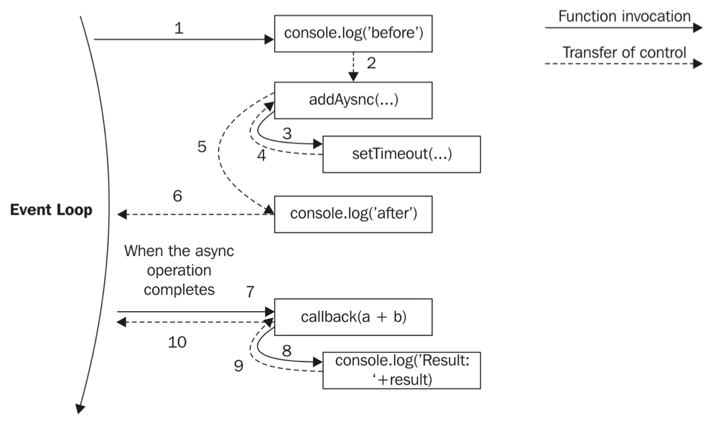
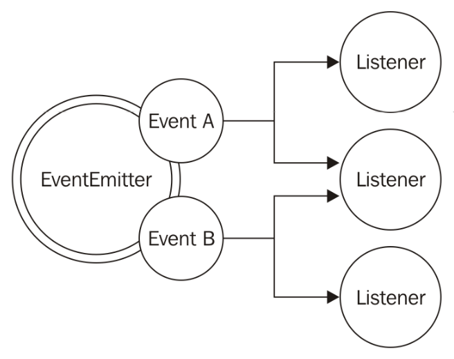

# Node.js Essential Patterns

去拥抱天生异步的 Node.js 非常重要， 特别是对那些不经常写异步代码语言的开发者。

在异步编程中我们习惯去假想一系列连续的操作来解决问题。 因为每一步操作都是阻塞的， 这意味着只有当前操作完成后才能执行下一步操作。

在异步编程中的一些操作， 例如读取文件或完成网络请求可以在后台启动。 当一个调用被启动时， 里一个调用会非常快地被启动甚至是在前一个操作还未完成时， 整个方程式应该在异步操作完成后出现适当的响应。

Node.js 提供了一系列工具和设计模式来处理这种异步代码。 在本章我们将要学习最重要的异步模式： 回掉和事件分发。

## 回掉模式

回掉是响应器模式的实体化处理， 它为 Node.js 带来了特别的编程风格。 回掉函数在操作完成后被调用。 回掉会替代经常同步调用的 ``return``。 函数是第一类对象它可以被当作值、 参数、 或者返回另一个函数或者被存储到数据结构内。 另一个实现回掉的理想结构式闭包。 在闭包内我们可以访问到函数的创建环境也可以不管回掉是否被调用时维持异步操作的上下文环境。

## 连续传递风格

在 JavaScript 中， 回掉可以被当作参数传递给另一个函数， 当操作结束后调用。 在函数编程内这被称作连续传递风格 continuation-passing style (CPS) 。 这是个普遍概念不经常与异步操作相联系。 实际上， 结果是被传送给另一个回掉函数了而非由调用者返回。

## 同步连续传递风格

````JavaScript
function add(a, b) {
     return a + b;
}
````

在这里， 结果被调用者用 ``return`` 直接返回； 这也叫作直接风格， 这是在同步编程中返回一个结果最普遍的方式。 而连续传递风格的函数是这样的：

````JavaScript
function add(a, b, callback) {
     callback(a + b);
}
````

``add()`` 函数是一个同步 CPS 函数， 这个函数将在回掉完成调用时返回一个值。  下面是示范：

````JavaScript
console.log('before');
add(1, 2, result => console.log('Result: ' + result));
console.log('after');
````

因为 ``add()`` 是同步的， 前面的代码将返回：

````JavaScript
before
Result: 3
after
````

## 异步连续传递风格
现在， 我们来看看异步下的 ``add()`` ：

````JavaScript
function additionAsync(a, b, callback) {
     setTimeout(() => callback(a + b), 100);
}
````

我们使用 ``setTimeout()`` 来模拟异步调用。

````JavaScript
console.log('before');
additionAsync(1, 2, result => console.log('Result: ' + result));
console.log('after');

before
after
Result: 3
````
因为 ``setTimeout()`` 触发一个异步操作， 它将不等待回掉被触发， 而是迅速返回， 把控制权交还给 ``additionAsync()``， 然后再回到它的调用者。 这在 Node.js 中至关重要， 因为它把控制权交还给了事件轮询当异步请求被触发时， 这样就允许一个队列处理一个新的事件。



当异步操作完成时， 操作执行继续从回掉开始。 操作执行将从事件轮询开始， 所以这有一个新的栈。 由于闭包， 维持回掉函数的上下文已经不重要了， 尽管回掉在不同时不同点被调用了。

同步函数一直阻塞直到完成它的操作。 异步函数立即返回而且结果被放入在未来一个事件轮询内的处理程序中。

## 非阻塞连续传递风格的回掉

这里有些状况让我们以为一个函数是异步的或是使用了连续传递风格； 一般不是这样的， 我们来看看：

````JavaScript
const result = [1, 5, 7].map(element => element - 1);
console.log(result); // [0, 4, 6]
````

很清楚， 回掉只用来遍历数组内的元素， 而不是被传入操作结果。 这是用直接风格的同步操作。

## 同步还是异步？

我们已经明白了指令的顺序是如何根据功能同步或异步的性质而发生变化的。 这将影响整个方程式的流程。 下面就分析了这两种模式的利弊。

### 一个难以预测的函数

一个最危险的情况是一个 API 在某种情况下是同步的而在其它情况下却是异步的：

````JavaScript
const fs = require('fs');
 const cache = {};
 function inconsistentRead(filename, callback) {
   if(cache[filename]) {
     //invoked synchronously
     callback(cache[filename]);
   } else {
     //asynchronous function
     fs.readFile(filename, 'utf8', (err, data) => {
       cache[filename] = data;
       callback(data);
     });
   }
}
````

处理函数使用了 ``cache`` 变量来储存不同文件读取的结果。 这只是个例子， 缓存逻辑不是最优的。

### 解除束缚

现在来看看不可预测函数的用处：

````JavaScript
function createFileReader(filename) {
   const listeners = [];
   inconsistentRead(filename, value => {
     listeners.forEach(listener => listener(value));
   });
   return {
     onDataReady: listener => listeners.push(listener)
   };
}
````

当处理函数被调用时它创建了一个新的对象， 我们将可以建立一个文件读取操作。 所有的监听操作将在读取操作完成的时候一次调用。

````JavaScript
const reader1 = createFileReader('data.txt');
   reader1.onDataReady(data => {
     console.log('First call data: ' + data);
     //...sometime later we try to read again from
     //the same file
     const reader2 = createFileReader('data.txt');
     reader2.onDataReady( data => {
       console.log('Second call data: ' + data);
     });
});

// First call data: some data
````

如你所见第二个回掉将永不执行：
* 在创建 reader1 时， 我们的 inconsistentRead() 是异步的， 因为因为这里没有缓存结果可用。 因此， 我们一直在注册我们的监听器
* 然后， reader2 在事件轮询的循环内创建。 内部的 inconsistentRead() 将使同步的。 所以这个回掉将立刻被调用， 这也就是说所有对 reader2 的监听都是同步调用的。 但是， 我们在创建 reader2 后注册监听器， 所以这些监听器将不会被调用。

### 使用同步 APIs

对上节例子中 inconsistentRead() 函数进行完全同步化便可以修复会出现的问题。 这是因为 Node.js 为基础 I/O 提供了一系列同步风格的 APIs。 例如  fs.readFileSync() ：

````JavaScript
const fs = require('fs');
 const cache = {};
 function consistentReadSync(filename) {
   if(cache[filename]) {
     return cache[filename];
   } else {
     cache[filename] = fs.readFileSync(filename, 'utf8');
     return cache[filename];
   }
}
````

记住把 API 从 CPS 风格转换到直接风格， 或者说是从异步风格转换到同步风格需要转换所有代码的使用风格。 在本例中我们就完全修改了 createFileReader() 的接口。

当然使用同步 API 有以下注意要点：

* 不是对应每个异步 API 都有其同步 API
* 同步 API 将阻塞事件轮询。 它将减慢方程式运行速度

在我们的 consistentReadSync() 函数中， 阻塞事件轮询带来的后果很轻因为同步的 I/O API 调用只在每个个文件名处启动， 缓存好的值将用于后面的调用。 如果我们限制了静态文件的数量然后再使用 consistentReadSync() 将不会对事件轮询产生大的影响。 当然如果我们一次读取很多的文件那就是另一回事了。 使用同步 I/O 操作在 Node.js 中的大多数情况下都不鼓励； 但是在一些情况下同步操作可能会有奇效。 在启动方程式的时候使用同步阻塞 API 来载入配置文件还是很有意义的。

当它们不影响服务器处理其它同时请求的情况下再使用阻塞 API。

### 延时执行

另一个来修复我们在上面出现的问题的可选方案是使用纯异步。 这里会使用一种延时执行的方案而非在事件轮询内立即启动。 在 Node.js 中， 我们可以使用 process.nextTick() 来延时执行直到下一轮的事件轮询。 它的功能非常简单； 它使用了回掉作为一个参数并把它放到事件队列的顶层， 即很多未开始的 I/O 事件并迅速返回。 回掉将在事件轮询再次开始时被调用。

我们这就来试试：

````JavaScript
const fs = require('fs');
   const cache = {};
   function consistentReadAsync(filename, callback) {
     if(cache[filename]) {
       process.nextTick(() => callback(cache[filename]));
     } else {
       //asynchronous function
       fs.readFile(filename, 'utf8', (err, data) => {
         cache[filename] = data;
         callback(data);
       });
     }
}
````

现在， 我们的函数保证会是异步的。

另一个用来延时执行的 API 是 setImmediate()。 它们的目标非常相似， 但是语义不一样。 process.nextTick() 回掉在所有其它 I/O 事件启动时。 而 setImmediate() 回掉是在已经准备好的 I/O 事件队列之后启动的。

## Node.js 回掉环境

在 Node.js 中， 连续传入风格 APIs 和回掉遵循一套一系列公约。 这些约定应用给 Node.js 核心 API 但是也遵循大量的用户模块。所以我们很有必要了解这些公约。

### 回掉在最后

在所有的 Node.js 核心方法中， 标准的公约是当函数接受回掉时在最后一个参数处放置回掉：

````JavaScript
fs.readFile(filename, [options], callback)
````

回掉一般放置在最后一个参数的位置， 这样可读性更高。

### 错误在最前面

在 CPS 中， 错误被作为任何一种结果来传送。 在 Node.js 中， 任何被  CPS 传入的错误都放置在第一个参数的位置， 任何实际的结果都放置在第二个参数处。 如果操作结果没有错误产生， 第一个参数将使 null 或 undefined：

````JavaScript
fs.readFile('foo.txt', 'utf8', (err, data) => {
   if(err)
     handleError(err);
   else
     processData(data);
});
````

这是种最佳实践而且易于调试。 另一个需要注意的点就是错误一直是 Error 类型。 这意味着简单的字符串或者数字将不应当作错误对象。

### 传递错误

同步传递错误， throw 语句被认为是直接的风格， 这将会导至直到错误被捕获时才弹出调用栈。

在异步 CPS 中， 简单的传入错误给下个回掉链很合适：

````JavaScript
const fs = require('fs');
function readJSON(filename, callback) {
 fs.readFile(filename, 'utf8', (err, data) => {
   let parsed;
   if(err)
     //propagate the error and exit the current function
     return callback(err);
   try {
     //parse the file contents
     parsed = JSON.parse(data);
   } catch(err) {
     //catch parsing errors
     return callback(err);
   }
   //no errors, propagate just the data
   callback(null, parsed);
 });
};
````

你应该注意到当我们想传递错误时该怎样传递有效结果。 我们使用 return 来传递错误。 这样出现错误时就不会调用下一行的代码了。

### 未捕获的异常

你可能已经看到 readJSON() 函数被用于避免任何异常出现在 fs.readFile() 回掉中了， 我们使用了 try...catch 块来包围 JSON.parse() 。 在异步函数内抛出异常将导致这个异常跳出事件轮询并不会被传递到下一个回掉内。

在 Node.js 内， 这是一种不可恢复的状态， 方程式将简单地打印处错误给 stderr 接口。 我们将去除 try...catch 块而示范：

````JavaScript
const fs = require('fs');
 function readJSONThrows(filename, callback) {
   fs.readFile(filename, 'utf8', (err, data) => {
     if(err) {
       return callback(err);
     }
     //no errors, propagate just the data
     callback(null, JSON.parse(data));
   });
};
````

在我们现在定义的函数内， 就没办法来捕获最终来自 JSON.parse() 的异常了。 如果我们试着解析一个未验证的 JSON 文件：

````JavaScript
readJSONThrows('nonJSON.txt', err => console.log(err));

// SyntaxError: Unexpected token d
//            at Object.parse (native)
//            at [...]
//            at fs.js:266:14
//            at Object.oncomplete (fs.js:107:15)
````

这将导致方程式因为异常突然被终止。

现在我们来追踪一下处理栈， 我们将看到它起始于 fs.js 模块， 确切说是来自读取 fs.readFile() 函数后通过事件轮询返回的结果。 这清晰地告诉我们异常来自我们的回掉然后直接进入事件轮询， 最后被捕获抛出。

这也意味着用 try...catch 块来包围 readJSONThrows() 将不会起作用， 因为在块内的处理栈不同于我们在回掉内的操作：

````JavaScript
try {
     readJSONThrows('nonJSON.txt', function(err, result) {
//... });
   } catch(err) {
     console.log('This will not catch the JSON parsing exception');
}
````

catch 语句将不会接收到 JSON 解析异常， 因为它将返回异常将抛出的栈。 我们只会看到栈在事件轮询处结束而不会看到触发异步操作。

正如以前说的， 方程式在异常到达事件轮询的时候发生崩溃； 但是我们依然可以做一点补救措施， 当发生崩溃时， Node.js 会分发一个特别事件 uncaughtException：

````JavaScript
process.on('uncaughtException', (err) => {
     console.error('This will catch at last the ' +
       'JSON parsing exception: ' + err.message);
     // Terminates the application with 1 (error) as exit code:
     // without the following line, the application would continue
     process.exit(1);
});
````

理解未捕获的异常在离开方程式时的状态不是连续的这点很重要。 例如， 一个未完成的 I/O 请求运行或闭包可能变成不连续的。 这就是为什么经常被建议， 特别是在生产环境内， 在收到未捕获异常后要退出方程式的原因。

## 模块系统和它的模式

模块就像砖块一样对方程式来说非常重要， 而且这也是一种使函数和变量保持私有化的强制机制。 在本章我们将介绍 Node.js 模块系统和一般模式。

### 揭秘模块模式

在 JavaScript 中最重要的问题里一定有命名空间。 运行在全局作用域的程序的数据会污染命名空间。 一种解决这类问题的流行技术是模块接口模式：

````JavaScript
const module = (() => {
     const privateFoo = () => {...};
     const privateBar = [];
     const exported = {
       publicFoo: () => {...},
       publicBar: () => {...}
};
 return exported;
})();
console.log(module);
````

这种模式采用了自执行函数来创建一个私有作用域并有选择的暴露出一部分给公共空间。 在代码中， module 变量只包含一个 API， 因为剩下的部分都是公共空间访问不到的。 正如我们所见的这种模式也是 Node.js 模块系统的基础。

## 揭秘 Node.js 模块

CommonJS 组织致力于标准化 JavaScript 生态， 它有一个非常流行的提议叫作 CommonJS 模块。 Node.js 在这基础之上建立了自己的模块系统， 我们这就来看看 Node.js 中的模块系统。

### 自制模块加载器

为了解释它是怎么工作的， 我们也来建一个类似的系统：

````JavaScript
function loadModule(filename, module, require) {
 const wrappedSrc=`(function(module, exports, require) {
     ${fs.readFileSync(filename, 'utf8')}
   })(module, module.exports, require);`;
 eval(wrappedSrc);
}
````

为了揭露出模块模式的原理我们把大多数细节都包含在一个函数内。 不同的是我们为它传入了一系列参数。

现在我们来实现 require() 函数：

````JavaScript
 const require = (moduleName) => {
  console.log(`Require invoked for module: ${moduleName}`);
  const id = require.resolve(moduleName); //[1]
  if(require.cache[id]) {                 //[2]
    return require.cache[id].exports;
  }

  //module metadata
  const module = {                        //[3]
    exports: {},
    id: id
  };
  //Update the cache
  require.cache[id] = module;             //[4]
  //load the module
  loadModule(id, module, require);        //[5]
  //return exported variables
  return module.exports;                  //[6]
};
require.cache = {};
require.resolve = (moduleName) => {
     /* resolve a full module id from the moduleName */
};
````

这里只是模拟了 require() 函数的基本实现， 我们来一步步解释：

1. 我们通过模块名字引入一个全路径模块
1. 如果模块已经被导入过， 那么可以在缓存内找到
1. 如果没有被导入， 我们就创建一个 module 对象来初始化
1. 缓存 module 对象
1. 导入模块的源代码并赋值给我们创建的 module.exports 对象
1. 导出 module.exports 作为模块的公共接口

### 定义一个模块

通过我们自定义的  require() 函数， 我们知道了如何定义一个模块下面是个实例：

````JavaScript
//load another dependency
const dependency = require('./anotherModule');
//a private function
function log() {
 console.log(`Well done ${dependency.username}`);
}
//the API to be exported for public use
module.exports.run = () => {
  log();
};
````

除了 module.exports 导出的内容剩下的东西全是私有的。

## 全局定义

尽管在模块内定义的变量和函数都有其本地作用域， 我们依然需要一个全局变量。 事实上模块系统内就有一个特殊的变量用作全局变量即 global， 一切分配给这个变量的值都将自动使用全局作用域。

### module.exports 对 exports

一些新手不理解 module.exports 和 exports 的区别， exports 只是 module.exports 初始值的引用； 像那些在模块导入前的大多数简单对象字面量。

这就意味着我们只能通过 exports 变量来为对象绑定新的属性：

````JavaScript
exports.hello = () => {
    console.log('Hello');
}

exports = () => {
     console.log('Hello');
}

module.exports = () => {
     console.log('Hello');
}
````

重新为 exports 赋值是无效的， 因为这不会改变 module.exports 的内容； 这仅仅会为变量本身重新赋值。 如果我们想暴露对象本身我们必须使用 module.exports。

## require 函数是同步的

另一个重要的细节就是 require 函数的同步的， 这就意味着我们的 module.exports 也必须是同步的， 下面的这种写法会出错：

````JavaScript
setTimeout(() => {
     module.exports = function() {...};
}, 100);
````
这将限制我们在定义模块时使用同步代码， 所以 Node.js 提供了同步 APIs 供我们使用。

如果我们需要异步方法来初始化一个模块， 我们可以在后面用异步的方法初始化定义并导出一个未初始化的模块。

在早期 Node.js 也提供异步的 require() 函数， 但很快便被移除了因为过分复杂的功能弊大于利。

## 算法揭秘

依赖地狱描述了一种因为软件间互相依赖出现版本不一致的问题。 Node.js 解决了这个问题。 我们这就来看看这个算法是如何实现的。 正如我们看到的 resolve() 函数以模块名作为输入并返回模块的全路径。 这条路径同时也用来辨别模块的唯一性。 这种算法可分为如下三个分支：

* 文件系统： 如果文件名以 ／ 开头， 路径被认为是绝对路径。 如果以 .／ 开头则是相对路径， 相对于请求的模块的路径
* 核心模块： 如果文件名没有 ／ 或 .／ 开头， 算法将从 Node.js 核心模块内查找模块
* 包模块： 如果没有在核心模块内找到模块， 剩下的便从第一个 node_modules 目录下查找， 如果还没找到则继续下一个 node_modules 目录下查找

对于文件和包模块， 如果都是相同的文件名， 算法按这样的顺序查找：

<moduleName>.js
<moduleName>/index.js
The directory/file specified in the main property of <moduleName>/package.json

http://nodejs.org/api/modules.html#modules_all_together.

基于我们刚刚描述的算法， 每个包仅能安装自己相应需要的依赖， 而没有解决平行结构内包之间的依赖。

myApp
   ├── foo.js
   └── node_modules
       ├── depA
       │   └── index.js
       ├── depB
       │   ├── bar.js
       │   └── node_modules
       │   └── depA
       │           └── index.js
       └── depC
           ├── foobar.js
           └── node_modules
               └── depA
                   └── index.js

myApp, depB, 和 depC 全部依赖于 depA； 但是它们都有其自己所依赖的私有版本包！ 依据前面提到的规则 require('depA') 将导入不同的模块：

* /myApp/foo.js 内的 require('depA') 将导入 /myApp/node_modules/depA/index.js
* /myApp/node_modules/depB/bar.js 内的 require('depA') 将导入 /myApp/node_modules/depB/node_modules/depA/index.js
* /myApp/node_modules/depC/foobar.js 内的 require('depA') 将导入 /myApp/node_modules/depC/node_modules/depA/index.js

这种算法就是 Node.js 管理依赖关系的核心， 从而保证 Node.js 可有拥有成千上万个包而不会出现版本冲突。

我们使用  require() 来解决包的导入； 但是如果需要的话也可以使用 require.resolve() 来直接导入任何模块。

### 模块缓存

因为 require() 将使用导入模块的缓存版本所以每个模块只导入一次。 我们可以通过删除 require.cache 内相关的键来使缓存失效。

### 循环依赖

许多循环依赖是本身设计的问题， 但也有可能发生， 所以我们应该了解这是怎么出现的。 再回头看看我们自制的 require() 函数：

````JavaScript
//a.js
exports.loaded = false;
const b = require('./b');
module.exports = {
  bWasLoaded: b.loaded,
  loaded: true
};

//b.js
exports.loaded = false;
const a = require('./a');
module.exports = {
  aWasLoaded: a.loaded,
  loaded: true
};

const a = require('./a');
const b = require('./b');
console.log(a);
console.log(b);

//
{ bWasLoaded: true, loaded: true }
{ aWasLoaded: false, loaded: true }
````

结果就是循环的依赖会出现问题。 当两个模块被导入时， 在 b.js 里导入的 a.js 会不完整。

``
This result reveals the caveats of circular dependencies. While both the modules are completely initialized the moment they are required from the main module, the a.js module will be incomplete when it is loaded from b.js. In particular, its state will be the one that it reached the moment it required b.js. This behavior should ring another bell, which will be confirmed if we swap the order in which the two modules are required in main.js.
``

如果我们这样做， 我们将在 a.js 内收到不完整的 b.js。 这很令人困惑。

## 模块定义模式

在模块系统内除了导入依赖的机制还有一个定义接口的工具。 和其它接口设计模式一样， 主要是用于区别私有和公共功能。 权衡的标准是可扩展性和重用性。

在本章， 我们将分析在 Node.js 中最流行的定义模块模式。

### 命名导出

导出一个公开接口最基本的方式是使用命名导出， 即把我们想导出的值赋给 exports （或者 module.exports）：

````JavaScript
//file logger.js
exports.info = (message) => {
 console.log('info: ' + message);
};
exports.verbose = (message) => {
 console.log('verbose: ' + message);
};

//file main.js
const logger = require('./logger');
logger.info('This is an informational message');
logger.verbose('This is a verbose message');
````

大多数 Node.js 核心模块都使用这种模式。

CommonJS 只允许使用 exports 来暴露公共成员。 因此，命名导出模式兼容性很强。

### 导出函数

给整个 module.exports 赋值一个函数也是一种非常流行的方式。 主要的优点是只导出一个功能更加清晰明了， 这被社区叫作垂直模式。

````JavaScript
//file logger.js
module.exports = (message) => {
  console.log(`info: ${message}`);
};

//这种模式还有一项扩展用于命名其它公开接口
module.exports.verbose = (message) => {
  console.log(`verbose: ${message}`);
};

//file main.js
const logger = require('./logger');
logger('This is an informational message');
logger.verbose('This is a verbose message');
````

虽然只暴露出一个函数看起来很有局限性， 实际上这是一种很完美的实现方式。 模块化的  Node.js 很提倡这种单一职责准则 (SRP)： 每个模块应该对一个功能负责， 这个模块的职责就是这一个功能。

### 暴露构建器

暴露构建器专门用于暴露函数。 不同的是这种模式允许我们使用构建器创建一个新的实例， 但是我们可以扩展原型并伪造新的类：

````JavaScript
//file logger.js
function Logger(name) {
 this.name = name;
}
Logger.prototype.log = function(message) {
 console.log(`[${this.name}] ${message}`);
};
Logger.prototype.info = function(message) {
 this.log(`info: ${message}`);
};
Logger.prototype.verbose = function(message) {
 this.log(`verbose: ${message}`);
};
module.exports = Logger;

//file main.js
const Logger = require('./logger');
const dbLogger = new Logger('DB');
dbLogger.info('This is an informational message');
const accessLogger = new Logger('ACCESS');
accessLogger.verbose('This is a verbose message');


class Logger {
 constructor(name) {
   this.name = name;
 }
 log(message) {
   console.log(`[${this.name}] ${message}`);
}
 info(message) {
   this.log(`info: ${message}`);
}
 verbose(message) {
   this.log(`verbose: ${message}`);
} }
module.exports = Logger;


function Logger(name) {
  if(!(this instanceof Logger)) {
    return new Logger(name);
  }
  this.name = name;
};
````

该模式的一个变体是应用一个没有使用 new 创建实例而保护策略。 这个小技巧允许我们将模块作为一个工厂：

````JavaScript
function Logger(name) {
 if(!(this instanceof Logger)) {
   return new Logger(name);
 }
 this.name = name;
};

//file logger.js
const Logger = require('./logger');
const dbLogger = Logger('DB');
accessLogger.verbose('This is a verbose message');

function Logger(name) {
 if(!new.target) {
   return new LoggerConstructor(name);
 }
 this.name = name;
}
````

我们还可以使用 ES2015 带来的 new.target 语法来实现。 new.target 属性使所有函数内的元属性。

### 暴露一个实例

我们可以使用缓存机制来从构建器或一个工厂定义一个有状态的实例， 这将在多模块间分享状态：

````JavaScript
//file logger.js
function Logger(name) {
 this.count = 0;
 this.name = name;
}
Logger.prototype.log = function(message) {
 this.count++;
 console.log('[' + this.name + '] ' + message);
};
module.exports = new Logger('DEFAULT');

//file main.js
const logger = require('./logger');
logger.log('This is an informational message');


module.exports.Logger = Logger;

const customLogger = new logger.Logger('CUSTOM');
customLogger.log('This is an informational message');
````

因为模块被缓存了， 每个导入 logger 模块的模块将取到对象内相同的实例。 这个模式很像创建了一个单例； 但是他不会传递每个实例间的区别， 就像发生在传统的单例模式中那样。 当我们分析这种算法时， 我们就知道了实际情况， 模块将被安装多次。 在多个相同逻辑模块的实例全部运行在一致的 Node.js 方程式中。

### 修改其它模块或全局作用域

我们应该知道我们可以修改模块或者任何对象内的全局作用域， 还有在缓存内的其它模块。 请注意这普遍被认为是一种糟糕实践， 但在某种情形下依然很有用。 这种行为被称作猴子补丁：

````JavaScript
//file patcher.js
// ./logger is another module
require('./logger').customMessage = () => console.log('This is a new functionality');

//file main.js
require('./patcher');
const logger = require('./logger');
logger.customMessage();
````

patcher 必须先于 logger 前被引入才其效。

## 观察者模式

含有一个重要的模式就是观察者模式。 有了反应器、 回掉、 模块后， 观察者模式是 Node.js 平台的支柱也是使用许多核心模块的先决条件。

观察者是一种对于  Node.js 天生的反应模型和完美实现回掉的理想解决方案。

观察者定义了一个可以注意到在一系列本身状态改变的观察者的对象（subject）。

和回掉的主要不同点在于对象（subject）可注意到多个观察者， 而传统的回掉只能传递结果给一个监听器。

## 事件触发器类

传统的面向对象编程中， 观察者模式需要接口、 有形类和等级体系； 在 Node.js 中， 这变得更加简单。 因为观察者模式已经被构建到 node 核心中并以 EventEmitter 类暴露。 EventEmitter 允许我们注册一个多多个监听器。



触发器是一个原型并且它被事件核心模块所暴露出来：

````JavaScript
const EventEmitter = require('events').EventEmitter;
const eeInstance = new EventEmitter();
````

一些触发器的基础方法：
* on(event, listener): 这个方法允许我们来为给定的事件注册一个新的监听器
* once(event, listener): 这个方法注册一个新的监听器且只监听一次
* emit(event, [arg1], [...]): 这个方法提供新的事件并可传入多个参数
* removeListener(event, listener): 这个方法移除事件的监听器

因为所有的方法都会返回 EventEmitter 实例所以你可以串联。 监听函数只接受发射器上发射的参数。

我们可以发现很多与回掉不同的地方； 特别是第一个参数不是 error 。

## 创建并使用事件发射器

我们这就来创建使用事件发射器：

````JavaScript
const EventEmitter = require('events').EventEmitter;
   const fs = require('fs');
   function findPattern(files, regex) {
     const emitter = new EventEmitter();
     files.forEach(function(file) {
       fs.readFile(file, 'utf8', (err, content) => {
         if(err)
           return emitter.emit('error', err);
         emitter.emit('fileread', file);
         let match;
         if(match = content.match(regex))
           match.forEach(elem => emitter.emit('found', file, elem));
       });
    });
    return emitter;
}

findPattern(
       ['fileA.txt', 'fileB.json'],
       /hello \w+/g
     )
     .on('fileread', file => console.log(file + ' was read'))
     .on('found', (file, match) => console.log('Matched "' + match +
       '" in file ' + file))
     .on('error', err => console.log('Error emitted: ' + err.message));
````

创建好的发射器产生三个事件：
* fileread: 文件被读取时发生
* found: 匹配找到时发生
*error: 在读取文件发生错误时触发

## 传递错误
