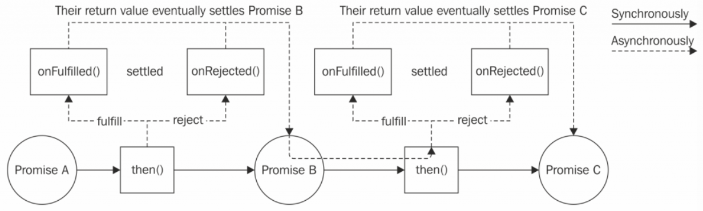

# Asynchronous Control Flow Patterns with ES2015 and Beyond

前一章我们学习了用回掉处理异步代码并理解了回掉地狱的产生。 在处理回掉地狱的方法上还有很多可选方案。

在本章， 我们将探索一下 promise 和 generators 还有 async await。

这些新方案处理起异步控制流将更加简单， 我们将试着理解它们并运用。

## Promise

Continuation Passing Style (CPS) 连续传入模式并不是处理异步代码唯一的方法。 在 JavaScript 生态中提供了很多可选方案， 其中 promise 已经被 ECMAScript 2015 纳入标准并在 Node.js 4 中可用。

### 什么是 promise

promise 是中抽象概念它允许函数返回一个 promise 对象， 而 promise 对象包含着异步操作的最终结果。 在 promise 内， 当异步操作没有完成时叫作 pending； 完成则叫 fulfilled； 失败则叫 rejected。 一旦 promise 处于 fulfilled 或 rejected 时， 就表明 promise 结束了。

我们使用 then() 方法来接收 fulfilled 或 rejected 值：

````JavaScript
promise.then([onFulfilled], [onRejected])
````

onFulfilled() 函数将接收成功的结果， onRejected() 将接收失败的结果。 它们都是可选的。


````JavaScript
asyncOperation(arg, (err, result) => {
  if (err) {
    //handle error
  }
  //do stuff with result
});

asyncOperation(arg)
  .then(result => {
    //do stuff with result
  }, err => {
    //handle error
  });
````

我们至关重要的 then() 方法会同步返回另一个 promise。 如果 fulfilled 或 rejected 会返回值， then() 方法将这样接收：

* Fulfill with x if x is a value
* Fulfill with the fulfillment value of x if x is a promise or a thenable
* Reject with the eventual rejection reason of x if x is a promise or a thenable

> A thenable is a promise-like object with a then() method. This term is used to indicate a promise that is foreign to the particular promise implementation in use.

这个特性允许我们启动链式 promise 然后我们简单聚合整理异步操作。 当然如果我们不处理 onFulfilled() 或 onRejected()， promise 的结果值将自动传递到下一个链式 promise。 这允许我们在整个 promise 链内传递错误， 直到出现 onRejected() 处理程序：

````JavaScript
asyncOperation(arg)
  .then(result1 => {
    //returns another promise
    return asyncOperation(arg2);
  })
  .then(result2 => {
    //returns a value
    return 'done';
  })
  .then(undefined, err => {
    //any error in the chain is caught here
  });
````



promise 内另一个重要的属性是 onFulfilled() 和 onRejected() 函数， 它们是被异步调用的。

如果在 onFulfilled() 或 onRejected() 处理程序内有  throw 语句抛出的异常， promise 将在 then() 方法内自动 reject。 这点比 CPS 更好， 这意味着 promise 将自动穿越链式调用并把错误传递出来。

### Promises/A+ 实现

在 JavaScript 和 Node.js 中， 下面的库实现了 Promises/A+ 标准：

* Bluebird (https://npmjs.org/package/bluebird)
* Q (https://npmjs.org/package/q)
* RSVP (https://npmjs.org/package/rsvp)
* Vow (https://npmjs.org/package/vow)
* When.js (https://npmjs.org/package/when)
* ES2015 promises

它们之间最重要的区别就是部分实现的特性不同。

ES2015 promises 提供的 APIs:

Constructor (new Promise(function(resolve, reject) {})): 这会创建一个新的 promise， 并基于函数传入的参数进行处理。

* resolve(obj): 这将以 fulfillment 值来解决一个 promise， obj 是一个值的话。
* reject(err): 这将以一个 err 来 reject promise。

Static methods of the Promise object:

* Promise.resolve(obj): 这将创建一个在 then() 方法后或一个值的 promise。
* Promise.reject(err): 这将创建一个以 err 为原因的 reject
* Promise.all(iterable):  This creates a promise that fulfills with an iterable of fulfillment values when every item in the iterable object fulfills, and rejects with the first rejection reason if any item rejects. Each item in the iterable object can be a promise, a generic thenable, or a value.
* Promise.race(iterable): This returns a promise that resolves or rejects as soon as one of the promises in the iterable resolves or rejects, with the value or reason from that promise.

Methods of a promise instance:

* promise.then(onFulfilled, onRejected): 这是 promise 的必要方法。
* promise.catch(onRejected): 这个是 promise.then(undefined, onRejected) 的语法糖。

### promise 风格的 Node.js 函数

在 JavaScript 内， 不是所有的异步函数和库都支持了 promise。 大多数情况下， 我们必须做些转换， 这个转换称为 promisification。

我们使用 Promise 对象提供的构建器来生成一个新函数 promisify() 并放在 utilities.js 模块内：

````JavaScript
module.exports.promisify = function(callbackBasedApi) {
  return function promisified() {
    const args = [].slice.call(arguments);
    return new Promise((resolve, reject) => { //[1]
      args.push((err, result) => {            //[2]
        if (err) {
          return reject(err);                 //[3]
        }
        if (arguments.length <= 2) {          //[4]
          resolve(result);
        } else {
          resolve([].slice.call(arguments, 1));
        }
      });
      callbackBasedApi.apply(null, args);     //[5]
    });
  }
};
````

处理函数返回另一个叫 promisified() 的函数， 它代表 promise 版本的 callbackBasedApi：

1. promisified() 函数使用 Promise 构建器创建一个新的 promise 并立即返回给它的调用者。
1. 在 Promise 构建器内， 传入 callbackBasedApi 回掉， 我们简单把它加到参数列表 (args) 并提供给 promisified() 函数。
1. 在这个回掉里， 如果我们收到一个错误， 立即 reject promise。
1. 如果没有接收到错误， 我们以单个值或值数组来 resolve promise， 这取决去有多少结果被传入回掉内
1. 最后， 我们以参数列表来简单地调用 callbackBasedApi。

### 序列执行

我们来把新的技术用到爬虫内：

````JavaScript
const utilities = require('./utilities');
const request = utilities.promisify(require('request'));
const mkdirp = utilities.promisify(require('mkdirp'));
const fs = require('fs');
const readFile = utilities.promisify(fs.readFile);
const writeFile = utilities.promisify(fs.writeFile);

function download(url, filename) {
  console.log(`Downloading ${url}`);
  let body;
  return request(url)
    .then(response => {
      body = response.body;
      return mkdirp(path.dirname(filename));
    })
    .then(() => writeFile(filename, body))
    .then(() => {
      console.log(`Downloaded and saved: ${url}`);
      return body;
    });
}

 spider(process.argv[2], 1)
     .then(() => console.log('Download complete'))
     .catch(err => console.log(err));
````

最重要的是我们通过 readFile() 为 promise 注册了 onRejected() 函数以防页面还未被下载情况的出现。

### 序列遍历

````JavaScript
function spiderLinks(currentUrl, body, nesting) {
  let promise = Promise.resolve();
  if (nesting === 0) {
    return promise;
  }
  const links = utilities.getPageLinks(currentUrl, body);
  links.forEach(link => {
    promise = promise.then(() => spider(link, nesting - 1));
  });
  return promise;
}
````

1. 第一我们定义一个空 promise， 并以 undefined 定义。
1. 然后， 更新 promise 变量。

### 序列遍历 - 模式

````JavaScript
let tasks = [ /* ... */ ]
let promise = Promise.resolve();
tasks.forEach(task => {
  promise = promise.then(() => {
    return task();
  });
});
promise.then(() => {
  //All tasks completed
});

let tasks = [ /* ... */ ]
let promise = tasks.reduce((prev, task) => {
  return prev.then(() => {
    return task();
  });
}, Promise.resolve());
promise.then(() => {
  //All tasks completed
});
````

### 平行启动

````JavaScript
function spiderLinks(currentUrl, body, nesting) {
  if (nesting === 0) {
    return Promise.resolve();
  }
  const links = utilities.getPageLinks(currentUrl, body);
  const promises = links.map(link => spider(link, nesting - 1));
  return Promise.all(promises);
}
````

### 限制平行启动

````JavaScript
next() {
  while (this.running < this.concurrency && this.queue.length) {
    const task = this.queue.shift();
    task().then(() => {
      this.running--;
      this.next();
    });
    this.running++;
  }
}

const TaskQueue = require('./taskQueue');
const downloadQueue = new TaskQueue(2);


function spiderLinks(currentUrl, body, nesting) {
  if (nesting === 0) {
    return Promise.resolve();
  }
  const links = utilities.getPageLinks(currentUrl, body);
  //we need the following because the Promise we create next
  //will never settle if there are no tasks to process
  if (links.length === 0) {
    return Promise.resolve();
  }
  return new Promise((resolve, reject) => {
    let completed = 0;
    let errored = false;
    links.forEach(link => {

      let task = () => {
        return spider(link, nesting - 1)
          .then(() => {
            if (++completed === links.length) {
              resolve();
            }
          })
          .catch(() => {
            if (!errored) {
              errored = true;
              reject();
            }
          });
      };
      downloadQueue.pushTask(task);
    });
  });
}
````

* First, we needed to return a new promise created using the Promise constructor. As we will see, this enables us to resolve the promise manually, when all of the tasks in the queue are completed.
* Second, we should look at how we defined the task. What we did is attach an onFulfilled() callback to the promise returned by spider(), so we could count the number of completed downloaded tasks. When the amount of completed downloads matches the number of links in the current page, we know that we are done processing, so we can invoke the resolve() function of the outer promise.

### 在公共接口内暴露回掉和 promise

如前面说的 promise 可以很好的代替回掉。 它们让我们的代码更具可读性。 尽管 promise 很有优势， 但也需要开发者理解更多的概念来正确掌握精通。 还有一些原因也是回掉比 promise 更好用的原因。

现在就来想象我们需要建造一个处理异步操作的公共库。 然后呢？ 创建一个基于回掉或基于 promise 的库？ 还有第三种方案吗？

基于回掉的库被用于像是 request、 redis、 mysql 等提供回掉的简单 API 的库。 而一些其它的库提供了可用 promise 的辅助函数。

还有一种就是提供基于回掉的 API， 但回掉的参数可选。 无论何时被传入一个回掉参数， 函数都不变， 成功失败都会被执行。 当回掉没被传入时， 函数会立即返回一个 Promise 对象。 这种实现有效地结合了回掉和 promise。 许多库已经支持这样做， 像 mongoose 和 sequelize。

我们来看一个简单的实现：

````JavaScript
module.exports = function asyncDivision(dividend, divisor, cb) {
  return new Promise((resolve, reject) => {         // [1]
    process.nextTick(() => {
      const result = dividend / divisor;
      if (isNaN(result) || !Number.isFinite(result)) {
        const error = new Error('Invalid operands');
        if (cb) {                                   // [2]
          cb(error);
        }
        return reject(error);
      }
    if (cb) {                                       // [3]
        cb(null, result);
      }
      resolve(result);
    });
  });
};


// callback oriented usage
asyncDivision(10, 2, (error, result) => {
  if (error) {
    return console.error(error);
  }
  console.log(result);
});
// promise oriented usage
asyncDivision(22, 11)
  .then(result => console.log(result))
  .catch(error => console.error(error));
````

* 第一， 返回一个新的 promise 构建器。 我们通过给构建器传入参数来定义所以逻辑。
* 如果出现 error， 我们 reject promise， 但是如果回掉被传入， 我们也会启动回掉来传递错误。
* 然后计算 promise 的结果， 但是如果有回掉依然是传递回掉里的结果。


## Generators

ES2015 引入了另一种机制 generators 也被称作半协同。 在一个函数里我们只能拥有一个入口来反馈函数的结果。 generators 有点像函数， 但是它可以被悬置并在未来某时再继续执行。 Generators 在实现遍历的时候很有用， 听起来很耳熟， 因为我们刚刚讨论了遍历器如何可以实现重要的异步控制流模式。

### generators 基础

在开始前， 我们需要学习一点基础知识。 就从语法开始吧； 一个 generator 函数被加在 function 后的 * 操作符声明：

````JavaScript
function* makeGenerator() {
     //body
}

function* makeGenerator() {
   yield 'Hello World';
   console.log('Re-entered');
}
````

我们用 yield 关键字返回被传入的值给调用者。
然后 generator yields 一个字符串 Hello World。 当 generator 返回时， 执行将从 console.log('Re-entered') 开始。

makeGenerator() 本质上也是一个函数， 被调用时返回一个新的 generator 对象：

````JavaScript
const gen = makeGenerator();

{
   value: <yielded value>
   done: <true if the execution reached the end>
}
````

generator 最重要的方法就是 next() 了， 被用于开始／返回 generator 的执行然后再返回一个对象。

对象包含被 generator 产出的值和一个指示 generator 是否完成调用的标志。

#### 简单事例

````JavaScript
function* fruitGenerator() {
  yield 'apple';
  yield 'orange';
  return 'watermelon';
}
const newFruitGenerator = fruitGenerator();
console.log(newFruitGenerator.next()); //[1]
console.log(newFruitGenerator.next()); //[2]
console.log(newFruitGenerator.next()); //[3]

//output
{ value: 'apple', done: false }
{ value: 'orange', done: false }
{ value: 'watermelon', done: true }
````

简单说明一下过程：
* newFruitGenerator.next() 第一次被调用时， generator 启动并在遇到 yield 命令停止， 并返回值 apple。
* 第二次调用， generator 启动并在遇到 yield 命令停止， 并返回值 orange。
* 第三次调用， generator 启动并返回值 watermelon。

#### Generators 作为迭代器

为了理解 generators 对实现迭代器如此有用的原因， 我们就来试一试：

````JavaScript
function* iteratorGenerator(arr) {
  for (let i = 0; i < arr.length; i++) {
    yield arr[i];
  }
}

const iterator = iteratorGenerator(['apple', 'orange', 'watermelon']);
let currentItem = iterator.next();
while (!currentItem.done) {
  console.log(currentItem.value);
  currentItem = iterator.next();
}

// output
apple
orange
watermelon
````

在本例中， 每次调用 iterator.next() ， 我们经历 generator 的 for 循环。 这演示了 generator 是如何通过调用来维持。

#### 传递值给 generator

继续探索 generators 的功能， 我们将学习如何传递值给 generator。 这非常简单； 我们仅仅需要为 next() 提供参数， 值通过 yield 语句返回：

````JavaScript
function* twoWayGenerator() {
  const what = yield null;
  console.log('Hello ' + what);
}
const twoWay = twoWayGenerator();
twoWay.next();
twoWay.next('world');
````

启动时， 程序将打印 Hello world 这意味着：

* next() 第一次调用时， generator 到了第一个 yield 语句并暂停。
* next('world') 调用时， generator 从它暂停的点开始， 但是这次我们传值了， 这个值被传入 what 变量。 generator 然后会启动 console.log() 命令并结束。

我们也可以强制 generator 抛出异常：

````JavaScript
const twoWay = twoWayGenerator();
twoWay.next();
twoWay.throw(new Error());
````

#### generator 与异步控制流

我们来示范一下 generator 如何操控异步控制流：

````JavaScript
function asyncFlow(generatorFunction) {
  function callback(err) {
    if (err) {
      return generator.throw(err);
    }
    const results = [].slice.call(arguments, 1);
    generator.next(results.length > 1 ? results : results[0]);
  }
  const generator = generatorFunction(callback);
  generator.next();
}

const generator = generatorFunction(callback);
generator.next();

if (err) {
  return generator.throw(err);
}
const results = [].slice.call(arguments, 1);
generator.next(results.length > 1 ? results : results[0]);

const fs = require('fs');
const path = require('path');
asyncFlow(function*(callback) {
  const fileName = path.basename(__filename);
  const myself = yield fs.readFile(fileName, 'utf8', callback);
  yield fs.writeFile(`clone_of_${filename}`, myself, callback);
  console.log('Clone created');
});
````
