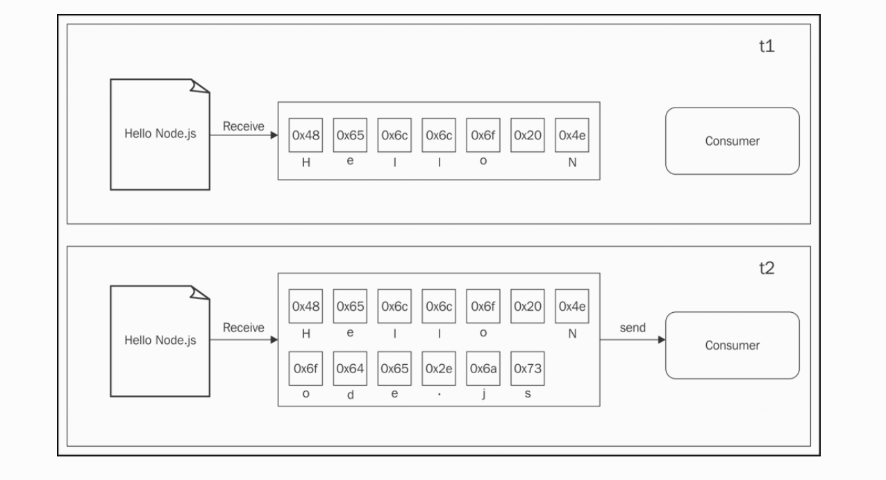
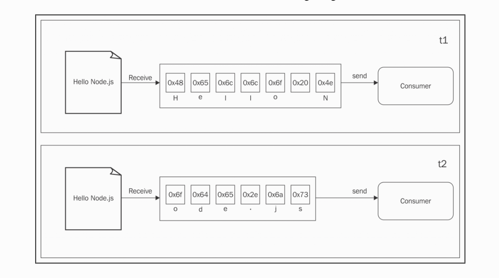
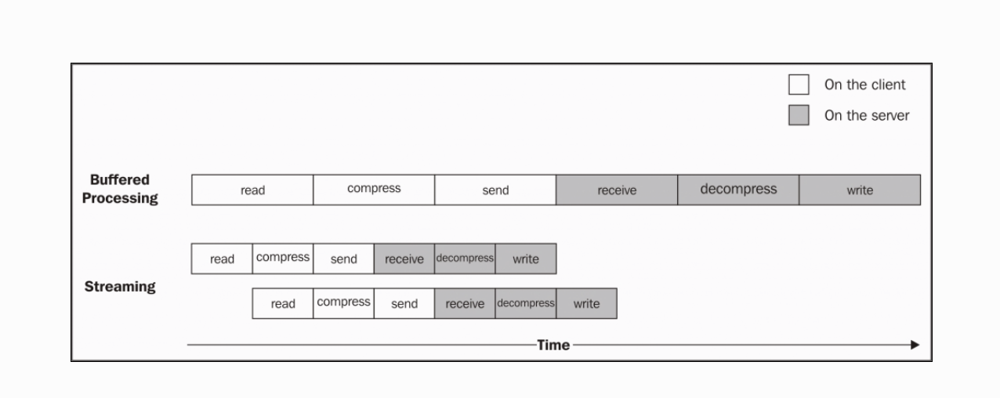
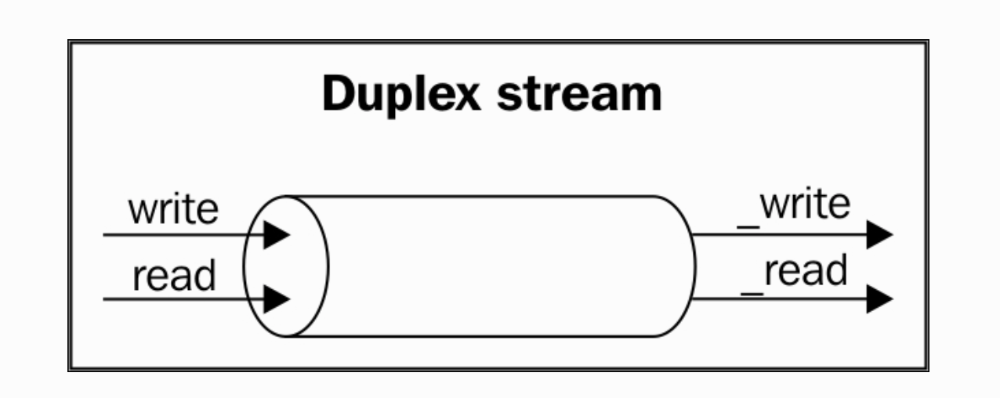
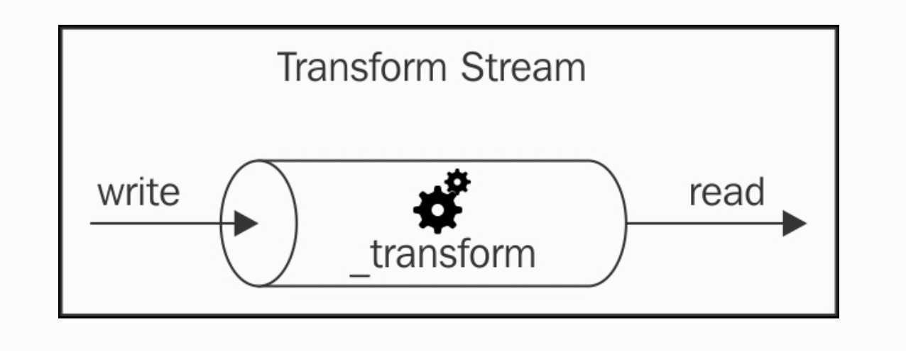
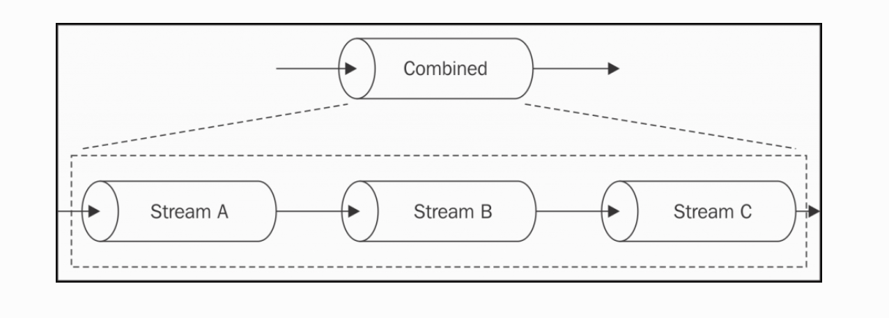
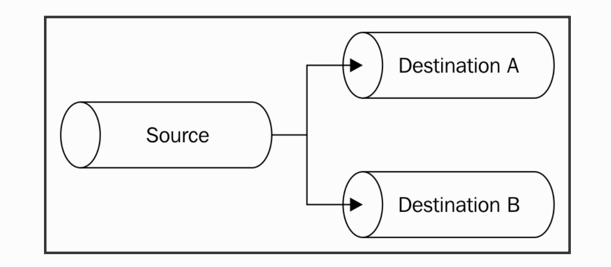
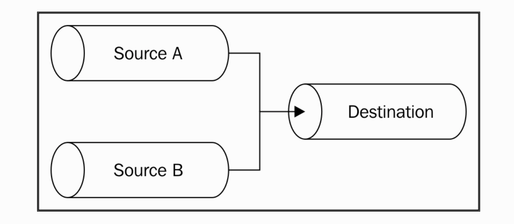
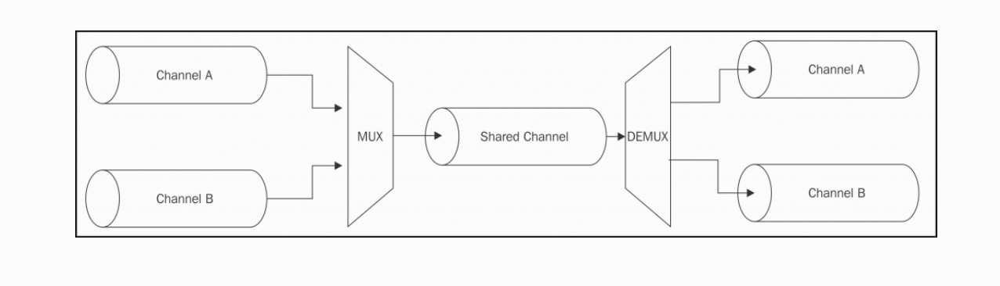
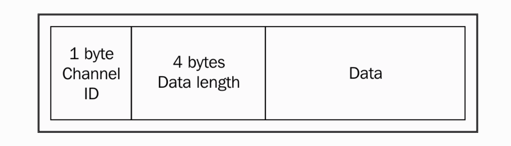

# Coding with Streams

流是 Node.js 中最重要的组件和模式。在社区中有一句格言： “流是一切！”，这就是流。有很多原因让流充满吸引力；这不仅是关于技术上的性能和效率，这更多的关乎到对 Node.js 哲学的优雅适配。

在本章，你将学到下面的主题：

* 为什么流在 Node.js 中如此重要
* 创建并使用流
* 流作为编程范例：不只在 I/O 中大放异彩
* 管道模式和连接流在不同的配置

## 走进流

在 Node.js 这类基于事件的平台中，流是最完美实时处理 I/O 操作的选择。

### buffering 对流

在本书内我们提到的额大部分异步 API 都使用了 buffer 模式。对于一个输入操作，buffer 模式中所有的数据都被转换为 buffer；当整个资源被读取时 buffer 被传入回掉。下面的图展示了这个过程：



在 t1 内，一些数据被资源所接收然后存入了 buffer。在 t2 内，另一些数据块被接收，直到读操作完成后所有的 buffer 被发送给了消费者。

从另一方面说，流允许我们在数据到达资源时立即对其进行操作。



每当有新的数据块被资源接收时，它就会立即提供给消费者，消费者也可以直接对其进行操作。

但是这两种实现有什么区别呢？主要有两个方面：

* 空间效率
* 时间效率

但是，Node.js 流有另一个最重要的优势：组合性。 我们来看看这到底是什么意思。

### 空间效率

首先，流允许我们做那些不可能的事情，一次处理 buffer 数据。例如当我们在读取一个特别大的文件时，成百上千兆的文件。当文件被完全被读取后返回一个 buffer 可不是个好主意，可以想象一下那些同时读取几个大文件的情况。我们的应用可以轻易被耗尽内存。而且在 V8 内 buffer 的大小被限制到 1GB 以内。

#### 使用 buffer API 来进行压缩

一个具体的例子，我们用命令行来压缩文件。使用 buffer API 来对文件进行 gzip：

````JavaScript
const fs = require('fs');
const zlib = require('zlib');

const file = process.argv[2];

fs.readFile(file, (err, buffer) => {
  zlib.gzip(buffer, (err, buffer) => {
    fs.writeFile(file + '.gz', buffer, err => {
      console.log('File successfully compressed');
    });
  });
});

````
现在我们可以这样来压缩文件

**node gzip <path to file>**

如果我们选择了一个大于 1GB 的文件，我们将接收到像下面这样的错误提示：

**RangeError: File size is greater than possible Buffer: 0x3FFFFFFF bytes**

这时就该让流出场了。

#### 使用流来进行压缩

````JavaScript
const fs = require('fs');
const zlib = require('zlib');
const file = process.argv[2];

fs.createReadStream(file)
  .pipe(zlib.createGzip())
  .pipe(fs.createWriteStream(file + '.gz'))
  .on('finish', () => console.log('File successfully compressed'));

````
很简单，对吧？

### 时间效率

假如现在有一个压缩好的文件需要上传到远程 HTTP 服务，然后对其进行解压缩保存，如果我们使用了 buffer API 的话，上传会等到文件被读取压缩完成后才开始，换句话说解压缩也需要所有数据被收到到时才开始。当使用流时就允许我们一边压缩一边上传文件，在服务器端也可以一边接收文件一边解压缩。我们这就来示范一下：

````JavaScript
// gzipReceive.js
const http = require('http');
const fs = require('fs');
const zlib = require('zlib');

const server = http.createServer((req, res) => {
  const filename = req.headers.filename;
  console.log('File request received: ' + filename);
  req.pipe(zlib.createGunzip())
      .pipe(fs.createWriteStream(filename))
      .on('finish', () => {
         res.writeHead(201, {'Content-Type': 'text/plain'});
         res.end('That's it）
         console.log(`File saved: ${filename}`);
      });
  });
  server.listen(3000, () => console.log('Listening'));


 // gzipSend.js
  const fs = require('fs');
  const zlib = require('zlib');
  const http = require('http');
  const path = require('path');
  const file = process.argv[2];
  const server = process.argv[3];

  const options = {
    hostname: server,
    port: 3000,
    path: '/',
    method: 'PUT',
    headers: {
      filename: path.basename(file),
      'Content-Type': 'application/octet-stream',
      'Content-Encoding': 'gzip'
    }
  };

  const req = http.request(options, res => {
    console.log('Server response: ' + res.statusCode);
  });

  fs.createReadStream(file)
    .pipe(zlib.createGzip())
    .pipe(req)
    .on('finish', () => {
      console.log('File successfully sent');
  });

````

我们来使用流处理这些文件 **node gzipReceive    node gzipSend <path to file> localhost**，下面的图例将解释一切：



1. 客户端读取文件
1. 客户端压缩数据
1. 客户端发送数据给服务端

1. 服务端接收数据
1. 服务端解压缩
1. 服务端写入数据

正如图示中看到的，使用 buffer 时所有的处理都是序列化的，使用了流以后我们可以实时接收数据块并对之操作，也不需要等待读取完所有数据，所有的操作都是平行执行的。因为所有的操作都是异步的。唯一的限制就是数据块的顺序必须保持一致。

### 组合性

我们来看另一个使用流的事例：

````JavaScript

const crypto = require('crypto');
// ...
fs.createReadStream(file)
  .pipe(zlib.createGzip())
  .pipe(crypto.createCipher('aes192', 'a_shared_secret'))
  .pipe(req)
  .on('finish', () => console.log('File succesfully sent'));

//server.js
const crypto = require('crypto');
// ...
const server = http.createServer((req, res) => {
  // ...
  req
    .pipe(crypto.createDecipher('aes192', 'a_shared_secret'))
    .pipe(zlib.createGunzip())
    .pipe(fs.createWriteStream(filename))
    .on('finish', () => { /* ... */ });
});

````
简简单单，我们为我们的应用加了一层加密层。

我们可以很轻松地处理我们的流，可以更好地实现模块化。


## 以流开始

在前面的章节里我们领略到了流的厉害，现在我们来看看细节。

### 流的解剖

每一个在 Node.js 中的流都由下面的四个抽象类实现

* stream.Readable
* stream.Writeable
* stream.Duplex
* stream.Transform

每一个流类也是 EventEmitter 的实例。流实际上也有一些事件： end、error。

另一个使流如此灵活的原因是流不仅可以处理二进制数据，也可以是任意 JavaScript 值，实际上它支持下面两种类型：

* Binary mode： 这个模式的数据可以是块就像是 buffer 或 字符串
* Object mode： 这个模式的流数据是分离的序列化对象

这两种操作模式允许我们不只在 I/O 操作中使用流，也可以在其它一些工具或功能上优雅的使用流。

### 可读流

可读流用于呈现数据；在 Node.js 中它用 stream 模块的 Readable 抽象类实现。

#### 在流中读取数据

这里有两种方法来接收可读流内的数据：non-flowing 和 flowing。接下来我们来看看。

##### non-flowing 模式

默认的可读流由一个监听 readable 事件的监听器组成。然后不停读取数据直到 buffer 为空。我们可以使用 read 方法，这个方法可以同步读取 buffer 并返回呈现数据块的 Buffer 或 String 对象。read 方法这样用 **readable.read([size])**。使用这个实现数据将从流内拉取到。

我们创建一个 readStdin.js

````JavaScript
process.stdin
  .on('readable', () => {
    let chunk;
    console.log('New data available');
    while((chunk = process.stdin.read()) !== null) {
      console.log(
        `Chunk read: (${chunk.length}) "${chunk.toString()}"`
      );
    }
  })
  .on('end', () => process.stdout.write('End of stream'));

````

read 方法是一个同步操作，它从可读流内拉取数据。如果流是二进制模式下的话返回的数据块是 Buffer 对象。

当数据存在时数据仅仅被 readable 监听器读取；当数据为空时 read 方法返回 null。这样我们不得不等待另一个 readable 事件启动，告诉我们流是否已经完成。当在二进制模式下我们用 size 值来确定数据量。这在网络协议或解析数据格式的时候特别有用。

我们运行 **cat <path to a file> | node readStdin**

##### flowing 模式

另一个读取流的方法是给数据附加监听器；这将切换流到 flowing 模式，这样 read 方法将不可拉取到数据，但我们可以在数据达到时便开始监听。

````JavaScript
process.stdin
  .on('data', chunk => {  
    console.log('New data available');  
    console.log(
      `Chunk read: (${chunk.length}) "${chunk.toString()}"`  
    );  
  })  
  .on('end', () => process.stdout.write('End of stream'));

````

flowing 模式继承了老版本的流接口，而且对流的控制没那么灵活。flowing 模式不是默认的模式，我们需要为数据附加一个监听器或者调用 resume 方法来开启 flowing 模式。为了暂时暂停数据的流，我们可以调用 pause 方法，这个方法可以捕获到任意缓存 buffer。

#### 实现可读流

现在我们知道了如何去读取流，下面我们就学习实现新的可读流。我们实现一个继承自 stream.Readable 的新类。流必须提供一个 _read 方法 **readable._read(size)**，而且使用 push 方法来填充内部 buffer **readable.push(chunk)**。

````JavaScript
//readomStream.js

const stream = require('stream');
const Chance = require('chance');

const chance = new Chance();

class RandomStream extends stream.Readable {
  constructor(options) {
    super(options);
  }

  _read(size) {
    const chunk = chance.string();                        //[1]
    console.log(`Pushing chunk of size: ${chunk.length}`);
    this.push(chunk, 'utf8');                             //[2]
    if(chance.bool({likelihood: 5})) {                    //[3]
      this.push(null);
    }
  }
}

module.exports = RandomStream;
````

我们使用了一个叫 chance 的模块，这个库可以生成序列化的随机值，数字、字符串、整句。

然后我们创建了一个叫 RandomStream 的新类，我们初始化了它的内部状态，options 参数包括下面的选项：

* encoding 参数被用于转换 Buffers 到 Strings，默认是 null
* 一个开启对象模式的标志， objectMode 默认为 false
* The upper limit of the data stored in the internal buffer, after which no more reading from the source should be done (highWaterMark defaults to 16KB)

好了，我们来解释一下 _read 方法

* 使用 chance 生成随机字符串的方法
* 它把字符串压入内部可读 buffer 内。注意因为我们压入的是字符串，所以我们指定了 utf8 编码。对二进制 Buffer 来说这不是必须的。
* 它有百分之五的几率随机终止流，通过压入 null 给内部 buffer 来终止。

我们可以在 _read 方法内看到 size 参数被忽略了，我们可以简单地把所有数据都压入，但是如果这里有多个 push 被调用的话，我们应该检查一下 push 方法返回 false，这样我们就可以终止数据压入了。

我们这就来实验一下：

````JavaScript
//generateRandom.js

const RandomStream = require('./randomStream');
const randomStream = new RandomStream();

randomStream.on('readable', () => {
  let chunk;
  while((chunk = randomStream.read()) !== null) {
    console.log(`Chunk received: ${chunk.toString()}`);
  }
});

````

### 可写流

一个可写流呈现了数据的目的地；在 Node.js 中，我们使用 Writable 抽象类实现可写流。

#### 写入流

把数据压入可写流内是一项简单的业务；我们只需要 write 方法 **writable.write(chunk, [encoding], [callback])**

encoding 参数是可选的，也可以指示块是否是 String （默认 utf8，如果块是 Buffer 的话这个参数可以被忽略）；callback 也是可选的，它在块被完全填充到资源后调用，也是可选的。

如果这里没有更多的数据需要写入流的话，我们需要使用 end() 方法： **writable.end([chunk], [encoding], [callback])**

我们通过 end 方法压入最后的数据块；这样的话， callback 函数相当于给写流注册了 finfish 事件。

我们来看看如何输出一个无序的序列化字符串：

````JavaScript
// entropyServer.js
const Chance = require('chance');
const chance = new Chance();

require('http').createServer((req, res) => {
  res.writeHead(200, {'Content-Type': 'text/plain'});        //[1]
  while(chance.bool({likelihood: 95})) {                     //[2]
    res.write(chance.string() + '\n');                       //[3]
  }
  res.end('\nThe end...\n');                                 //[4]
  res.on('finish', () => console.log('All data was sent'));  //[5]
}).listen(8080, () => console.log('Listening on http://localhost:8080'));

````

我们创建了一个写入 res 对象的写流：

1. 首先我们写入 HTTP 的响应。writeHead 方法是 http.ServerResponse 类的方法。
1. 有百分之五的几率终止写入
1. 在循环中，我们把字符串写入流内
1. 当循环结束后，我们调用了流上的 end 方法，来指示这里已没有更多的数据需要写入了。我们也提供了一个最后的字符串给可写流
1. 最后我们注册一个 finish 事件

我们启动 entropyServer.js，然后这样测试： **curl localhost:8080**

#### back-pressure

就像液体流在管道系统中一样，当数据的写入比流返回速度快时， Node.js 流就会出现瓶颈。处理这个问题的机制包括缓冲输入数据；但是如果流没有给写入任何反馈，我们将引入一种数据在内部 buffer 中增加，从而导致不需要的内存开销的情形。

为了防止这种情况的发生，在内部 buffer 超过水位线限制时 writable.write() 将返回 false。可写流有 highWaterMark 属性，这个属性限制了内部 buffer 的数量，这样可以指示应用来停止写入。当 buffer 为空时将触发 drain 事件并提示可写入。这种机制就是 back-pressure。

我们来示范一下这种情况：

````JavaScript
const Chance = require('chance');
const chance = new Chance();

require('http').createServer((req, res) => {
  res.writeHead(200, {'Content-Type': 'text/plain'});
  function generateMore() {                           //[1]
    while(chance.bool({likelihood: 95})) {
      let shouldContinue = res.write(
      chance.string({length: (16 * 1024) - 1})        //[2]
    );
      if(!shouldContinue) {                           //[3]
        console.log('Backpressure');
        return res.once('drain', generateMore);
      }
    }
    res.end('\nThe end...\n',() => console.log('All data was sent'));
  }
  generateMore();
}).listen(8080, () => console.log('Listening on http://localhost:8080'));

````

1. 我们先用 generateMore() 包装主逻辑
1. 增加触发 back-pressure 的几率，我们增加了数据块到 16KB-1 Byte，这和水位线限制很接近。
1. 写入数据块后，我们检查 res.write() 的返回值；如果我们接收到 false，这意味着 buffer 已经占满，我们应该停止发送数据。这样我们退出这个函数，并在 drain 事件触发时注册另一个写循环事件。

#### 实现可写流

我们通过继承 stream 的原型来实现一个新的可写流，这就是 _write() 方法。并规定可写流的格式：

````JavaScript
{
  path: <path to a file>
  content: <string or buffer>
}
````

对于每一个这样的对象，我们的流需要保存数据到输入的文件路径下。我们可以看到流将是对象：

````JavaScript
// ToFileStream.js
const stream = require('stream');
const fs = require('fs');
const path = require('path');
const mkdirp = require('mkdirp');

class ToFileStream extends stream.Writable {
  constructor() {
    super({objectMode: true});
  }
  _write (chunk, encoding, callback) {
     mkdirp(path.dirname(chunk.path), err => {
       if (err) {
         return callback(err);
       }
       fs.writeFile(chunk.path, chunk.content, callback);
     });
   }
 }
 module.exports = ToFileStream;

````

首先我们载入所有的依赖。我们创建一个继承自 stream.Writable 的新类，并在 constructor 内对其初始化，其它被 stream.Writable 接收的选项有：

* highWaterMark(默认是 16KB)：它控制着 back-pressure 限制
* decodeStrings(默认是 true)：这将在 _write() 方法前开启自动解码字符串到二进制。这个选项在对象模式下被忽略。

最后，我们实现了 _write() 方法。这个方法接收数据块，encoding（这个选项只在二进制模式和 decodeStrings 为 false是有意义）。当然这个方法还接收一个回掉函数，这个函数在操作完成时调用。如果有可能，我们依然可以传入一个 error 事件。

我们来创建一个新的模块：

````JavaScript
// writeToFile.js
const ToFileStream = require('./toFileStream.js');
const tfs = new ToFileStream();

tfs.write({path: "file1.txt", content: "Hello"});
tfs.write({path: "file2.txt", content: "Node.js"});
tfs.write({path: "file3.txt", content: "Streams"});
tfs.end(() => console.log("All files created"));

````
这样我们就实践了我们创建的第一个可写流。

### 双工流

一个双工流指的是既可写又可读的流。在我们像描述一个既是数据源又是数据目的地的时候很有用。双工流继承了 stream.Readable 和 stream.Writable 的方法。这样的流既可读又可写。

来创建一个自定义的双工流，我们需要提供 _write 和 _read 方法；在 options 对象内提供给 Duplex() 的构造器和前面的可读和可写构造器一样。另一个新属性是 allowHalfOpen（默认 true），如果设为 false 后两方面的流将停止。

### 转换流

转换流是一种被用于转换数据的特殊双工流。

在简单双工流内，可读流和可写流间没有什么关系。想想 TCP 插口每次发送和接收数据时的情形；这个插口意识不到输入与输出的关系：



另一方面，Transform 流对每一块从可写端接收的数据都运用了转换，然后提供给了可读端



在外面看，转换流就像是双工流一样。但是当我们想构建一个双工流时我们必须提供 _write() 和 _read() 方法，为了实现转换流我们需要实现另外两个方法 _transform() 和 _flush() 方法。

#### 实现转换流

````JavaScript
//replaceStream.js
const stream = require('stream');
const util = require('util');

class ReplaceStream extends stream.Transform {
  constructor(searchString, replaceString) {
    super();
    this.searchString = searchString;
    this.replaceString = replaceString;
    this.tailPiece = '';
  }

  _transform(chunk, encoding, callback) {
    const pieces = (this.tailPiece + chunk)                   //[1]
      .split(this.searchString);
    const lastPiece = pieces[pieces.length - 1];
    const tailPieceLen = this.searchString.length - 1;

    this.tailPiece = lastPiece.slice(-tailPieceLen);          //[2]
    pieces[pieces.length - 1] = lastPiece.slice(0,-tailPieceLen);

    this.push(pieces.join(this.replaceString));               //[3]
    callback();
  }
  _flush(callback) {
    this.push(this.tailPiece);
    callback();
  }
}

module.exports = ReplaceStream;


// replaceStreamTest.js
const ReplaceStream = require('./replaceStream');

const rs = new ReplaceStream('World', 'Node.js');
rs.on('data', chunk => console.log(chunk.toString()));

rs.write('Hello W');
rs.write('orld!');
rs.end();

//outputs:
//Hel
//lo Node.js
//!
//试验转换流
````
我们来创建一个扩展自 stream.Transform 基类的新类。这个构造器接收两个参数：searchString 和 replaceString。用法就如它们的名字说明的。

我们来分析一下 _transform() 方法，这是新类的核心。这个方法和可写流中的 _write() 时一致的，但是它并未直接写入文件它只是把数据压入到内部 buffer。

ReplaceStream 的 _transfrom 方法是我们的核心算法。在 buffer 内搜索替换字符串很简单；但是在流内这会在多个数据块内分发。解释一下：

1. 我们使用 searchString 方法来分割数据块。
1. 然后，拿到数组最后的块保存到 tailPiece 变量，它将被添加到下一个数据块的前面
1. 最后所有 spilt() 后的块被压入内部 buffer

当流结束时，我们可能还有最后 tailPiece 变量而非压入内部 buffer。这就是 _flush() 函数做的；它在流结束前被调用，这是我们在流结束前处理流的最后机会。

_flush() 方法只在回掉内调用，这样可以保证在流终止前被调用。


### 使用 pipes 连接流

Unixs 的管道概念来自 Douglas Mcllroy；这可以让一个程序的输出连接到另一个程序的输入。看下下面的命令行：

**echo Hello World! | sed s/World/Node.js/g**

在前面的命令行中，echo 将写入 Hello World！到标准输出，然后重定向 sed 命令到标准输入；sed 替换了任何存在的 World。

在 Node.js 中我们可以这样使用 pipe() 方法：

**readable.pipe(writable, [options])**

直觉上，pipe() 方法以从 readable 流中抽取数据然后提供给 writable 流。当可读流触发 end 事件时可写流也自动 end，除非我们在 options 中设置了 {end: false}。pipe() 方法把
把可写流以参数的形式传递，这样就允许我们在流是可读时进行串联调用（像是双工流和转换流）。

管道把两个流汇集到一起并创建一个汇总数据到可写流，这里没有 read 和 write 方法，最重要的是这里不需要处理任何 back-pressure，因为它自动处理。

我们可以创建一个简单的模块来演示一下：

````JavaScript
// replace.js

const ReplaceStream = require('./replaceStream');
process.stdin
  .pipe(new ReplaceStream(process.argv[2], process.argv[3]))
  .pipe(process.stdout);

````

**echo Hello World! | node replace World Node.js** 这样操作，并且返回 **Hello Node.js**

这个事例演示了流是一个普遍的接口，它可以连接接通几乎所有的接口。

#### 与流工作

目前我们创建流的方式不太 Node.js 的风格；实际上，继承流的基类违反了小表面积原则而且需要一些模版代码。不是说流的设计有问题，而是 Node.js 的核心应该保持精简便于用户扩展。

但是在大多数情况下，我们不需要原型上的所有功能，我们只需要快捷地实现自己所需的部分而已。Node.js 社区当然为此提供了一个解决方案。一个完美的方案就是 [through2](https://npmjs.org/package/through2), 它简化了转化流的创建工作，我们仅仅这样就可以创建一个转换流：

**const transform = through2([options], [_transform], [_flush])**

相同的[from2](https://npmjs.org/package/from2) 允许我们我们简便地创建一个可读流：

**const readable = from2([options], _read)**

## 流与异步控制流程

流不仅仅对处理 I/O 很有用，而且也是一种处理数据的优雅编程模式。它的有点不仅仅体现在表面上而且在异步控制流程上也又重要体现。

### 序列执行

默认状态下，流是序列处理数据的，转换流的 _transform 函数在前一个调用成功前不会在下一个数据块上被调用。这是流很重要的一点，以正确的顺序来处理每个数据块很关键，但是把流用在处理控制流程上依然是一种优雅的选择。

来点代码你就明白了：

````JavaScript
// concatFiles.js

const fromArray = require('from2-array');
const through = require('through2');
const fs = require('fs');


function concatFiles(destination, files, callback) {
  const destStream = fs.createWriteStream(destination);
  fromArray.obj(files)                         //[1]
    .pipe(through.obj((file, enc, done) => {   //[2]
      const src = fs.createReadStream(file);
      src.pipe(destStream, {end: false});
      src.on('end', done)                      //[3]
    }))
    .on('finish', () => {                      //[4]
      destStream.end();  
      callback();
    });
}
module.exports = concatFiles;


// concat.js
const concatFiles = require('./concatFiles');
concatFiles(process.argv[2], process.argv.slice(3), () => {
  console.log('Files concatenated successfully');
});

````

这个处理函数实现了通过转换为流来序列遍历文件数组

1. 首先我们我使用了 from2-array 来创建可读流
1. 然后，我们创建了 through(Transfrom) 流处理每一个在序列内的文件。对于每一个文件，我们创建了一个可读流然后把它接到 destStream 上，并监听它不会在文件完成读取时被关闭。
1. 当所有源文件的内容被倒入了 destStream 里，我们就调用 done 函数。
1. 当所有文件被处理完毕后， finish 事件被触发；我们节结束 destStream 并调用回掉函数。

**node concatallTogether.txt file1.txt file2.txt**

这样就创建了 allTogether.txt 容器，并包含了 file1.txt 和 file2.txt。

有了 concatFile 函数我们可以使用流来拥有异步序列遍历器。

### 无序平行执行

我们刚见识了用流来序列化处理每个数据块，但是在大多数情况下这将成为并发的瓶颈。当我们为每个数据块都启动一个慢速的异步操作时，平行执行将加速整体处理速度。这样当每个数据块没有关联时我们就可以采用平行执行了。

#### 实现无序平行流

````JavaScript
// parallelStream.js

const stream = require('stream');

class ParallelStream extends stream.Transform {
  constructor(userTransform) {
    super({objectMode: true});
    this.userTransform = userTransform;
    this.running = 0;
    this.terminateCallback = null;
  }

  _transform(chunk, enc, done) {
    this.running++;
    this.userTransform(chunk, enc, this.push.bind(this),
    this._onComplete.bind(this));
    done();
  }

  _flush(done) {
    if(this.running> 0) {
      this.terminateCallback = done;
    } else {
      done();
    }
  }

  _onComplete(err) {
    this.running--;
    if(err) {
      return this.emit('error', err);
    }
    if(this.running === 0) {
      this.terminateCallback && this.terminateCallback();
    }
  }

}

module.exports = ParallelStream;

````

如你所见，构造器函数接受一个 userTransform 函数，它将保存实例变量；我们依旧父类的构造器函数且为了方便开启了对象模式。

然后在 _transform 方法内调用了 userTransform 函数，然后增加了运行中的任务数；最后我们注意到当前的转换任务通过 done 函数调用来完成。这是个触发处理另外一个任务小技巧；我们不再等待 userTransform  函数在 done 函数调用前完成；相反地，我们立即完成了它。换句话说，我们给 userTransform 函数提供了一个特别的回掉 this._onComplete 方法；这允许我们在 userTransform 执行完毕时获取通知。

_flush 方法在流终止前被调用，所以如果这里依然有任务在运行时我们可以通过不调用 done 方法来搁置 finish 事件的释放；相反地，我们把它赋给 this.terminateCallback 变量。为了明白流如何被适时地终止，我们需要看看 _onComplete 方法。这个方法会检查这里是否还有其它在运行的任务，如果没了就直接调用 this.terminateCallback 函数，这会终止流并释放在 _flush 方法内的 finish 事件。


ParallelStream 类允许我们简单创建一个可平行启动任务的转换流，但这里有一个警告：他不会保护任务到达的顺序。实际上，异步操作可能随时完成。所以这在处理数据顺序很重要的二进制流时不太好，但是在处理一个对象流时却很有用。

#### 实现一个 URL 状态监控应用

现在我们把平行流应用到实例上。假设我们需要构建一个简单的服务来监控一系列 URL 变化。假设所有的 URl 都在一个单独的文件内。

流可以非常有效且优雅地解决这个问题。尤其好似我们使用我们的 ParallelStream 来平行处理这些 URL。

````JavaScript
// checkUrls.js

const fs = require('fs');
const split = require('split');
const request = require('request');
const ParallelStream = require('./parallelStream');

fs.createReadStream(process.argv[2])                       //[1]
  .pipe(split())                                           //[2]
  .pipe(new ParallelStream((url, enc, push, done) => {     //[3]
    if(!url) return done();
      request.head(url, (err, response) => {
          push(url + ' is ' + (err ? 'down' : 'up') + '\n');
          done();
        });
      }))
      .pipe(fs.createWriteStream('results.txt'))   //[4]
      .on('finish', () => console.log('All urls were checked'));

````

1. 首先我们为输入的文件创建了一个可读流。
1. 我们通过 [split](https://npmjs.org/package/split) 获取内容，一个转换流来确保输出每行到一个不同的块上。
1. 然后使用我们的 ParallelStream 来检查 URl。通过请求每个 url 获取的响应完成检查。当回掉被调用时，我们把操作结果推到流内。
1. 最后，所有的结果被导入到 results.txt 文件内。

**node checkUrls urlList.txt** 启动执行。

urlList.txt 包含如下一个 URls：

*http://www.mariocasciaro.me
*http://loige.co
*http://thiswillbedownforsure.com

当命令行结束运行，我们将看到我们创建的 results.txt ：

*http://thiswillbedownforsure.com is down
*http://loige.co is up
*http://www.mariocasciaro.me is up

内容中的 url 顺序已经发生了变化，因为在平行流内无法确认数据块的顺序。

## 限制数量的无序平行执行

如果我们对一个包含了成千上万 URls 的文件执行 checkUrls 函数，一定会遇到麻烦。我们的一次性创建了太多数量的连接了。平行发送大量数据会潜在破坏程序的稳定性与系统的可用性。如我们所知我们最好限制同时加载的任务的数量。

我们创建 limitedParallelStream.js 模块来适配在前面创建的 parallelStream.js。

````JavaScript
//limitedParallelStream.js
class LimitedParallelStream extends stream.Transform {
    constructor(concurrency, userTransform) {
      super({objectMode: true});
      this.concurrency = concurrency;
      this.userTransform = userTransform;
      this.running = 0;
      this.terminateCallback = null;
      this.continueCallback = null;
    }
    _transform(chunk, enc, done) {
      this.running++;
      this.userTransform(chunk, enc, this._onComplete.bind(this));
      if(this.running < this.concurrency) {
        done();
      } else {
        this.continueCallback = done;
         }
      }
    _onComplete(err) {
      this.running--;
      if(err) {
        return this.emit('error', err);
      }
      const tmpCallback = this.continueCallback;
      this.continueCallback = null;
      tmpCallback && tmpCallback();
      if(this.running === 0) {
        this.terminateCallback && this.terminateCallback();
      }
    }  

````

我们需要 concurrency 来限制数量，而且这次我们有两个回掉，一个用来 pending _transform 方法(continueCallback)，另一个是 _flush 方法的(terminateCallback)。

_transform 方法中我们必须检查在 done 函数前这里是否有运行中的任务而且还触发了对下一个项目的处理。如果我们已经达到了流运行的最大并发数量，我们可以简单地保存 done 回掉给 continueCallback 变量，这样就可以在任务结束时被调用了。

_flush 方法依然和 ParallelStream 类的一致。

每次任务完成我们就会调用 continueCallback 函数来释放流并触发对下一个项目的执行。

### 有序平行执行

在我们前面创建的平行流内，数据的顺序可能是无序的。有时我们需要有序的数据。现在我们可以运行平行转换函数；我们需要做的是对每一个发出的数据排序然后再对接收的数据进行相应的排序。

这个技术会当每个运行任务发出时调用 buffer 来重排数据块。为了简便我们使用一个包来实现这个功能 [through2-parallel](https://npmjs.org/package/through2-parallel)。

我们可以通过修改 checkUrls 模块来实现：

````JavaScript
// through2-parallel

//...
const throughParallel = require('through2-parallel');

fs.createReadStream(process.argv[2])
  .pipe(split())
  .pipe(throughParallel.obj({concurrency: 2},(url, enc, done) => {
      //...
    })
  )
  .pipe(fs.createWriteStream('results.txt'))
  .on('finish', () => console.log('All urls were checked'));

````

正如我们所见， through2-parallel 的接口和 through2 的接口很像；唯一的区别就是我们可以设置并发的数量。如果我们运行这个新版本的 checkUrls 将会看到 results.txt 内的项目顺序和输入文件内的项目顺序一致。

## 管道模式

在一个实时管道系统中， Node.js 流也可以把不同的模式接到一起；实际上我们可以把两个不同的流接成一个，或者把一个流分割成几个，甚至根据条件来控制流的导向。在本节，我们将探索 Node.js  流中最重要的管道系统技术。

### 组合流

在本节内我们一直都在强调流提供了简单的基础设置来模块化或重用我们的代码，但是这里留下了一块最重要的知识点：如果我们想模块化并重用整个管道会怎样呢？如果我们把多个流结合起来会发生什么呢？



从图可知：

*当我们对一个组合流进行写入时，我们只是写入了管道内的第一个流
*当我们从一个组合流内读取数据时，我们实际上读取的时管道内的最后一个流

组合流通常是一个双工流，它被用来连接第一个流到可写的一边，连接最后的流到可读的一边。

实际上关于组合流最重要的特性是它可以捕获整条管道内由任意流发出的错误。正如我们已经说过的任意错误不会自动接到管道中；所以如果我们需要合适的错误管理器，我们必须明确地为每一个流附加错误监听器。但是如果一个组合流是一个黑盒一样的话，我是是说我们无法获取到任何中间的流的话，那么让组合流在管道内累计所有错误将会至关重要。

总结一下，组合流有两个主要的优势：

*我们可以通过隐藏它的内部管道来重新分配它
*我们有了简化的错误管理器，我们不必为每个流附件错误监听器只需要附加给组合流本身即可

组合流是一项普遍的技术，有很多现成的解决方案想 [multipipe](https://www.npmjs.org/package/multipipe) 或者 [combine-stream](https://www.npmjs.org/package/combine-stream)。

#### 实现一个组合流

为了说明一个简单的例子，我们考虑下下面的转换流：

* 两个压缩并加密的数据
* 两个解密并解压缩的数据

使用类似 multipipe 的库我们可以简单地构建这些流：

````JavaScript
// combinedStreams.js

const zlib = require('zlib');
const crypto = require('crypto');
const combine = require('multipipe');

module.exports.compressAndEncrypt = password => {
  return combine(
    zlib.createGzip(),
    crypto.createCipher('aes192', password)
  );
};

module.exports.decryptAndDecompress = password => {
  return combine(
    crypto.createDecipher('aes192', password),
    zlib.createGunzip()
  );
};

````

现在我们可以像黑盒一样使用这些组合流，例如创建一个压缩加密的文件：

````JavaScript
//archive.js
const fs = require('fs');
const compressAndEncryptStream =  require('./combinedStreams').compressAndEncrypt;

fs.createReadStream(process.argv[3])
  .pipe(compressAndEncryptStream(process.argv[2]))
  .pipe(fs.createWriteStream(process.argv[3] + ".gz.enc"));

````

我们可以通过组合流来提升这些处理代码，这次不是用于可用性只是为了处理错误。因为正如我们以前说过很多遍的，流只会捕获最后一个流发出的错误：

````JavaScript
fs.createReadStream(process.argv[3])
  .pipe(compressAndEncryptStream(process.argv[2]))
  .pipe(fs.createWriteStream(process.argv[3] + ".gz.enc"))
  .on('error', err => {
    //Only errors from the last stream
    console.log(err);
  });

````

但是通过组合流我们可以修复这个问题：

````JavaScript
//archive.js
const combine = require('multipipe');
const fs = require('fs');
const compressAndEncryptStream = require('./combinedStreams').compressAndEncrypt;

combine(
  fs.createReadStream(process.argv[3])
  .pipe(compressAndEncryptStream(process.argv[2]))
  .pipe(fs.createWriteStream(process.argv[3] + ".gz.enc"))
).on('error', err => {
  //this error may come from any stream in the pipeline
  console.log(err);
});

````
正如我们所见：运用组合流可以捕获到管道内所有流的错误。这样运行程序 **node archive mypassword/path/to/a/file.txt**

这个事例清晰地示意了组合流的重要性；一方面来说它允许我们创建可重用的流组合，另一方面来说它简化了管道内的错误处理。

### 分叉流

我们可以通过把一个可读流导成几个可写流来实现分叉流。在我们想把同一个数据发送道不同的地方时这很有用，例如两个不同的插口或文件。也可以在同一数据上进行不同的转换，或者当我们想基于同样的标准来分割数据。



#### 实现一个多重校验生成器

我们来创建一个输出给定文件的 sha1 和 md5 的工具：

````JavaScript
// generateHashes.js
const fs = require('fs');
const crypto = require('crypto');

const sha1Stream = crypto.createHash('sha1');
sha1Stream.setEncoding('base64');

const md5Stream = crypto.createHash('md5');
md5Stream.setEncoding('base64');

const inputFile = process.argv[2];
const inputStream = fs.createReadStream(inputFile);
inputStream
  .pipe(sha1Stream)
  .pipe(fs.createWriteStream(inputFile + '.sha1'));

inputStream
  .pipe(md5Stream)
  .pipe(fs.createWriteStream(inputFile + '.md5'));
````

很简单对吧？但依然有一些点指的注意：

*sha1Stream 和 md5Stream 将在 inputStream 结束时自动终止，除非在调用 pipe 方法时指定 {end: false}
*两个分叉将接收相同的数据块，所以我们在对数据执行副作用操作时必须非常小心，因为这将影响到每个分叉的流
*Back-pressure 将开箱即用；inputStream 流的速度取决于最慢的分叉流

## 合并流

合并流是分叉流的反向实现，它连接一组可读流到一个可写流内：



合并多个流到一个是一个普遍简单的操作；但是，我们必须对 end 事件重点处理，因为管道使用的 auto end 选项将会因为其中一个流的结束而导致最终的流提前结束。这经常导致错误的产生，因为其它活跃的资源将持续写入已经终止的流。我们需要在导入多个资源到最终流时设置 {end: false} 来解决这个问题，然后再调用 end 函数。

### 从多个目录创建一个压缩包

我们来实现一个压缩两个目录内容的压缩包小程序，首先先介绍两个包：
* [tar](https://npmjs.org/package/tar)：一个创建压缩包的流类型包
* [fstream](https://npmjs.org/package/fstream)：一个从文件系统中创建对象流的库

````JavaScript
// mergeTar.js
const tar = require('tar');
const fstream = require('fstream');
const path = require('path');

const destination = path.resolve(process.argv[2]);
const sourceA = path.resolve(process.argv[3]);
const sourceB = path.resolve(process.argv[4]);

const pack = tar.Pack();
pack.pipe(fstream.Writer(destination));


let endCount = 0;
function onEnd() {
 if(++endCount === 2) {
   pack.end();
 }
}

const sourceStreamA = fstream.Reader({type: "Directory", path: sourceA})
 .on('end', onEnd);
const sourceStreamB = fstream.Reader({type: "Directory", path: sourceB})
 .on('end', onEnd);

sourceStreamA.pipe(pack, {end: false});
sourceStreamB.pipe(pack, {end: false});


````

在前面的代码中，我们创建了读取两个源目录的流；然后为每个流附加了 end 监听器，它们将在两个文件读取完毕后终止 pack 流。

我们导入两个源到 pack 流，并设置了 {end: false} 给两个 pipe 调用。

这样我们就实现了一个简单的压缩工具。这样使用： **node mergeTar /path/to/sourceA /path/to/sourceB **

总结一下，值得一提的是这里有很多包会简化合并流：

* [merge-stream](https://npmjs.org/package/merge-stream)
* [multistream-merge](https://npmjs.org/package/multistream-merge)

对于可并流还有一点是，数据倒进最终流是随机混合的；这对一些对象类型的流来说是可接收的但对一些二进制流来说是不需要的副作用。

但是这里有一种变种的模式允许我们有序的合并流；它会一个一个来消费流，当前一个流结束，下一个流就会发出块（类似于把流串联起来）。

## 多路传输与解多路传输

这里有一个关于合并流特别的变体如图：



合并多个流为一体（channels）并以单个流的形式来传播叫做多路传输，对对于这种情况的反操作就叫作解多路传输。对这两种操作的设备叫作多路复用器（mux）和解多路复用器（demux）。这是个在计算机科学和电信学科中广泛的概念，因为他几乎是任何类型传输媒体的基础，像电话、广播、电视、当然还有因特网。内容有限我们不进行深入的了解了，这是个非常庞大的话题。

### 构建远程记录仪

我们来个实例解释一下。我们现在需要开始一个子进程来重定向标准输出和标准错误到远程服务器上，这将把两个流导进两个文件中。所以这在里我们需要共享一个 TCP 连接，因为两个 channel（stdout 和 stderr） 将被多路传输。我们将用到一种叫分组交换的技术，相同的技术也用在 IP、TCP、UDP 协议上。由数据包装进 packet 允许我们指定许多元数据、有用的多路传输、路由、管理流，检测问题数据等。我们将要实现的例子非常极简；实际上我们将简化包装我们的数据到 packet：



就像上图显示的，一个 packet 包含有一些基础数据，也包含有头部（Channel ID + Data 长度），这将用于区分每个流的数据并使多路传输路由到正确的 channel。

#### 客户端 - 多路复用

我们来实现我们应用的客户端部分。

````JavaScript
// client.js
const child_process = require('child_process');
const net = require('net');

function multiplexChannels(sources, destination) {
  let totalChannels = sources.length;
  for(let i = 0; i <sources.length; i++) {
    sources[i]
      .on('readable', function() {                           //[1]
        let chunk;
        while((chunk = this.read()) !== null) {
          const outBuff = new Buffer(1 + 4 + chunk.length);  //[2]
          outBuff.writeUInt8(i, 0);        
          outBuff.writeUInt32BE(chunk.length, 1);
          chunk.copy(outBuff, 5);
          console.log('Sending packet to channel: ' + i);
          destination.write(outBuff);                        //[3]
        }
      }
      .on('end', () => {                                     //[4]
        if(--totalChannels === 0) {
           destination.end();
        }
      });
  }
}

const socket = net.connect(3000, () => {                    //[1]
  const child = child_process.fork(                         //[2]
  process.argv[2],
  process.argv.slice(3),
    {silent: true}
  );
  multiplexChannels([child.stdout, child.stderr], socket);  //[3]
});


````

multiplexChannels 函数以输入作为源流和目的 channel 并被多路传输，然后执行下面的步骤：

1. 对每个事件流它注册了 readable 事件，这个事件中我们使用非流模式来读取数据。
1. 当数据块被读取时，我们把它序列包装进 packet： 为 channel ID 指定 1 byte（UInt8）， 4 byte （UInt32BE） 的 packet 体积，还有具体数据。
1. 当 packet 准备好时，我们把它写入目的流。
1. 最后，当所有源流都结束时我们注册一个 end 事件来终止目的流。

在最后的操作里：

1. 我们创建一个新的 TCP 客户端来连接 localhost：3000。
1. 我们以第一个命令行参数作为路径来开始子进程，我们指定了 {silent: true} 来使子进程不进程父类的 stdout 和 stderr。
1. 最后，我们用 multiplexChannels 函数把 stdout 和 stderr 并多路传输进插口。


#### 服务端 - 解多路传输

现在我们来看看服务端：


````JavaScript
// server.js

const net = require('net');
const fs = require('fs');

function demultiplexChannel(source, destinations) {
  let currentChannel = null;
  let currentLength = null;

  source
    .on('readable', () => {                                      //[1]
      let chunk;
      if(currentChannel === null) {                              //[2]
        chunk = source.read(1);
        currentChannel = chunk && chunk.readUInt8(0);
      }

      if(currentLength === null) {                               //[3]
        chunk = source.read(4);
        currentLength = chunk && chunk.readUInt32BE(0);
        if(currentLength === null) {
          return;
        }
      }

    chunk = source.read(currentLength);                         //[4]
    if(chunk === null) {
      return;
    }
    console.log('Received packet from: ' + “currentChannel);
    destinations[currentChannel].write(chunk);                  //[5]
    currentChannel = null;
    currentLength = null;
  })
  .on('end', ()=> {                                             //[6]
    destinations.forEach(destination => destination.end());
    console.log('Source channel closed');
  });
}

net.createServer(socket => {
  const stdoutStream = fs.createWriteStream('stdout.log');
  const stderrStream = fs.createWriteStream('stderr.log');  
  demultiplexChannel(socket, [stdoutStream, stderrStream]);
}).listen(3000, () => console.log('Server started'));


````

下面的处理代码看起来有点复杂其实不是的；由于 Node.js 可读流的拉特性，我们可以简单地实现解多路传输：

1. 我们以 non-flowing 模式读取流。
1. 首先，如果还没有读取到 channel ID，就尝试读取 1 byte 的流数据然后把它们转换到一个数字。
1. 下一步就是读取数据的长度。我们需要 4 byte，但在内部的 buffer 内可能没有足够的数据，这会使 this.read() 调用返回 null。如果那样，我们简单地打断解析并在 readable 事件内重试。
1. 当我们最终读取到数据大小时，我们知道有多少数据在内部 buffer 中，所以我们试着读取全部。
1. 当我们读取所有数据时，我们可以写入到正确的目标 channel，确认重置 currentChannel 和 currentLength 变量（这将用于解析下一个 packet）。
1. 最后，当源 channel 结束时目的 channel 也将结束。


最后我们解多路传输。在处理代码内，首先开始一个 TCP 服务，然后对于每个连接创建两个只想两个不同文件的可写流，一个用于标准输出，另一个用于标准错误；这就是我们的目的 channel。最后，我们使用 demultiplexChannel 函数来解多路传输插口流到 stdoutStream 和  stderrStream。

#### 启动
