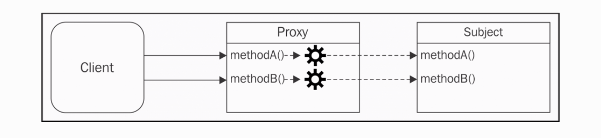
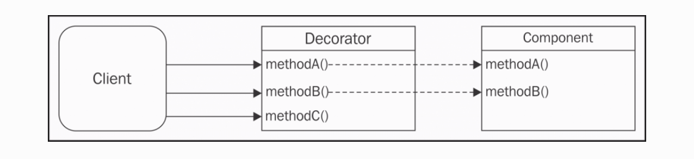

# Chapter 6. Design Patterns

设计模式是解决一个复现问题的可重用方案；定义的很宽它会跨越一个应用的多个领域。但是它经常会和一系列众所周知的面向对象模式产生关联。有本叫《Design Patterns: Elements of Reusable Object-Oriented Software, Pearson Education》的书在九十年代就很出名，它由赫赫有名的四人帮（GoF）所作：Erich Gamma, Richard Helm, Ralph Johnson, 和 John Vlissides。我们将经常提及一些传统的设计模式，或者是 GoF 设计模式。

在 JavaScript 中一系列面向对象设计模式不像经典的面向对象那样直接正式。正如我们所知的，JavaScript 是一门多范式面向对象基于原型拥有动态类型的语言；它把函数作为第一类公民，允许函数式编程。这些特性使 JavaScript 变得十分灵活，它赋给开发者强大的能力的同时也带来了破碎的编程风格、约定、技术，以及最终的生态模式。在 JavaScript 中有太多的办法来完成一件事。一个明显的佐证就是 JavaScript 中大量的框架库；也许其它语言都不曾有过这么多，特别是 Node.js 的出现更给 JavaScript 带来了全新的可能性。

在这种环境下，传统的设计模式也被 JavaScript 所影响。这里有很多方法也可由传统的设计模式所实现。在一些事例中，它们甚至不太可能，因为 JavaScript 不有真正的类或抽象接口。但每个设计模式原本的出发点和解决问题的关键概念没有变化。

在本章，我们将探索一些应用到 Node.js 和它设计哲学中的最重要的 GoF 设计模式，从而从另一个角度重新看待它们的重要性。在这些传统的设计模式中，我们也会找到一些因为 JavaScript 生态而没那么“传统”的设计模式。

我们将在本章探索一下设计模式：

* 工厂
* 揭露构造器
* 代理
* 装饰者
* 适配器
* 策略
* 状态
* 模版
* 中间件
* 命令

## 工厂

我们以可能在 Node.js 中最普遍最简单的设计模式开始： 工厂模式。

### 一个创建对象的通用接口

我们已经知道在 JavaScript 中函数式范例是纯面向对象的首选。因为它简约，可用，较小的表面积。尤其是在创建一个新对象实例时。实际上，通过调用工厂而不是直接在原型上使用 new 和 Object.create 来创建一个新对象是如此的方便和灵活，原因有几点：

首先，工厂可以让我们分离对象的创建和实现；工厂本质上包装了给我们更可控更灵活的一个新实例。在工厂内部，我们可以借助闭包、原型、new、Object.create() ，甚至基于特定的条件来返回一个不同的实例而创建一个新的实例。对工厂的消费者来说如何创建一个实例完全是不可知的。真相是通过 new 关键字我们把我们的代码绑定到一个指定的对象上，因为在 JavaScript 中我们可以很灵活，甚至可以说是自由。我们来看一个创建 Image 对象的例子：

````JavaScript
function createImage(name){
  return new Image(name)
}

const image = createImage('photo.jpg')
````

createImage 工厂看起来完全多此一举；为什么不直接用 new 操作符创建一个 Image 对象呢？就像下面这样：

````JavaScript
const image = new Image(name)
````

正如我们前面提及的，使用 new 绑定我们的代码到一个特别类型的的对象上；拿前面的例子说指 Image 对象类型。因为一个工厂拥有更多的灵活性；假设我们想去重构 Image 类，把它分割成更小的类，支持每一个图片格式。如果我们我们只暴露一个工厂来创建新的图片，我们可以这样做：

````JavaScript
function createImage(name) {
  if(name.match(/\.jpeg$/)) {
    return new JpegImage(name);
  } else if(name.match(/\.gif$/)) {
    return new GifImage(name);
  } else if(name.match(/\.png$/)) {
    return new PngImage(name);
  } else {
    throw new Exception('Unsupported format');
  }
}
````

我们的工厂也允许我们不暴露创造对象的构造器，并保护它们被修改或扩展。在 Node.js 中我们可以通过暴露一个工厂来保持构造器私有化。

### 强制封装机制

因为闭包的存在，工厂也可以用于强制封装。我们直到在 JavaScript 中我们没有入口级修饰符（例如我们没有私有变量），所以强制封装的唯一方法是通过函数作用域和闭包。工厂可以直接封装私有变量：


````JavaScript
function createPerson(name){
  const privateProperties = {}
  const person = {
    setName: name => {
      if (!name) throw new Error('A person must have a name')
      privateProperties.name = name
    },
    getName: () => {
      return privateProperties.name
    }
  }

  person.setName(name)
  return person
}
````

在代码内，我们运用闭包来创建了两个对象：一个被工厂返回的公共接口 person 对象，另一个是不可被外部访问到的只通过 person 对象提供接口暴露 privateProperties 对象。这样我们会确保 person 的 name 属性永不为空。

### 构建一个简单的代码探查器

我们通过构造一个简单的代码探查器来理解工厂，它有两个属性：

* start 方法触发探查 session
* end 方法终止 session 并记录日志

````JavaScript
// profiler.js

class Profiler {
  constructor(label) {
    this.label = label;
    this.lastTime = null;
  }

  start() {
    this.lastTime = process.hrtime();
  }

  end() {
    const diff = process.hrtime(this.lastTime);
    console.log(
      `Timer "${this.label}" took ${diff[0]} seconds and ${diff[1]}
        nanoseconds.`
    );
  }
}


module.exports = function(label) {
  if(process.env.NODE_ENV === 'development') {
    return new Profiler(label);                       //[1]
  } else if(process.env.NODE_ENV === 'production') {
    return {                                          //[2]
      start: function() {},
      end: function() {}
    }
  } else {
    throw new Error('Must set NODE_ENV');
  }
};

// profilerTest.js
const profiler = require('./profiler');

function getRandomArray(len) {
  const p = profiler('Generating a ' + len + ' items long array');
  p.start();
  const arr = [];
  for(let i = 0; i < len; i++) {
    arr.push(Math.random());
  }
  p.end();
}

getRandomArray(1e6);
console.log('Done');


````

我们使用了默认的时间方法来保存时间到 last time 上，然后在 end 方法调用时计算过去的时间并打印。

然后我们可以利用工厂可配置的特性，在实际工作中应用前面的探查器。

**export NODE_ENV=development; node profilerTest**
**export NODE_ENV=production; node profilerTest**

这个例子只是一个运用了工厂模式的非常简单的事例，但它清楚地展现了从对象实现内分离对象创建的优势。

## 可组合的工厂函数

我们已经熟悉了工厂模式，现在我们来介绍一下可组合的工厂模式，它允许我们构建从其它地方继承行为和属性的对象，而不需要复杂的类制度。

我们通过一个简单的事例来介绍这个概念。假设我们想要构建一个拥有很多角色的游戏，这些角色又有很多动作：移动、攻击、射击等等。而且每个角色都有一些相同的属性，例如生命值、位置，名字。

我们需要几种角色，为每一种角色定义几组动作：

* Character：基本角色拥有生命值、位置、名字
* Mover：角色可以移动
* Slasher： 角色可以砍杀
* Shooter： 角色可以射击

理想上来说我们可以定义每一个角色，然后组合不同的动作。我们需要绝对的自由，我们可以在已存的角色类型上定义：

* Runner： 移动角色
* Samurai： 可以移动和砍杀的角色
* Sniper： 可以射击的角色
* Gunslinger： 可以射击和移动的角色
* Western Samurai： 可以移动、射击、砍杀的角色

如你所见我们可以随意组合这些特点，但要使用类和继承模式解决这个问题的话就显得没那么容易了。我们使用 [stampit](https://www.npmjs.com/package/stampit) 包来作为基本模块。这个包提供了简单的接口，我们可以把这些东西组合进我们的新工厂函数内：


````JavaScript
const stampit = require('stampit')

const character = stampit().
  props({
    name: 'anyone',
    liftPonits: 100,
    x: 0,
    y: 0
  })


const c = character();
c.name = 'John';
c.lifePoints = 10;
console.log(c); // { name: 'John', lifePoints: 10, x:0, y:0 }

const mover = stampit()
  .methods({
    move(xIncr, yIncr) {
      this.x += xIncr;
      this.y += yIncr;
      console.log(`${this.name} moved to [${this.x}, ${this.y}]`);            
    }
  });


const slasher = stampit()
    .methods({
      slash(direction) {
            console.log(`${this.name} slashed to the ${direction}`);
           }
    });

const shooter = stampit()
 .props({
   bullets: 6
 })
 .methods({
   shoot(direction) {
     if (this.bullets > 0) {
       --this.bullets;
         console.log(`${this.name} shoot to the ${direction}`);                 
     }
   }
 });

````

在前面的代码内，我们定义了 charater 工厂函数，这个函数可用于创建基本的角色实例。然后我们使用了 stampit 模块的 methods 方法声明这个对象可提供的所有方法。

既然我们已经了解了基本的概念，然后可以继续添加一些基本的类型了。

最后我们把这些基本类型组合起来：

````JavaScript
const runner = stampit.compose(character, mover);
const samurai = stampit.compose(character, mover, slasher);
const sniper = stampit.compose(character, shooter);
const gunslinger = stampit.compose(character, mover, shooter);
const westernSamurai = stampit.compose(gunslinger, samurai);


const gojiro = westernSamurai();
gojiro.name = 'Gojiro Kiryu';
gojiro.move(1,0);
gojiro.slash('left');
gojiro.shoot('right');

//output
Yojimbo moved to [1, 0]
Yojimbo slashed to the left
Yojimbo shoot to the right

````

stampit.compose 定义了一个新的组合工厂函数，它将提供组合了这些基本类型的对象。

### 真实情景

正如我们说的，工厂在 Node.js 中非常受欢迎。许多包只提供了创建一个新实例的工厂：

* [Dnode](https://npmjs.org/package/dnode)：这是一个 Node.js 远程程序调用（RPC）系统。
* [Restify](https://npmjs.org/package/restify)：用来构建 REST APIs 的框架。

其它模块有同时暴露了类和工厂，但工厂是主要方法：

* [http-proxy](https://npmjs.org/package/http-proxy)：一个可编程的代理库
* Node.js HTTP 核心服务：新实例几乎都创建自 http.createServer() ，本质上是 new http.Server()
* [bunyan](https://npmjs.org/package/bunyan)：一个流行的日志记录库；它提供了 bunyan.createLogger() 工厂来创建实例，相当于 new bunyan()。


## 揭露构造器

揭露构造器模式是一种新模式，它在 Node.js 社区和 JavaScript 中发扬光大，特别是因为在一些核心库中的使用比如： Pormise。

````JavaScript
const promise = new Promise(function(resolve, reject){
  //...
})
````
Promise 接收一个函数作为构建器参数，这个参数叫作执行函数。它被 Promise 构造器内部的实现所调用，它允许构建代码操作 promise 内部的一些状态。换句话说，它暴露出来的 resolve 和 reject 函数可被用来调用改变这个对象的状态。

### 一个只读事件的发射器

我们这就来实现一个应用揭露构造器模式的例子：

````JavaScript
//roee.js
const EventEmitter = require('events');

module.exports = class Roee extends EventEmitter {
  constructor (executor) {
    super();
    const emit = this.emit.bind(this);
    this.emit = undefined;
    executor(emit);
  }
};

````
在这个简单的类中，我们拓展了核心的 EventEmitter 类并以一个 executor 函数作为唯一的构造器参数。

在构造器内，我们调用了 super 函数来初始化父类的构造器函数，并把 emit 函数设置为备用然后移除它。最后调用 executor 函数作为第一个参数。

最重要的地方是我们把 emit 设置为了 undefined，我们将不能再调用它了。我们备用版本的 emit 被定义为 executor 的本地变量，这个机制使我们只能在 executor 内使用 emit。

现在我们来简单地创建一个 ticker 类，每一秒发射 tick 事件：

````JavaScript
//ticker.js
const Roee = require('./roee');

const ticker = new Roee((emit) => {
  let tickCount = 0;
  setInterval(() => emit('tick', tickCount++), 1000);
});

module.exports = ticker;

// 使用
const ticker = require('./ticker');

ticker.on('tick', (tickCount) => console.log(tickCount, 'TICK'));
// ticker.emit('something', {}); <-- This will fail


````

正如我们看到的，我们的构造器接收一个 emit 函数为参数，并在每一秒发射一个新的 tick 事件。然后我们订阅 tick 事件。

### 真实情景

即使这个模式十分的有趣灵巧，除了在 Promise 中使用很少在其它地方用到。

值得一提的在新的流规范中这将是一个更好的选择：https://streams.spec.whatwg.org。

而且我们已经在本书的流的章节实现 ParallelStream 类的时候使用过了这个模式，这个类接收 userTransform 函数为构造器参数。

尽管在这个例子中 executor 函数是在内部的 transform 方法使用的而不是在构造时间调用的，这个通用概念依然是一致的。实际上这种实现允许我们暴露一些内部东西。


## 代理

代理是一个可以控制另一个主题对象的对象。代理和主题拥有相同的接口所以我们可以对它们互换；实际上这个模式更合适的称呼应该是替代者。一个代理拦截了主题所有的操作，参数，或者是实现行为。



图例向我们展示了代理和主题之间的关系，代理在主题的前面对客户端请求进行预处理并传递主题的处理。

代理适合以下几种状况：

* 数据校验：拦截数据进行校验
* 安全：代理验证客户端授权然后再决定是否请求到主题
* 可缓存：代理保持了一个内部缓存，操作在主题上执行
* 惰性初始化：如果创建主题的操作很昂贵，那么代理可以把它延迟到在真正需要它的时候再创建
* 打印日志：代理拦截相关的方法参数并在方法调用时进行打印
* 远程对象：代理可以把一个远程对象本地化


### 实现代理的技术

当代理一个对象时，我们可以拦截它所有的方法或者部分方法。

#### 对象构成

组合是一种将对象与另一个对象组合以扩展或使用其功能的技术。在一些代理模式的例子中，一个对象拥有和主题相同接口，并且把对主题的引用储存在代理内部的变量或者闭包变量内。主题可以在创建时从客户端注入，也可以由代理本身创建。

````JavaScript
function createProxy(subject) {
  const proto = Object.getPrototypeOf(subject);

  function Proxy(subject) {
    this.subject = subject;
  }

  Proxy.prototype = Object.create(proto);

  //proxied method
  Proxy.prototype.hello = function(){
    return this.subject.hello() + ' world!';
  };

  //delegated method
  Proxy.prototype.goodbye = function(){
    return this.subject.goodbye
      .apply(this.subject, arguments);
  };

  return new Proxy(subject);
}
module.exports = createProxy;

````


使用组合来实现一个代理时，我们必须拦截我们感兴趣的操作方法，同时简单委托剩余部分的主题。

前面的代码还显示了主题有原型的特定情况，我们希望维护正确的原型链。执行 **proxy instanceof Subject** 将返回 true；我们使用了伪类继承。

这只是额外的一步，只在我们对获取原型链时需要这么做，这会提升代理的兼容性。

但是，由于 JavaScript 拥有动态类型，大多数情况下我们可以避免使用继承进而使用直接的实现方法。例如，一个可选的实现代理方案是使用对象字面量和工厂：

````JavaScript
function createProxy(subject) {
  return {
    //proxied method
    hello: () => (subject.hello() + ' world!'),

    //delegated method
    goodbye: () => (subject.goodbye.apply(subject, arguments))
  };
}

````

### 对象增强

对象增强或者说是猴子补丁可能是代理最实用的地方：

````JavaScript
function createProxy(subject) {
  const helloOrig = subject.hello;
  subject.hello = () => (helloOrig.call(this) + ' world!');

  return subject;
}

````

## 不同技术的对比

构成被认为是创建代理最安全的方式，因为它使主体不受影响而不改变其原始行为。它唯一的缺点是我们必须手动委派所有方法，即使我们只想代理其中一个方法。如果需要，我们可能还必须委托对主题属性的访问。

另一方面，对象增强会修改主题，这可能并不总是我们想要的，但它不会带来与委派相关的各种不便。 出于这个原因，对象扩充绝对是在 JavaScript 中实现代理的最实用的方法，而且在所有那些修改主题不是一个大问题的情况下它是首选技术。

但是，这里至少有一种情况只适合组合，那就是当我们需要控制主题的初始化时，例如只在需要时才初始化（惰性初始化）。

## 创建一个日志记录可写流

来看一个代理模式的真实例子，我们将构建一个充当可写流的代理对象。它拦截了所有对 write 方法的调用同时打印记录。我们将使用对象构成来实现我们的代理：

````JavaScript
// loggingWritable.js

function createLoggingWritable(writableOrig) {
  const proto = Object.getPrototypeOf(writableOrig);

  function LoggingWritable(writableOrig) {
    this.writableOrig = writableOrig;
  }
  LoggingWritable.prototype = Object.create(proto);
  LoggingWritable.prototype.write = function(chunk, encoding, callback) {
    if(!callback && typeof encoding === 'function') {
      callback = encoding;
      encoding = undefined;
    }
    console.log('Writing ', chunk);
    return this.writableOrig.write(chunk, encoding, function() {
      console.log('Finished writing ', chunk);
      callback && callback();
    });
  };

  LoggingWritable.prototype.on = function() {
    return this.writableOrig.on
      .apply(this.writableOrig, arguments);
  };

  LoggingWritable.prototype.end = function() {
    return this.writableOrig.end
      .apply(this.writableOrig, arguments);
  };

  return new LoggingWritable(writableOrig);
}


const fs = require('fs');

const writable = fs.createWriteStream('test.txt');
const writableProxy = createLoggingWritable(writable);

writableProxy.write('First chunk');
writableProxy.write('Second chunk');
writable.write('This is not logged');
writableProxy.end();
````

我们在这里返回了一个代理版本以 writable 当作参数传入到对象中的工厂。我们重写了 write 方法，它当异步操作完成时会记录日志到标准输出。这是一个为异步函数创建代理的好例子，它使得异步回掉是必要的；这在 Node.js 平台上是值得考虑的事情。on 方法和 end 方法依然简单委托了原来 writable 流的相应方法。

## 生态系统中的代理 - 函数钩子和 AOP

以其多种形式，代理在 Node.js 中是一种十分流行的模式。实际上，一些库允许我们简化代理的创建，大多数情况下利用对象增强作为实现方法。在社区中，这种模式也被成为钩子函数，有时叫面向切面编程（AOP），实际上是代理的常见应用领域。在 AOP 中，这些库通常允许开发者为特定的方法设置 pre- 或着 post- 或 post-execution 钩子，这些钩子允许我们在建议的方法调用的前或后启动自定义代码。

有时代理也被成为中间件，因为它也发生在中间件模式中，中间件模式允许我们在输入输出前后作处理。有时，我们也可以利用像中间件一样的管道在相同的方法上注册多个钩子。

这里有一些库允许我们实现函数钩子： [hooks](htts://npmjs.org/package/hooks)、[hooker](htts://npmjs.org/package/hooker)、[meld](htts://npmjs.org/package/meld)。

## ES2015 中的代理

在 ES2015 中特别推荐了一个叫 Proxy 的全局对象，它可在 Node.js 第六版中使用。

Proxy API 包含一个 Proxy 构造器，这个构造器接收 target 和 handler 作为参数：

**const proxy = new Proxy(target, handler);**

target 指被代理的对象（即我们说的主题），handler 是一个定义了代理行为的特殊对象。

handler 对象包含了一系列可选的预定义方法（如：apply, get, set 和 has），这些方法将在代理实例上执行相应的操作时自动执行。


````JavaScript
const scientist = {
  name: 'nikola',
  surname: 'tesla'
};

const uppercaseScientist = new Proxy(scientist, {
  get: (target, property) => target[property].toUpperCase()
});

console.log(uppercaseScientist.name, uppercaseScientist.surname);  
  // prints NIKOLA TESLA

````

在这个例子中，我们使用了 Proxy API 来拦截对目标对象（即 scientist）的访问，然后转换了原始值。

仔细观察这个例子，你可能注意到这个 API 的奇怪之处，它允许我们获取到目标对象的通用属性。这可能是因为 API 不仅仅是个可以方便创建代理对象的包装器。相反，它是一个深入集成到 JavaScript 语言本身的功能，这允许开发者拦截自定义许多执行在对象上的操作。我们看另一个例子：

````JavaScript

const evenNumbers = new Proxy([], {
  get: (target, index) => index * 2,
  has: (target, number) => number % 2 === 0
});

console.log(2 in evenNumbers); // true
console.log(5 in evenNumbers); // false
console.log(evenNumbers[7]);   // 14

````

在本例中，我们创建了一个虚拟数组来包含所有的偶数。它可以被用于普通数组。之所以称之为虚拟数组是因为我们从未存入任何数据。

看一下实现，这个代理使用了一个空数组作为目标并定义了 get 和 has 操作：

* get 获取到了数组元素，返回给定索引的双倍索引
* has 拦截了 in 算数符的使用并检查给定的数字是否是偶数

Proxy API 支持一系列有趣的策略例如 set, delete 和 construct，也允许我们创建可以按需撤销的代理，禁用所有策略并恢复目标对象的原始行为。

分析这一章节背后所有的特性；最重要的事是要理解在你需要代理的时候利用代理的长处。

### 真实情景

[Mongoose](http://mongoosejs.com) 是一款 MongoDB 的对象文档映射库。在其内部它使用了 hooks 包来提供前置和后置钩子处理它文档上 init、validate、save、remove 方法。更多官方文档上可以点击 http://mongoosejs.com/docs/middleware.html。

## 装饰器

装饰器是一种动态增强现有对象的结构化模式。它有别于传统的继承，因为增加的行为不会应用到同一类上的所有对象，它只会添加到被装饰的实例上。

实现上类似与代理模式，但它不是增强或者修改对象原存在接口，它将增加新的功能：



通过增加 methodC 方法，装饰器对象拓展了组件对象。已存在的方法一般被代理到了装饰器对象上，且没有更多处理。当然我们也可以简单地组合代理模式来拦截获得已存在的方法。

### 装饰器技术实现

尽管代理和装饰器是概念上的两种模式而且是两种意图，但它们拥有相同的实现策略。


#### 组合

使用组合，装饰组件被包裹在一个通常从它继承的新对象，在本例中，装饰器只需要定义一个新方法同时委托已存在的方法：

````JavaScript
function decorate(component) {
  const proto = Object.getPrototypeOf(component);

  function Decorator(component) {
    this.component = component;
  }

  Decorator.prototype = Object.create(proto);

  //new method
  Decorator.prototype.greetings = function() {
    return 'Hi!';
  };

  //delegated method
  Decorator.prototype.hello = function() {
    return this.component.hello.apply(this.component, arguments);  
  };

  return new Decorator(component);
}
````

#### 对象增强

通过简单附加一个新方法到对象装饰器：

````JavaScript
function decorate(component) {
  //new method
  component.greetings = () => {
    //...
  };
  return component;
}

````

### 装饰一个 LevelUP 数据库

在我们开始编程前，我们谈谈我们将要使用 LevelUP。

#### LevelUP 和 LevelDB 介绍

[LevelUP](https://npmjs.org/package/levelup) 包装了 Google 的 LevelDB， LevelDB 是一款最初为在 Chrome 浏览器中实现 IndexedDB 而构建的键/值存储数据库。LevelDB 已经被 Dominic Tarr 定义为 “数据库中的 Node.js”，因为它简约设计和拓展能力。就像 Node.js 一样，LevelDB 提供了极快的表现和一系列基础的特性，它允许开发者在其智商构建任何数据库。

Node.js社区，在这种情况下，Rod Vagg，并没有错过通过创建 LevelUP 将这个数据库的强大功能带入 Node.js 的机会。它作为 LevelDB 的包装者诞生。它随后支持了多种后端，从内存型储存到其它 NoSQL 数据库像是 Riak 和 Redis, 到 web 储存引擎如 IndexedDb 和 localStorage，它允许我们在客户端和服务端使用相同的 API，开启了一些有趣的局面。

目前，围绕 LevelUP 已经有了羽翼丰满的生态环境，已经有了各类拓展自核心模块的插件和模块来实现例如自复制、第二索引、实时更新、查询引擎等等的特性。也有了基于 LevelUP 包括对 CouchDB 的克隆如 PouchDb、CouchUP，甚至是图数据库、levelgraph，它可运行在 Node.js 和浏览器中！

#### 实现一个 LevelUP 插件

下一个例子中我们将向你展示通过装饰器模式为 LevelUP 创建一个插件。

我们的插件让我们可以接收到每一条数据存入数据库时的提醒。

````JavaScript
//levelSubscribe.js

module.exports = function levelSubscribe(db) {

  db.subscribe = (pattern, listener) => {        //[1]
    db.on('put', (key, val) => {                 //[2]
      const match = Object.keys(pattern).every(
        k => (pattern[k] === val[k])             //[3]
      );
      if(match) {
        listener(key, val);                      //[4]
      }
    });
  };

  return db;
};


//levelSubscribeTest.js

const level = require('level');                              //[1]
const levelSubscribe = require('./levelSubscribe');          //[2]

let db = level(__dirname + '/db', {valueEncoding: 'json'});
db = levelSubscribe(db);

db.subscribe(
  {doctype: 'tweet', language: 'en'},                        //[3]
  (k, val) => console.log(val)  
);
db.put('1', {doctype: 'tweet', text: 'Hi', language: 'en'}); //[4]
db.put('2', {doctype: 'company', name: 'ACME Co.'});

````

1. 我们以 subscribe 对象装饰 db 对象。我们简单附件方法到提供的 db 实例上。
1. 我们监听了一切在数据库上的 put 操作。
1. 我们执行了一个简单的模式匹配算法，来确定模式提供的所有属性也被插入的数据所拥有。
1. 如果匹配上就通知给监听器。

然后我们在 levelSubscribeTest.js 文件内测试：

1. 首先初始化我们的 LevelUP 数据库，选择了文件储存的目录和默认编码。
1. 然后加载我们的插件。
1. 使用我们的新功能 subscribe 方法，我们在乎的是 {doctype: 'tweet', language: 'en'}。
1. 最后，我们使用 put 方法保存一些值，第一个调用将触发相关的回掉，也会看到打印出的值，第二个调用将不会打印。

这个实例展示了一个运用装饰器模式的最简实现的真实应用：对象增强。它看起不足轻重但只要使用合理就会有不容置疑的力量。

### 真实情景

我们可以在 LevelUP 插件里看到更多真实的案例：

[level-inverted-index](https://github.com/dominictarr/level-inverted-index)

[level-plus](https://github.com/dominictarr/level-plus)


## 适配器
