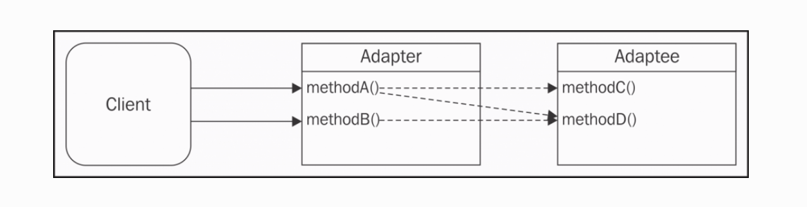
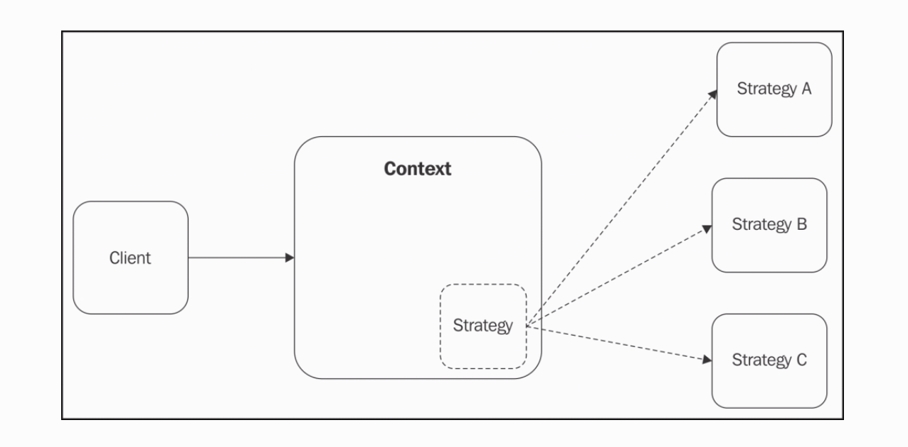
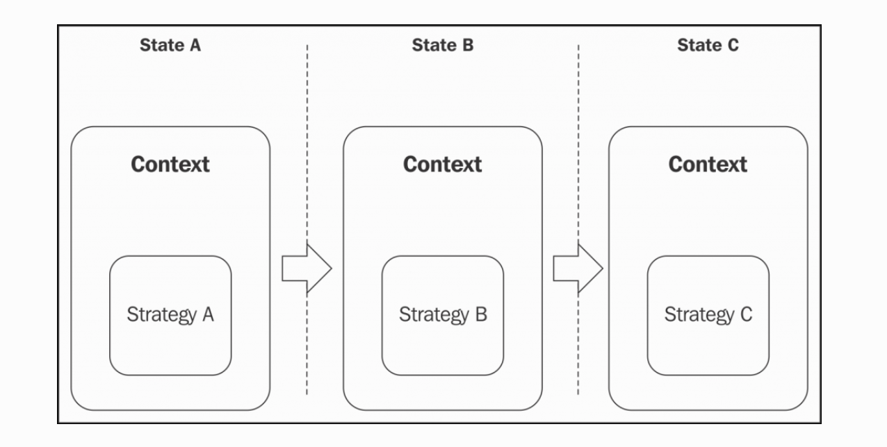
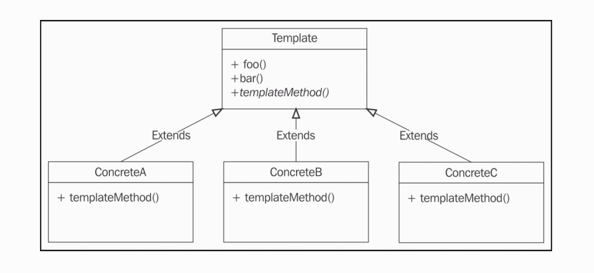
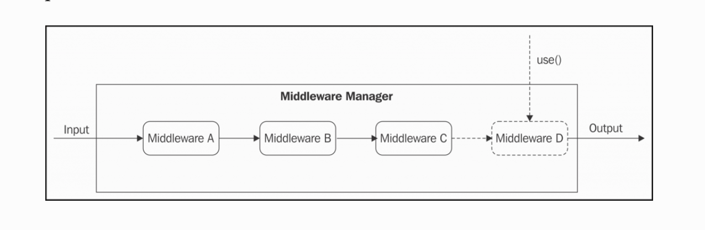
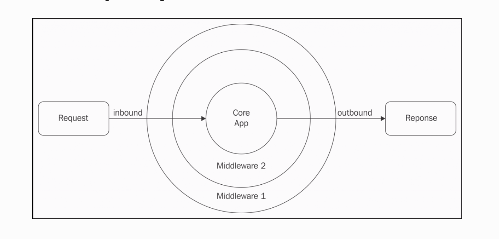
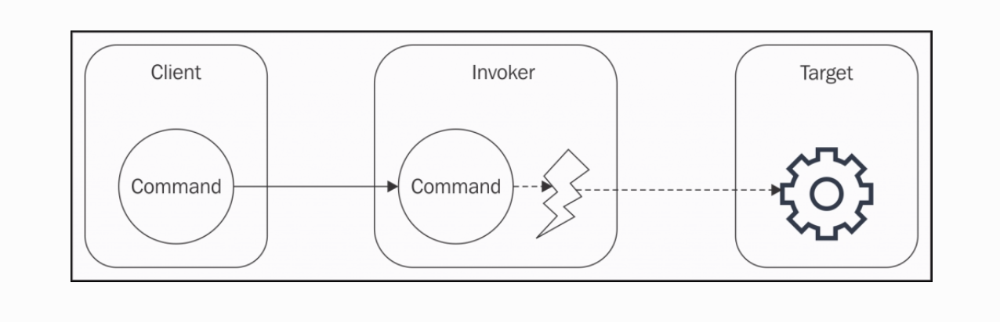

# Chapter 6. Design Patterns

设计模式是解决一个复现问题的可重用方案；定义的很宽它会跨越一个应用的多个领域。但是它经常会和一系列众所周知的面向对象模式产生关联。有本叫《Design Patterns: Elements of Reusable Object-Oriented Software, Pearson Education》的书在九十年代就很出名，它由赫赫有名的四人帮（GoF）：Erich Gamma, Richard Helm, Ralph Johnson, 和 John Vlissides 所作。我们将经常提及一些传统的设计模式，或者是 GoF 设计模式。

在 JavaScript 中一系列面向对象设计模式不像经典的面向对象那样直接正式。正如我们所知的，JavaScript 是一门多范式面向对象基于原型拥有动态类型的语言；它把函数作为第一类公民，允许函数式编程。这些特性使 JavaScript 变得十分灵活，它赋给开发者强大的能力的同时也带来了破碎的编程风格、约定、技术，以及最终的生态模式。在 JavaScript 中有太多的办法来完成一件事。一个明显的佐证就是 JavaScript 中大量的框架库；也许其它语言都不曾有过这么多，特别是 Node.js 的出现更给 JavaScript 带来了全新的可能性。

在这种环境下，传统的设计模式也被 JavaScript 所影响。这里有很多方法也可由传统的设计模式所实现。在一些事例中，它们甚至不太可能，因为 JavaScript 没有真正的类或抽象接口。但每个设计模式原本的出发点和解决问题的关键概念是没有变化的。

在本章，我们将探索一些应用到 Node.js 和它设计哲学中的最重要的 GoF 设计模式。从而从另一个角度重新看待它们的重要性。在这些传统的设计模式中，我们也会找到一些因为 JavaScript 生态而没那么“传统”的设计模式。

我们将在本章探索一下设计模式：

* 工厂
* 揭露构造器
* 代理
* 装饰者
* 适配器
* 策略
* 状态
* 模版
* 中间件
* 命令

## 工厂

我们以可能在 Node.js 中最普遍最简单的设计模式开始： 工厂模式。

### 一个创建对象的通用接口

我们已经知道在 JavaScript 中函数式范例是纯面向对象的首选。因为它简约，可用，较小的表面积。尤其是在创建一个新对象实例时。实际上，通过调用工厂而不是直接在原型上使用 new 和 Object.create 来创建一个新对象是如此的方便和灵活，原因有几点：

首先，工厂可以让我们分离对象的创建和实现；工厂本质上包装了给我们更可控更灵活的一个新实例。在工厂内部，我们可以借助闭包、原型、new、Object.create() ，甚至基于特定的条件来返回一个不同的实例而创建一个新的实例。对工厂的消费者来说如何创建一个实例完全是不可知的。真相是通过 new 关键字我们把我们的代码绑定到一个指定的对象上，因为在 JavaScript 中我们可以很灵活，甚至可以说是自由。我们来看一个创建 Image 对象的例子：

````JavaScript
function createImage(name){
  return new Image(name)
}

const image = createImage('photo.jpg')
````

createImage 工厂看起来完全多此一举；为什么不直接用 new 操作符创建一个 Image 对象呢？就像下面这样：

````JavaScript
const image = new Image(name)
````

正如我们前面提及的，使用 new 绑定我们的代码到一个特别类型的的对象上；拿前面的例子说，是指 Image 对象类型。因为一个工厂拥有更多的灵活性；假设我们想去重构 Image 类，把它分割成更小的类，支持每一个图片格式。如果我们我们只暴露一个工厂来创建新的图片，我们可以这样做：

````JavaScript
function createImage(name) {
  if(name.match(/\.jpeg$/)) {
    return new JpegImage(name);
  } else if(name.match(/\.gif$/)) {
    return new GifImage(name);
  } else if(name.match(/\.png$/)) {
    return new PngImage(name);
  } else {
    throw new Exception('Unsupported format');
  }
}
````

我们的工厂也允许我们不暴露创造对象的构造器，并保护它们被修改或扩展。在 Node.js 中我们可以通过暴露一个工厂来保持构造器私有化。

### 强制封装机制

因为闭包的存在，工厂也可以用于强制封装。我们知道在 JavaScript 中没有入口级修饰符（例如我们没有私有变量），所以强制封装的唯一方法是通过函数作用域和闭包。工厂可以直接封装私有变量：


````JavaScript
function createPerson(name){
  const privateProperties = {}
  const person = {
    setName: name => {
      if (!name) throw new Error('A person must have a name')
      privateProperties.name = name
    },
    getName: () => {
      return privateProperties.name
    }
  }

  person.setName(name)
  return person
}
````

在代码内，我们运用闭包来创建了两个对象：一个被工厂返回的公共接口 person 对象，另一个是不可被外部访问到的只通过 person 对象提供接口暴露 privateProperties 对象。这样我们会确保 person 的 name 属性永不为空。

### 构建一个简单的代码探查器

我们通过构造一个简单的代码探查器来理解工厂，它有两个属性：

* start 方法触发探查 session
* end 方法终止 session 并记录日志

````JavaScript
// profiler.js

class Profiler {
  constructor(label) {
    this.label = label;
    this.lastTime = null;
  }

  start() {
    this.lastTime = process.hrtime();
  }

  end() {
    const diff = process.hrtime(this.lastTime);
    console.log(
      `Timer "${this.label}" took ${diff[0]} seconds and ${diff[1]}
        nanoseconds.`
    );
  }
}


module.exports = function(label) {
  if(process.env.NODE_ENV === 'development') {
    return new Profiler(label);                       //[1]
  } else if(process.env.NODE_ENV === 'production') {
    return {                                          //[2]
      start: function() {},
      end: function() {}
    }
  } else {
    throw new Error('Must set NODE_ENV');
  }
};

// profilerTest.js
const profiler = require('./profiler');

function getRandomArray(len) {
  const p = profiler('Generating a ' + len + ' items long array');
  p.start();
  const arr = [];
  for(let i = 0; i < len; i++) {
    arr.push(Math.random());
  }
  p.end();
}

getRandomArray(1e6);
console.log('Done');


````

我们使用了默认的时间方法来保存时间到 last time 上，然后在 end 方法调用时计算过去的时间并打印。

然后我们可以利用工厂可配置的特性，在实际工作中应用前面的探查器。

**export NODE_ENV=development; node profilerTest**
**export NODE_ENV=production; node profilerTest**

这个例子只是一个运用了工厂模式的非常简单的事例，但它清楚地展现了从对象实现内分离对象创建的优势。

## 可组合的工厂函数

我们已经熟悉了工厂模式，现在我们来介绍一下可组合的工厂模式，它允许我们构建从其它地方继承行为和属性的对象，而不需要复杂的类制度。

我们通过一个简单的事例来介绍这个概念。假设我们想要构建一个拥有很多角色的游戏，这些角色又有很多动作：移动、攻击、射击等等。而且每个角色都有一些相同的属性，例如生命值、位置，名字。

我们需要几种角色，为每一种角色定义几组动作：

* Character：基本角色拥有生命值、位置、名字
* Mover：角色可以移动
* Slasher： 角色可以砍杀
* Shooter： 角色可以射击

理想上来说我们可以定义每一个角色，然后组合不同的动作。我们需要绝对的自由，我们可以在已存的角色类型上定义：

* Runner： 移动角色
* Samurai： 可以移动和砍杀的角色
* Sniper： 可以射击的角色
* Gunslinger： 可以射击和移动的角色
* Western Samurai： 可以移动、射击、砍杀的角色

如你所见我们可以随意组合这些特点，但要使用类和继承模式解决这个问题的话就显得没那么容易了。我们使用 [stampit](https://www.npmjs.com/package/stampit) 包来作为基本模块。这个包提供了简单的接口，我们可以把这些东西组合进我们的新工厂函数内：


````JavaScript
const stampit = require('stampit')

const character = stampit().
  props({
    name: 'anyone',
    liftPonits: 100,
    x: 0,
    y: 0
  })


const c = character();
c.name = 'John';
c.lifePoints = 10;
console.log(c); // { name: 'John', lifePoints: 10, x:0, y:0 }

const mover = stampit()
  .methods({
    move(xIncr, yIncr) {
      this.x += xIncr;
      this.y += yIncr;
      console.log(`${this.name} moved to [${this.x}, ${this.y}]`);            
    }
  });


const slasher = stampit()
    .methods({
      slash(direction) {
            console.log(`${this.name} slashed to the ${direction}`);
           }
    });

const shooter = stampit()
 .props({
   bullets: 6
 })
 .methods({
   shoot(direction) {
     if (this.bullets > 0) {
       --this.bullets;
         console.log(`${this.name} shoot to the ${direction}`);                 
     }
   }
 });

````

在前面的代码内，我们定义了 charater 工厂函数，这个函数可用于创建基本的角色实例。然后我们使用了 stampit 模块的 methods 方法声明这个对象可提供的所有方法。

既然我们已经了解了基本的概念，然后可以继续添加一些基本的类型了。

最后我们把这些基本类型组合起来：

````JavaScript
const runner = stampit.compose(character, mover);
const samurai = stampit.compose(character, mover, slasher);
const sniper = stampit.compose(character, shooter);
const gunslinger = stampit.compose(character, mover, shooter);
const westernSamurai = stampit.compose(gunslinger, samurai);


const gojiro = westernSamurai();
gojiro.name = 'Gojiro Kiryu';
gojiro.move(1,0);
gojiro.slash('left');
gojiro.shoot('right');

//output
Yojimbo moved to [1, 0]
Yojimbo slashed to the left
Yojimbo shoot to the right

````

stampit.compose 定义了一个新的组合工厂函数，它将提供组合了这些基本类型的对象。

### 真实情景

正如我们说的，工厂在 Node.js 中非常受欢迎。许多包只提供了创建一个新实例的工厂：

* [Dnode](https://npmjs.org/package/dnode)：这是一个 Node.js 远程程序调用（RPC）系统。
* [Restify](https://npmjs.org/package/restify)：用来构建 REST APIs 的框架。

其它模块有同时暴露了类和工厂，但工厂是主要方法：

* [http-proxy](https://npmjs.org/package/http-proxy)：一个可编程的代理库
* Node.js HTTP 核心服务：新实例几乎都创建自 http.createServer() ，本质上是 new http.Server()
* [bunyan](https://npmjs.org/package/bunyan)：一个流行的日志记录库；它提供了 bunyan.createLogger() 工厂来创建实例，相当于 new bunyan()。


## 揭露构造器

揭露构造器模式是一种新模式，它在 Node.js 社区和 JavaScript 中发扬光大，特别是因为在一些核心库中的使用比如： Pormise。

````JavaScript
const promise = new Promise(function(resolve, reject){
  //...
})
````
Promise 接收一个函数作为构建器参数，这个参数叫作执行函数。它被 Promise 构造器内部的实现所调用，它允许构建代码操作 promise 内部的一些状态。换句话说，它暴露出来的 resolve 和 reject 函数可被用来调用改变这个对象的状态。

### 一个只读事件的发射器

我们这就来实现一个应用揭露构造器模式的例子：

````JavaScript
//roee.js
const EventEmitter = require('events');

module.exports = class Roee extends EventEmitter {
  constructor (executor) {
    super();
    const emit = this.emit.bind(this);
    this.emit = undefined;
    executor(emit);
  }
};

````
在这个简单的类中，我们拓展了核心的 EventEmitter 类并以一个 executor 函数作为唯一的构造器参数。

在构造器内，我们调用了 super 函数来初始化父类的构造器函数，并把 emit 函数设置为备用然后移除它。最后调用 executor 函数作为第一个参数。

最重要的地方是我们把 emit 设置为了 undefined，我们将不能再调用它了。我们备用版本的 emit 被定义为 executor 的本地变量，这个机制使我们只能在 executor 内使用 emit。

现在我们来简单地创建一个 ticker 类，每一秒发射 tick 事件：

````JavaScript
//ticker.js
const Roee = require('./roee');

const ticker = new Roee((emit) => {
  let tickCount = 0;
  setInterval(() => emit('tick', tickCount++), 1000);
});

module.exports = ticker;

// 使用
const ticker = require('./ticker');

ticker.on('tick', (tickCount) => console.log(tickCount, 'TICK'));
// ticker.emit('something', {}); <-- This will fail


````

正如我们看到的，我们的构造器接收一个 emit 函数为参数，并在每一秒发射一个新的 tick 事件。然后我们订阅 tick 事件。

### 真实情景

即使这个模式十分的有趣灵巧，除了在 Promise 中使用很少在其它地方用到。

值得一提的在新的流规范中这将是一个更好的选择：https://streams.spec.whatwg.org。

而且我们已经在本书的流的章节实现 ParallelStream 类的时候使用过了这个模式，这个类接收 userTransform 函数为构造器参数。

尽管在这个例子中 executor 函数是在内部的 transform 方法使用的而不是在构造时间调用的，这个通用概念依然是一致的。实际上这种实现允许我们暴露一些内部东西。


## 代理

代理是一个可以控制另一个主题对象的对象。代理和主题拥有相同的接口所以我们可以对它们互换；实际上这个模式更合适的称呼应该是替代者。一个代理拦截了主题所有的操作，参数，或者是实现行为。


图例向我们展示了代理和主题之间的关系，代理在主题的前面对客户端请求进行预处理并传递主题的处理。

代理适合以下几种状况：

* 数据校验：拦截数据进行校验
* 安全：代理验证客户端授权然后再决定是否请求到主题
* 可缓存：代理保持了一个内部缓存，操作在主题上执行
* 惰性初始化：如果创建主题的操作很昂贵，那么代理可以把它延迟到在真正需要它的时候再创建
* 打印日志：代理拦截相关的方法参数并在方法调用时进行打印
* 远程对象：代理可以把一个远程对象本地化


### 实现代理的技术

当代理一个对象时，我们可以拦截它所有的方法或者部分方法。

#### 对象构成

组合是一种将对象与另一个对象组合以扩展或使用其功能的技术。在一些代理模式的例子中，一个对象拥有和主题相同接口，并且把对主题的引用储存在代理内部的变量或者闭包变量内。主题可以在创建时从客户端注入，也可以由代理本身创建。

````JavaScript
function createProxy(subject) {
  const proto = Object.getPrototypeOf(subject);

  function Proxy(subject) {
    this.subject = subject;
  }

  Proxy.prototype = Object.create(proto);

  //proxied method
  Proxy.prototype.hello = function(){
    return this.subject.hello() + ' world!';
  };

  //delegated method
  Proxy.prototype.goodbye = function(){
    return this.subject.goodbye
      .apply(this.subject, arguments);
  };

  return new Proxy(subject);
}
module.exports = createProxy;

````


使用组合来实现一个代理时，我们必须拦截我们感兴趣的操作方法，同时简单委托剩余部分的主题。

前面的代码还显示了主题有原型的特定情况，我们希望维护正确的原型链。执行 **proxy instanceof Subject** 将返回 true；我们使用了伪类继承。

这只是额外的一步，只在我们对获取原型链时需要这么做，这会提升代理的兼容性。

但是，由于 JavaScript 拥有动态类型，大多数情况下我们可以避免使用继承进而使用直接的实现方法。例如，一个可选的实现代理方案是使用对象字面量和工厂：

````JavaScript
function createProxy(subject) {
  return {
    //proxied method
    hello: () => (subject.hello() + ' world!'),

    //delegated method
    goodbye: () => (subject.goodbye.apply(subject, arguments))
  };
}

````

### 对象增强

对象增强或者说是猴子补丁可能是代理最实用的地方：

````JavaScript
function createProxy(subject) {
  const helloOrig = subject.hello;
  subject.hello = () => (helloOrig.call(this) + ' world!');

  return subject;
}

````

## 不同技术的对比

构成被认为是创建代理最安全的方式，因为它使主体不受影响而不改变其原始行为。它唯一的缺点是我们必须手动委派所有方法，即使我们只想代理其中一个方法。如果需要，我们可能还必须委托对主题属性的访问。

另一方面，对象增强会修改主题，这可能并不总是我们想要的，但它不会带来与委派相关的各种不便。 出于这个原因，对象扩充绝对是在 JavaScript 中实现代理的最实用的方法，而且在所有那些修改主题不是一个大问题的情况下它是首选技术。

但是，这里至少有一种情况只适合组合，那就是当我们需要控制主题的初始化时，例如只在需要时才初始化（惰性初始化）。

## 创建一个日志记录可写流

来看一个代理模式的真实例子，我们将构建一个充当可写流的代理对象。它拦截了所有对 write 方法的调用同时打印记录。我们将使用对象构成来实现我们的代理：

````JavaScript
// loggingWritable.js

function createLoggingWritable(writableOrig) {
  const proto = Object.getPrototypeOf(writableOrig);

  function LoggingWritable(writableOrig) {
    this.writableOrig = writableOrig;
  }
  LoggingWritable.prototype = Object.create(proto);
  LoggingWritable.prototype.write = function(chunk, encoding, callback) {
    if(!callback && typeof encoding === 'function') {
      callback = encoding;
      encoding = undefined;
    }
    console.log('Writing ', chunk);
    return this.writableOrig.write(chunk, encoding, function() {
      console.log('Finished writing ', chunk);
      callback && callback();
    });
  };

  LoggingWritable.prototype.on = function() {
    return this.writableOrig.on
      .apply(this.writableOrig, arguments);
  };

  LoggingWritable.prototype.end = function() {
    return this.writableOrig.end
      .apply(this.writableOrig, arguments);
  };

  return new LoggingWritable(writableOrig);
}


const fs = require('fs');

const writable = fs.createWriteStream('test.txt');
const writableProxy = createLoggingWritable(writable);

writableProxy.write('First chunk');
writableProxy.write('Second chunk');
writable.write('This is not logged');
writableProxy.end();
````

我们在这里返回了一个代理版本以 writable 当作参数传入到对象中的工厂。我们重写了 write 方法，它当异步操作完成时会记录日志到标准输出。这是一个为异步函数创建代理的好例子，它使得异步回掉是必要的；这在 Node.js 平台上是值得考虑的事情。on 方法和 end 方法依然简单委托了原来 writable 流的相应方法。

## 生态系统中的代理 - 函数钩子和 AOP

以其多种形式，代理在 Node.js 中是一种十分流行的模式。实际上，一些库允许我们简化代理的创建，大多数情况下利用对象增强作为实现方法。在社区中，这种模式也被成为钩子函数，有时叫面向切面编程（AOP），实际上是代理的常见应用领域。在 AOP 中，这些库通常允许开发者为特定的方法设置 pre- 或着 post- 或 post-execution 钩子，这些钩子允许我们在建议的方法调用的前或后启动自定义代码。

有时代理也被成为中间件，因为它也发生在中间件模式中，中间件模式允许我们在输入输出前后作处理。有时，我们也可以利用像中间件一样的管道在相同的方法上注册多个钩子。

这里有一些库允许我们实现函数钩子： [hooks](htts://npmjs.org/package/hooks)、[hooker](htts://npmjs.org/package/hooker)、[meld](htts://npmjs.org/package/meld)。

## ES2015 中的代理

在 ES2015 中特别推荐了一个叫 Proxy 的全局对象，它可在 Node.js 第六版中使用。

Proxy API 包含一个 Proxy 构造器，这个构造器接收 target 和 handler 作为参数：

**const proxy = new Proxy(target, handler);**

target 指被代理的对象（即我们说的主题），handler 是一个定义了代理行为的特殊对象。

handler 对象包含了一系列可选的预定义方法（如：apply, get, set 和 has），这些方法将在代理实例上执行相应的操作时自动执行。


````JavaScript
const scientist = {
  name: 'nikola',
  surname: 'tesla'
};

const uppercaseScientist = new Proxy(scientist, {
  get: (target, property) => target[property].toUpperCase()
});

console.log(uppercaseScientist.name, uppercaseScientist.surname);  
  // prints NIKOLA TESLA

````

在这个例子中，我们使用了 Proxy API 来拦截对目标对象（即 scientist）的访问，然后转换了原始值。

仔细观察这个例子，你可能注意到这个 API 的奇怪之处，它允许我们获取到目标对象的通用属性。这可能是因为 API 不仅仅是个可以方便创建代理对象的包装器。相反，它是一个深入集成到 JavaScript 语言本身的功能，这允许开发者拦截自定义许多执行在对象上的操作。我们看另一个例子：

````JavaScript

const evenNumbers = new Proxy([], {
  get: (target, index) => index * 2,
  has: (target, number) => number % 2 === 0
});

console.log(2 in evenNumbers); // true
console.log(5 in evenNumbers); // false
console.log(evenNumbers[7]);   // 14

````

在本例中，我们创建了一个虚拟数组来包含所有的偶数。它可以被用于普通数组。之所以称之为虚拟数组是因为我们从未存入任何数据。

看一下实现，这个代理使用了一个空数组作为目标并定义了 get 和 has 操作：

* get 获取到了数组元素，返回给定索引的双倍索引
* has 拦截了 in 算数符的使用并检查给定的数字是否是偶数

Proxy API 支持一系列有趣的策略例如 set, delete 和 construct，也允许我们创建可以按需撤销的代理，禁用所有策略并恢复目标对象的原始行为。

分析这一章节背后所有的特性；最重要的事是要理解在你需要代理的时候利用代理的长处。

### 真实情景

[Mongoose](http://mongoosejs.com) 是一款 MongoDB 的对象文档映射库。在其内部它使用了 hooks 包来提供前置和后置钩子处理它文档上 init、validate、save、remove 方法。更多官方文档上可以点击 http://mongoosejs.com/docs/middleware.html。

## 装饰器

装饰器是一种动态增强现有对象的结构化模式。它有别于传统的继承，因为增加的行为不会应用到同一类上的所有对象，它只会添加到被装饰的实例上。

实现上类似与代理模式，但它不是增强或者修改对象原存在接口，它将增加新的功能：


通过增加 methodC 方法，装饰器对象拓展了组件对象。已存在的方法一般被代理到了装饰器对象上，且没有更多处理。当然我们也可以简单地组合代理模式来拦截获得已存在的方法。

### 装饰器技术实现

尽管代理和装饰器是概念上的两种模式而且是两种意图，但它们拥有相同的实现策略。


#### 组合

使用组合，装饰组件被包裹在一个通常从它继承的新对象，在本例中，装饰器只需要定义一个新方法同时委托已存在的方法：

````JavaScript
function decorate(component) {
  const proto = Object.getPrototypeOf(component);

  function Decorator(component) {
    this.component = component;
  }

  Decorator.prototype = Object.create(proto);

  //new method
  Decorator.prototype.greetings = function() {
    return 'Hi!';
  };

  //delegated method
  Decorator.prototype.hello = function() {
    return this.component.hello.apply(this.component, arguments);  
  };

  return new Decorator(component);
}
````

#### 对象增强

通过简单附加一个新方法到对象装饰器：

````JavaScript
function decorate(component) {
  //new method
  component.greetings = () => {
    //...
  };
  return component;
}

````

### 装饰一个 LevelUP 数据库

在我们开始编程前，我们谈谈我们将要使用 LevelUP。

#### LevelUP 和 LevelDB 介绍

[LevelUP](https://npmjs.org/package/levelup) 包装了 Google 的 LevelDB， LevelDB 是一款最初为在 Chrome 浏览器中实现 IndexedDB 而构建的键/值存储数据库。LevelDB 已经被 Dominic Tarr 定义为 “数据库中的 Node.js”，因为它简约设计和拓展能力。就像 Node.js 一样，LevelDB 提供了极快的表现和一系列基础的特性，它允许开发者在其智商构建任何数据库。

Node.js社区，在这种情况下，Rod Vagg，并没有错过通过创建 LevelUP 将这个数据库的强大功能带入 Node.js 的机会。它作为 LevelDB 的包装者诞生。它随后支持了多种后端，从内存型储存到其它 NoSQL 数据库像是 Riak 和 Redis, 到 web 储存引擎如 IndexedDb 和 localStorage，它允许我们在客户端和服务端使用相同的 API，开启了一些有趣的局面。

目前，围绕 LevelUP 已经有了羽翼丰满的生态环境，已经有了各类拓展自核心模块的插件和模块来实现例如自复制、第二索引、实时更新、查询引擎等等的特性。也有了基于 LevelUP 包括对 CouchDB 的克隆如 PouchDb、CouchUP，甚至是图数据库、levelgraph，它可运行在 Node.js 和浏览器中！

#### 实现一个 LevelUP 插件

下一个例子中我们将向你展示通过装饰器模式为 LevelUP 创建一个插件。

我们的插件让我们可以接收到每一条数据存入数据库时的提醒。

````JavaScript
//levelSubscribe.js

module.exports = function levelSubscribe(db) {

  db.subscribe = (pattern, listener) => {        //[1]
    db.on('put', (key, val) => {                 //[2]
      const match = Object.keys(pattern).every(
        k => (pattern[k] === val[k])             //[3]
      );
      if(match) {
        listener(key, val);                      //[4]
      }
    });
  };

  return db;
};


//levelSubscribeTest.js

const level = require('level');                              //[1]
const levelSubscribe = require('./levelSubscribe');          //[2]

let db = level(__dirname + '/db', {valueEncoding: 'json'});
db = levelSubscribe(db);

db.subscribe(
  {doctype: 'tweet', language: 'en'},                        //[3]
  (k, val) => console.log(val)  
);
db.put('1', {doctype: 'tweet', text: 'Hi', language: 'en'}); //[4]
db.put('2', {doctype: 'company', name: 'ACME Co.'});

````

1. 我们以 subscribe 对象装饰 db 对象。我们简单附件方法到提供的 db 实例上。
1. 我们监听了一切在数据库上的 put 操作。
1. 我们执行了一个简单的模式匹配算法，来确定模式提供的所有属性也被插入的数据所拥有。
1. 如果匹配上就通知给监听器。

然后我们在 levelSubscribeTest.js 文件内测试：

1. 首先初始化我们的 LevelUP 数据库，选择了文件储存的目录和默认编码。
1. 然后加载我们的插件。
1. 使用我们的新功能 subscribe 方法，我们在乎的是 {doctype: 'tweet', language: 'en'}。
1. 最后，我们使用 put 方法保存一些值，第一个调用将触发相关的回掉，也会看到打印出的值，第二个调用将不会打印。

这个实例展示了一个运用装饰器模式的最简实现的真实应用：对象增强。它看起不足轻重但只要使用合理就会有不容置疑的力量。

### 真实情景

我们可以在 LevelUP 插件里看到更多真实的案例：

[level-inverted-index](https://github.com/dominictarr/level-inverted-index)

[level-plus](https://github.com/dominictarr/level-plus)


## 适配器

适配器模式允许我们使用一个不同的接口来获取一个对象的功能。正如名字说的，它适配了一个对象以便它可被期待不同接口的组件使用。



图例展现了通过暴露出一个不同的接口对一个适配者的包装。适配者上被调用的多个方法可以被适配器组合起来。从实现的角度来说，组合是最常见的技术，适配器方法提供了到适配者方法之间的桥梁。这个模式很直接，我们来看看实例。

### 通过文件系统的 API 来使用 LevelUP

我们将构建一个 LevelUP API 的适配器，并发它转化进核心 fs 模块内。尤其是，我们将使每一个 readFile 和 writeFile 调用转化为 db.get 和 db.put；这样我们就可以用 LevelUP 数据库来做基本的文件操作了。

我们以创建一个新的模块开始：

````JavaScript
//fsAdapter.js

const path = require('path');

module.exports = function createFsAdapter(db) {
  const fs = {};

  fs.readFile = (filename, options, callback) => {
  if(typeof options === 'function') {
    callback = options;
    options = {};
  } else if(typeof options === 'string') {
    options = {encoding: options};
  }
  db.get(path.resolve(filename), {                   //[1]
      valueEncoding: options.encoding
    },
    (err, value) => {
      if(err) {
        if(err.type === 'NotFoundError') {           //[2]
          err = new Error(`ENOENT, open "${filename}"`);
          err.code = 'ENOENT';
          err.errno = 34;
          err.path = filename;
        }
        return callback && callback(err);
      }
      callback && callback(null, value);             //[3]
    }
  );
};

  fs.writeFile = (filename, contents, options, callback) => {
    if(typeof options === 'function') {
      callback = options;
      options = {};
    } else if(typeof options === 'string') {
      options = {encoding: options};
    }

    db.put(path.resolve(filename), contents, {
        valueEncoding: options.encoding
    }, callback);
  }
  return fs;
}

````

在代码中，我们必须做一些额外的工作来确保新函数的行为尽可能接近原 fs.readFile 的行为。

1. 调用 db.get 从 db 类取回一个文件，通过确认后的全路径使用 filename 作为键。设置数据库 valueEncoding 的值等于任何最终输入 encoding 选项。
1. 如果键没有在数据库中被找到，我们创建一个 ENOENT 作为错误码，这个错误码是 fs 模块以前就使用的。
1. 如果键值对被数据库成功返回，我们通过回掉返回这个值。

这个函数还很粗糙；我们继续实现 writeFile 函数：


在这个例子中，我们简单包装了一下并忽略了一个文件权限(options.mode)，最后返回 fs。


````JavaScript
const fs = require('fs');

fs.writeFile('file.txt', 'Hello!', () => {
  fs.readFile('file.txt', {encoding: 'utf8'}, (err, res) => {
    console.log(res);
  });
});

//try to read a missing file
fs.readFile('missing.txt', {encoding: 'utf8'}, (err, res) => {
  console.log(err);
});

{ [Error: ENOENT, open 'missing.txt'] errno: 34, code: 'ENOENT', path: 'missing.txt' }
Hello!
````

代码使用了 fs API 来处理一些读写操作，并打印出一些错误。

现在我们试着用我们的适配器来代理 fs 模块：

````JavaScript
const levelup = require('level');
const fsAdapter = require('./fsAdapter');
const db = levelup('./fsDB', {valueEncoding: 'binary'});
const fs = fsAdapter(db);

````

### 真实情景

这里有一大堆适配器的真实例子：

* LevelUP 可以在不同的存储后端上工作。所以这里有很多适配了 LevelUP 的适配器实现：https://github.com/rvagg/node-levelup/wiki/Modules#storage-back-ends。

* jugglingdb 是一个多数据库 ORM，当然也有多个适配器来保证它对各个数据库的兼容：https://github.com/1602/jugglingdb/tree/master/lib/adapters。

* 替代我们创建的例子的最完美实现 [level-filesystem](https://www.npmjs.org/package/level-filesystem)。

## 策略

策略模式是允许一个叫上下文的对象把可变部分提取为单独的可交换对象的不同逻辑模式。上下文实现了一系列算法的通用逻辑，而策略实现了可变部分，允许上下文根据不同因素（如输入值，系统配置或用户首选项）调整其行为。策略通常是一系列解决方案的一部分，并且所有这些策略都实现了相同的接口，这是上下文所期望的接口。



上下文对象可以把不同的策略加进它的结构中，就像它们是披萨可替代的一部分一样。就像是一辆可以适应不同路段的汽车一样。由于它们的螺柱，我们可以在雪路上安装冬季轮胎，我们可以在高速公路，长途旅行中安装高性能轮胎。换句话说虽然路路况不同但我们不必换辆车。

这种模式的出色之处在于，它不仅可以分离出在算法中的不同，而且也可以弹性地适配同一个问题中各式各样的差异。

策略模式特别适用于支持算法的变化需要复杂的条件逻辑的情况例如 if...else 或 switch 语句，或者混和不同算法到一起。假设有一个叫 Order 的对象，它有一个 pay 方法，为了支持不同的支付系统我们就可以用到策略模式：

* 使用 if...else 语句完成付款选项
* 委托支付逻辑到策略对象

第一个方案中，我们的 Order 对象不能支持支付方法除非是修改代码。随着支付选项增加这会变得更加复杂化。而使用策略模式将使 Order 对象支持无限制的支付方法。


### 多格式配置对象

我们有一个叫 Config 的对象，它拥有一系列配置参数，例如数据库地址，服务器端口等。 Config 对象应该提供一个简单的接口来获取到这些参数，而且也应有一个持久性储存来导入导出这些配置，例如一个文件。我们需要支持各种储存配置的格式，例如 JSON、INI、YAML。

通过我们学到了策略模式，我们可以迅速识别出 Config 对象内的可变部分，就是序列和反序列的功能。

````JavaScript
//config.js
const fs = require('fs');
const objectPath = require('object-path');

class Config {
  constructor(strategy) {
    this.data = {};
    this.strategy = strategy;
  }

  get(path) {
    return objectPath.get(this.data, path);
  }
  set(path, value) {
    return objectPath.set(this.data, path, value);
  }
  read(file) {
    console.log(`Deserializing from ${file}`);
    this.data = this.strategy.deserialize(fs.readFileSync(file, 'utf-8'));
  }

  save(file) {
    console.log(`Serializing to ${file}`);
    fs.writeFileSync(file, this.strategy.serialize(this.data));
  }
}
module.exports = Config;

````

我们把配置数据包含进实例变量(this.data)中，然后提供了 set 和 get 方法来获取配置属性，并利用 obejct-path 包来使用点语法。我们把 strategy 作为输入，它将用于序列和反序列数据。

当我们从文件中读取配置时，我们委托反序列任务给 strategy；然后当我们想去保存配置到文件中时，我们使用 strategy 来序列化配置。这个简单的设计允许 Config 对象支持不同的文件格式。

创建几个策略：

````JavaScript
//strategies.js

module.exports.json = {
  deserialize: data => JSON.parse(data),
  serialize: data => JSON.stringify(data, null, '  ')
}

const ini = require('ini'); //-> https://npmjs.org/package/ini
module.exports.ini = {
  deserialize: data => ini.parse(data),
  serialize: data => ini.stringify(data)
}

````


````JavaScript
//configTest.js

const Config = require('./config');
const strategies = require('./strategies');

const jsonConfig = new Config(strategies.json);
jsonConfig.read('samples/conf.json');
jsonConfig.set('book.nodejs', 'design patterns');
jsonConfig.save('samples/conf_mod.json');

const iniConfig = new Config(strategies.ini);
iniConfig.read('samples/conf.ini');
iniConfig.set('book.nodejs', 'design patterns');
iniConfig.save('samples/conf_mod.ini');

````

我们的测试模块揭露了策略模式的属性。我们只定义了一个 Config 类来实现配置管理的通用部分，而策略是会改变的。

前面的例子只显示了我们选择策略的可能替代方案之一。 其他有效的方法可能是以下：

* 创建两个不同的策略：一个用以反序列化另一个用来序列化。这将允许从同一个格式读取数据然后存入另一种格式中。
* 依据提供的文件名拓展来动态选择策略；Config 对象可以维持一个映射 extension -> strategy 然后通过文件拓展名选择正确的算法。

正如我们看到的，这里有一些选项来选择策略，正确的一个只取决于我们的要求和我们想要获得的功能/简单性的权衡。

实现的本身也可以不同；对于最简单的格式，上下文和策略都可以是简单的函数：

**function context(strategy) {...}**

### 真实情景

[passport.js](http://passportjs.org) 是一个权限框架，它允许服务端实现不同的授权模型。我们可以提供以 Facebook 登录或 Twitter 登录功能到我们的 web 应用。Passport 使用了策略模式来分离在授权过程中要求的通用逻辑。例如，我们可能使用 OAuth 来获取 access token 来获取用户 Facebook 或 Twitter 的信息，或者简单地使用本地数据库来验证用户名和密码，我们可以预知，这个库支持无限制的授权服务。


## 状态

状态是策略模式的变体，其中策略根据上下文的状态而变化。在前面的章节里我们可以看到策略hi可以依据用户的喜好来变化的。

作为替代，在状态模式内，策略（在此被叫作“状态”）是动态的，它可以在上下文的生命周期内变化，因此允许它的行为适用于它的内部状态：



假设我们有一个酒店预订系统和一个 Reservation 对象模拟房间预订。这是个经典的情形要求我们必须依据对象的状态来适配对象的行为：

1. 当预订被创建时，用户可以确认（confirm）预订；当然他们不可以取消（cancel），因为还没确认。但是他们可以删除（delete）预订。
1. 一旦预订被确认，使用 confirm 函数将不会有任何意义；但是现在可以取消预订了，但不可以删除预订。
1. 当预订日期前一天就不可以取消预订了。

现在假设我们在一个巨大的对象中实现预订系统；我们已经使用了 if..else 和 switch 语句。

在这种情况下，状态模式是完美的：这里将有三个策略，来实现描述的三个方法，每个实现只有一个行为对应着模式状态。通过使用这个模式，在 Reservation 对象中切换状态将非常简单；这将简单的激活不同的状态。

上下文对象可以控制和初始化状态的变化。

### 实现基本的故障安全套接字

我们通过实例来学习状态模式。让我们构建一个客户端TCP套接字，当与服务器的连接丢失时不会失败；我们希望将服务器脱机期间发送的所有数据排队，然后在重新建立连接后再次尝试发送它。我们将在一个监控系统中利用这个套接字，一系列的机器会发送一些统计数据；如果服务器挂掉了，我们的套接字将在本地序列化数据直到服务器重新连接。

````JavaScript
//failsafeSocket.js
const OfflineState = require('./offlineState');
const OnlineState = require('./onlineState');

class FailsafeSocket{
  constructor (options) {                        //[1]
    this.options = options;
    this.queue = [];
    this.currentState = null;
    this.socket = null;
    this.states = {
      offline: new OfflineState(this),
      online: new OnlineState(this)
    };
    this.changeState('offline');
  }

  changeState (state) {                          //[2]
    console.log('Activating state: ' + state);
    this.currentState = this.states[state];
    this.currentState.activate();
  }

  send(data) {                                   //[3]
    this.currentState.send(data);
  }
}

module.exports = options => {
  return new FailsafeSocket(options);
};

````

1. 这个构造器初始化了很多数据结构，包括离线后的储存数据队列。而且还创建了两个状态。
1. changeState 方法用于状态的转换。它简单地更新 currentState 实例变量并调用 activate 方法。
1. send 方法，我们根据离线/在线状态有不同的行为。


````JavaScript
//offlineState.js

const jot = require('json-over-tcp');         //[1]

module.exports = class OfflineState {

  constructor (failsafeSocket) {
    this.failsafeSocket = failsafeSocket;
  }

  send(data) {                                //[2]
    this.failsafeSocket.queue.push(data);
  }

  activate() {                                //[3]
    const retry = () => {
      setTimeout(() => this.activate(), 500);
    }

    this.failsafeSocket.socket = jot.connect(
      this.failsafeSocket.options,
      () => {
        this.failsafeSocket.socket.removeListener('error', retry);
        this.failsafeSocket.changeState('online');
      }
    );
    this.failsafeSocket.socket.once('error', retry);
  }
};

````

1. 我们使用 josn-over-tcp 库来通过 TCP 发送 JSON 对象。
1. send 方法来发送接收到的序列化数据。
1. activate 方法尝试创建连接。


````JavaScript
//onlineState.js

module.exports = class OnlineState {
  constructor(failsafeSocket) {
    this.failsafeSocket = failsafeSocket;
  }

  send(data) {                                 //[1]
    this.failsafeSocket.socket.write(data);
  };

  activate() {                                 //[2]
    this.failsafeSocket.queue.forEach(data => {
      this.failsafeSocket.socket.write(data);
    });
    this.failsafeSocket.queue = [];

    this.failsafeSocket.socket.once('error', () => {
      this.failsafeSocket.changeState('offline');
    });
  }
};
````

1. send 方法直接把数据写入套接字。
1. activate 方法刷新套接字脱机时排队的所有数据，并且它也开始侦听任何错误事件;我们将此作为套接字脱机的症状（为简单起见）。发生这种情况时，我们会转换到离线状态

````JavaScript

//server.js
const jot = require('json-over-tcp');
const server = jot.createServer(5000);
server.on('connection', socket => {
  socket.on('data', data => {
    console.log('Client data', data);
  });
});
server.listen(5000, () => console.log('Started'));


// client.js
const createFailsafeSocket = require('./failsafeSocket');
const failsafeSocket = createFailsafeSocket({port: 5000});

setInterval(() => {
  //send current memory usage
  failsafeSocket.send(process.memoryUsage());
}, 1000);

````

我们的服务器简单打印收到的 JSON，利用 FailsafeSocket 对象，我们的客户端每秒都会发送一次内存利用率测量。

为了验证我们构建的小系统，我们应该在客户端和服务器端同时运行起来，然后通过暂停或重启服务器来测试 failsafeSocket 功能。我们应该看到客户端在 online 和 offline 切换，任何在服务器离线下的内存测量都会被收集到队列内然后在重新连接后发送到服务器。


## 模版

下一个模式我们来讨论模版模式，它与战略模式有很多共同之处。模板包括定义一个算法骨架的抽象伪类，其中的一些步骤未定义。子类可以填充算法上缺失的步骤，这些子类叫作模版方法。这种模式的目的是使定义一系列类的算法成为可能，这些类都是类似算法的变体。



三个实体类拓展了模版并提供了 templateMethod 方法，这个方法是抽象或纯粹的虚拟；在 JavaScript 中这意味着方法没被定义或者被赋值给了一个需要实现的函数。模版模式比其它我们提到的模式更经典的面向对象，因为继承是它的核心实现。

模版和策略的目的很相似，但是主要的不同点在于它们的结构和实现。它们都允许我们改变算法的部分重用相同的部分；但是，策略允许我们动态改变而且可能在运行时改变，而模版的算法是在实例被定义的时候决定的。在这样的假定下，模版模式可能更适合那些预先包装的算法变体。

### 一个可配置的管理器模版

为了比较策略和模版，我们再实现一个 Config 对象。

````JavaScript
// configTemplate.js
const fs = require('fs');
const objectPath = require('object-path');

class ConfigTemplate {

  read(file) {
    console.log(`Deserializing from ${file}`);
    this.data = this._deserialize(fs.readFileSync(file, 'utf-8'));
  }

  save(file) {
    console.log(`Serializing to ${file}`);
    fs.writeFileSync(file, this._serialize(this.data));
  }

  get(path) {
    return objectPath.get(this.data, path);
  }

  set(path, value) {
    return objectPath.set(this.data, path, value);
  }

  _serialize() {
    throw new Error('_serialize() must be implemented');
  }
  _deserialize() {
    throw new Error('_deserialize() must be implemented');
  }
}

module.exports = ConfigTemplate;

````

新的 ConfigTemplate 类定义了两个模版方法：serialize、deserialize。下划线用于标示它们只在内部使用。

````JavaScript
const util = require('util');
const ConfigTemplate = require('./configTemplate');

class JsonConfig extends ConfigTemplate {

  _deserialize(data) {
    return JSON.parse(data);
  };

  _serialize(data) {
    return JSON.stringify(data, null, '  ');
  }
}
module.exports = JsonConfig;


````

JsonConfig 类继承自我们的模版，并对 serialize、deserialize 提供了具体实现。

现在 JsonConfig 类可以用于独立的配置对象了。

````JavaScript
const JsonConfig = require('./jsonConfig');

constjsonConfig = new JsonConfig();
jsonConfig.read('samples/conf.json');
jsonConfig.set('nodejs', 'design patterns');
jsonConfig.save('samples/conf_mod.json');

````

### 真实情景

这个模式对我们来说并不陌生，因为我们已经在第五章见识过了。我们实现了 write、read、transform、flush 方法。


## 中间件

在 Node.js 中最特别的模式绝对是中间件模式了。不幸的是，对于缺乏经验的人来说，这也是最令人困惑的一个，特别是对于来自企业编程世界的开发人员而言。迷失方向的原因可能与术语中间件的含义有关，中间件在企业架构行话中代表了各种软件套件，它们有助于抽象出低级机制，如 OS API，网络通信，内存管理等等，允许开发人员只关注应用程序的业务案例。在这种情况下，术语中间件回顾了诸如 CORBA，企业服务总线，Spring，JBoss 等主题，但在更通用的意义上，它还可以定义任何类型的软件层，它们就像是低级服务和应用程序之间的粘合剂（字面意思是中间的软件）。

### Express 中的中间件

Express 使中间件变得受欢迎，让它变成一个特殊的设计模式。在 Express 中，实际上中间件是一系列服务的呈现，特别是函数，函数被组织进管道中并负责处理 HTTP 请求的输入操作和相关响应
。

Express 作为一个以非常自以为是和极简主义的网络框架而闻名。使用中间件模式对开发者来说是一个有效的策略创建分发可被添加到当前应用的新的特性，而且不会破坏框架的极简核心。

一个 Express 中间件是这样的：

**function(req, res, next) { ...  }**

在这，req 是 HTTP 的输入请求，res 是响应，next 是当前中间件完成任务时被调用的回掉。

Express 中间件包含下面：

* 解析请求体
* 压缩/解压缩请求和响应
* 产生日志
* 管理 session
* 管理加密 cookies
* 提供跨站请求伪造保护

如果我们考虑一下这个，这些功能都不严格和主要功能相关，也不是 web 服务器的核心部分；相反，它们是附件，组件为应用程序的其余部分提供支持，并允许实际请求处理程序仅关注其主要业务逻辑。本质上来说，那些任务是中间的软件。

### 作为模式的中间件

在 Express 中实现中间件不是什么新鲜事；实际上它在 Node.js 中以拦截过滤器模式和职责链体现。更通用的说，它以一个处理管道流体现。现在在 Node.js 中，中间件这个词的使用远远超出了 Express 框架的界限，它表示一种特定模式，凭借一组处理单元，过滤器和处理程序以函数的形式连接以形成异步序列，以便执行任何类型数据的预处理和后处理。这个模式主要的优点是非常灵活；实际上，这个模式允许我们以极少的努力获得插件基础架构，为使用新的过滤器和处理程序扩展系统提供了一种方便的方式。



这个模式的必要组件就是中间件管理器，它负责组织并执行中间件函数。最重要的实现如下：

* 新的中间件可以以 use 函数调用。一般来说，新的中间件只能添加到管道后面，但也不一定。
* 当新数据被接收处理时，异步序列执行流内注册的中间件将依次被调用。
* 每一个中间件都可以通过不调用回掉或给回掉传入一个错误来决定是否继续处理数据。

对于在管道内如何传递和处理数据也没有一定的规则。一些策略如下：

* 通过额外的属性或者函数来加强数据
* 通过一些处理来替换数据
* 维持原数据并总是返回原数据的拷贝作为处理结果

正确的实现依赖于中间件管理器的实现和中间件本身的处理类型。

### 为 ØMQ 创建一个中间件框架

我们通过为 ØMQ 创建一个中间件框架来演示中间件模式。ØMQ （也称 ZQM 或 ZeroMQ）使用了多样化的协议通过网络为原子消息提供了一个简单的接口；它的性能令人眼前一亮，其基本的抽象集合专门用于促进自定义消息传递体系结构的实现。因此 ØMQ 经常被用来构建复杂的分发系统。


ØMQ 的接口十分底层；它只允许我们使用字符串或者二进制 buffer 的消息，所以任何编码或者自定义的数据格式必须由我们自己实现。

在下一个例子中，我们将构建一个中间件基础架构来抽象传入 ØMQ 插口的预处理或后处理数据，然后我们就可以使用 JSON 对象了，而且还可以通过管道流来无缝压缩。

#### 中间件管理器

第一步我们需要在消息被接收时，围绕 ØMQ 创建一个启动中间件管道的管道。为此我们新建一个 zmqMiddlewareManager.js 文件：


````JavaScript
//zmqMiddlewareManager.js
module.exports = class ZmqMiddlewareManager {
  constructor(socket) {
    this.socket = socket;
    this.inboundMiddleware = [];                    //[1]
    this.outboundMiddleware = [];
    socket.on('message', message => {               //[2]
      this.executeMiddleware(this.inboundMiddleware, {
        data: message
      });
    });
  }

  send(data) {
    constmessage = {
      data: data
    };

    this.executeMiddleware(this.outboundMiddleware, message,
      () => {
        this.socket.send(message.data);
      }
    );
  }

  use(middleware) {
    if (middleware.inbound) {
          this.inboundMiddleware.push(middleware.inbound);
        }
        if (middleware.outbound) {
          this.outboundMiddleware.unshift(middleware.outbound);
        }
      }

  executeMiddleware(middleware, arg, finish) {
    function iterator(index) {
      if (index === middleware.length) {
        return finish && finish();
      }
      middleware[index].call(this, arg, err => {
        if (err) {
          return console.log('There was an error: ' + err.message);
        }
        iterator.call(this, ++index);
      });
    }
    iterator.call(this, 0);
  }
};

````

1. 首先创建两个包含我们中间件函数的空列表，一个是输入消息另一个为输出消息。
1. 通过一个 message 事件，它会立即开始对插口内的新消息进行监听。在监听器内，我们通过执行 inboundMiddleware 管道来处理输入信息。

send 方法会在新消息发到插口时启动中间件。

消息通过在 outboundMiddleware 列表内的过滤器被处理，然后传给 socket.send 传输。

use 方法用于把新的中间件函数压入到我们的管道中。每个中间件都成对压入；在我们的实现中，中间件拥有两个属性，inbound 和 outbound。

值得注意的是，中间件会被压入到 inboundMiddleware 队列的后面，然后被压入到 outboundMiddleware 队列的前面。这是因为完整的 inbound/outbound 中间件函数通常需要以相反的顺序被执行。例如，如果我们想使用 JSON 来解压缩然后再反序列化一个输入消息，就意味着，在 outbound 中先反序列化再解压缩。


最后的函数 executeMiddleware 是我们的核心函数，它负责执行中间件。这里的代码看起来很熟悉吧？因为这是一个异步序列遍历模式的简单实现。每一个在中间件队列内的函数将依次执行。这也是个从一个中间件传递属性给下一个的小技巧。最后 finish 回掉被调用。

#### 支持 JSON 消息的中间件

现在我们实现了中间件管理器，我们可以创建一对中间件来示范如何处理输入输出消息了。如我们前面讲的，我们的目标就是拥有一个序列化和反序列化 JSON 消息的过滤器，我们来创建 jsonMiddleware.js：


````JavaScript
//jsonMiddleware.js

module.exports.json = () => {
  return {
    inbound: function (message, next) {
      message.data = JSON.parse(message.data.toString());
      next();
    },
    outbound: function (message, next) {
      message.data = new Buffer(JSON.stringify(message.data));
      next();
    }
  }
};

````

我们的 json 中间件非常简单：

* inbound 中间件反序列化接收到的消息，并把它赋值回 message 的 data 属性，这样后面管道就可以继续处理了
* outbound 序列化 message.data

请注意我们的中间件和 Express 内的中间件是不太一样的；这个事例展示了把中间件模式适配我们的指定的需求。

#### 使用 ØMQ 中间件框架

我们这就来使用我们刚创建的中间件基础设施。通过一个回定时发送 ping 到服务器的客户端和一个会返回接收消息的服务端来演示。

从实现的视角来看，我们依赖 ØMQ 提供的 request/reply 消息模式。我们将用我们的 zmqMiddlewareManager 包装插口：

##### 服务端

````JavaScript
//server.js

const zmq = require('zmq');
const ZmqMiddlewareManager = require('./zmqMiddlewareManager');
const jsonMiddleware = require('./jsonMiddleware');
const reply = zmq.socket('rep');
reply.bind('tcp://127.0.0.1:5000');

const zmqm = new ZmqMiddlewareManager(reply);
zmqm.use(jsonMiddleware.json());


zmqm.use({
  inbound: function (message, next) {
    console.log('Received: ', message.data);
    if (message.data.action === 'ping') {
      this.send({action: 'pong', echo: message.data.echo});
    }
    next();
  }
});


````

导入依赖并绑定一个本地的端口来开启服务，使用中间件。因为最后的中间件是在 zlib 和 json 中间件后定义的，我们可以显然可以通过 message.data 内的变量来使用解压缩和反序列化后消息。换句话说，任何传入 send 方法的数据将被 outbound 中间件来处理。


##### 客户端

````JavaScript
//client.js

const zmq = require('zmq');
const ZmqMiddlewareManager = require('./zmqMiddlewareManager');
const jsonMiddleware = require('./jsonMiddleware');

const request = zmq.socket('req');
request.connect('tcp://127.0.0.1:5000');

const zmqm = new ZmqMiddlewareManager(request);
zmqm.use(jsonMiddleware.json());


zmqm.use({
  inbound: function (message, next) {
    console.log('Echoed back: ', message.data);
    next();
  }
});


setInterval( () => {
  zmqm.send({action: 'ping', echo: Date.now()});
}, 1000);


````

在处理代码内，我们简单拦截了 inbound 的响应并把它打印了出来。

最后，我们设定一个计时器来发送 ping 给服务器。注意我们在 inbound 和 outbound 内都没有使用箭头函数，正如我们在第一章所学的，箭头函数会绑定 this 到它的词法作用域上，但是在箭头函数上使用 call 将不会改变它的内部作用域。换句话说，如果我们使用箭头函数的话，我们的中间件将不能识别 this 为 zmqMiddlewareManager 实例，而是会打印 “TypeError: this.send is not a function” 错误。

分别启动服务： **node server  node client**

### Koa generators 内的中间件

在前面的章节内，我们看了怎么通过回掉和一个消息系统实现中间件模式。

正如我们在介绍时所看到的那样，中间件模式在 Web 框架中真正发挥作用的是作为构建逻辑”层“的便捷机制，可以处理输入和输出，因为数据流遍了整个应用程序的核心。

除了 Express 另一个严重使用中间件模式的框架就是 Koa 了。Koa 是个很有趣的框架，因为它是通过 ES2015 generator 函数实现中间件模式而非回掉。我们将在一瞬间看到这种选择如何大大简化了中间件的编写方式：



在示意图中，我们有一个进来的请求，它在进入我们的 app 核心前经历了一系列中间件。这部分流被称为入站或下游。当流到达 app 的核心时，它会在此经历中间件，但是这次经历中间件的顺序会是相反的顺序。这允许中间件在执行应用程序的主要逻辑并且响应准备好发送给用户之后执行其他操作。 这部分流程称为出站或上游。

由于中间件包裹应用的方式和洋葱相似，这被称之为 “切洋葱” 模型。

现在我们来创建一个新的应用，看看如何为 Koa 写一个中间件。

我们的 app 将是一个返回 JSON 数据的 API 服务。

首先下载 Koa： **npm install koa**

然后编写我们的 app.js：

````JavaScript
// app.js

const app = require('koa')();

app.use(function *(){
  this.body = {"now": new Date()};
});

app.listen(3000);

````

值得注意的是我们的核心应用使用了生成器函数。我们将在一会看到中间件是如何被添加到应用中的。

运行服务： **node app.js**

当我们发送一个 JavaScript 对象时，Koa 小心的把响应转换成了 JSON 字符串然后添加了正确的 content-type 头。

我们的 API 服务运行良好，但是我们现在决定保护一下它。为防止过量调用，我们限制了请求频率。这个逻辑在主要业务逻辑外，所以我们通过中间件来实现：


````JavaScript
//rateLimit.js

const lastCall = new Map();

module.exports = function *(next) {

  // inbound
  const now = new Date();
  if (lastCall.has(this.ip) && now.getTime() -
      lastCall.get(this.ip).getTime() < 1000) {
     return this.status = 429; // Too Many Requests
  }
  yield next;

  // outbound
  lastCall.set(this.ip, now);
  this.set('X-RateLimit-Reset', now.getTime() + 1000);
};

````

第一个事就是我们使用了 Map 对象来储存我们最后接收到的 IP 地址。我们用 Map 对象来检查我们的服务是否调用超过限制。当然这只是个模型例子而不是理想的解决方案。在真实情景中，我们更倾向于使用额外的储存方式，例如 Redis、Memcache 等数据库。

通过 yield next 调用，我们可以看到中间件的大体内容被分为两个逻辑部分， inbound 和 outbound。在 inbound 部分，我们还未触碰到应用核心，所以在这里我们检查了用户使用超过了我们的速率限制。如果超过了，我们简单地把响应设置为 429（请求太多）并返回。

我们可以进入下一个中间件项目的另一种方法是调用 yield next。使用 generator 函数和 yield，中间件的执行将会被挂起直到执行完序列种所有的中间件后才会继续按队列反序执行挂起后的内容，直到第一个中间件再次被调用。

当我们的中间件再次接收到控制时，我们储存了调用的时间戳并添加了 X-RateLimit-Reset 头给请求，来指示用户可以产生新的请求了。

为了使用中间件，我们需要这样添加： **app.use(require('./reateLimit'));**

现在我们的新 app 已经准备好了，重启服务打开浏览器。如果刷新频率过高就会返回 429 状态码。


## 命令

在 Node.js 中另一个非常重要的模式当属命令模式。在通常的定义里，我们可以认为命令是一个包含了所有必要信息在将来执行一个操作的对象。所以，我们不是直接调用一个方法或者函数，而是将创建一个包含操作意图或调用的对象。然后，另一个组件将负责实现意图，将其转化为实际行动。传统意义上，这个模式是围绕四个主要的组件构建而成：



典型的命令模式是这样的：

* Command：一个包含必要信息来调用方法或函数的对象。
* Client：创建命令并提供给调用者。
* Invoker：负责在目标 target 上调用执行命令。
* Target（Receiver）：这是调用的主题。可能是个单函数或者包含方法的对象。

如我们所见，这四个组件会因我们的实现模式而各异。

使用命令模式而非直接执行操作有如下几个优点：

* 可以安排命令在有执行。
* 命令可以简单序列化并通过网络发送。这样我们就可以通过远程机器来分发任务了，从浏览器传送命令到服务器，创建 RPC 系统等等。
* 命令可以保持历史。
* 命令对一些数据算法的同步和冲突解决来说很重要。
* 在还没执行前，命令是可以取消的。它也可以被撤销，重新使应用的状态回到以前的某一点上。
* 可以将几个命令组合在一起。这可以用于创建原子事务或实现一种机制，从而一次执行组中的所有操作。
* 可以对一组命令执行不同类型的转换，例如重复删除，连接和拆分。或者应用更多的算法，例如 Operational Transformation(OT)，这是当今大多数实时协作软件的基础，例如协作文本编辑。

先前的清单清晰地为我们展示了这个模式的重要性，特别是在网络和异步执行的 Node.js 平台中。


### 一个灵活的模式

正如刚说的，命令模式可以以多种形式实现；我们这就来看看。

#### 任务模式

我们可以以一个最简单的实现开始：任务模式。在 JavaScript 中创建一个对象最简单的方式，就是闭包了：

````JavaScript

function createTask(target, args) {
  return () => {
    target.apply(null, args)
  }
}
````

这个例子有点眼熟；在第三章中我们已经多次使用过了这个模式了。这种技术允许我们使用一个单独的组件来控制和安排我们的任务的执行，这基本上等同于命令模式的调用者。例如，你还记得我们如何定义传入 async 库的任务吗？或者是使用 thunks 与 generator 混合的时候？回掉碑身也可以被认为是一个简化版的命令模式。

#### 更复杂的命令

我们来一个更复杂的命令；这次我们来支持撤销和序列化。

````JavaScript
const statusUpdateService = {
  statusUpdates: {},
  sendUpdate: function(status) {
    console.log('Status sent: ' + status);
    let id = Math.floor(Math.random() * 1000000);
    statusUpdateService.statusUpdates[id] = status;
    return id;
  },

  destroyUpdate: id => {
    console.log('Status removed: ' + id);
    delete statusUpdateService.statusUpdates[id];
  }
};


function createSendStatusCmd(service, status) {
  let postId = null;

  const command = () => {
    postId = service.sendUpdate(status);
  };

  command.undo = () => {
    if(postId) {
      service.destroyUpdate(postId);
      postId = null;
    }
  };

  command.serialize = () => {
    return {type: 'status', action: 'post', status: status};
  };

  return command;
}


````

前面的函数是一个产生新的 sendStatus 命令的工厂。每个命令实现以下三个功能：

1. 命令本身也是一个函数，被调用时将触发一个动作；换句话说，它实现了任务模式。命令启动时将使用 target service 的方法来更新一个状态。
1. undo 函数被附加到了主任务上。我们简单调用 destroyUpdate 方法。
1. serialize 函数构建一个包含必要信息来重建同一个命令对象的 JSON 对象。


然后我们构建一个调用者：

````JavaScript
class Invoker {

  constructor() {
    this.history = [];
  }

  run (cmd) {
    this.history.push(cmd);
    cmd();
    console.log('Command executed', cmd.serialize());
  }  

  delay (cmd, delay) {
    setTimeout(() => {
      this.run(cmd);
    }, delay)
  }

  undo () {
    const cmd = this.history.pop();
    cmd.undo();
    console.log('Command undone', cmd.serialize());
  }

  runRemotely (cmd) {
    request.post('http://localhost:3000/cmd',
      {json: cmd.serialize()},
        err => {
          console.log('Command executed remotely', cmd.serialize());
        }
    );
    }
  }

}


````

run 方法用于把命令保存进 history 实例变量中然后再触发命令本身。

现在我们有了命令，调用者，和目标：

**const invoker = new Invoker()**

然后创建一个命令： **const command = createSendStatusCmd(statusUpdateService, 'HI')**

然后执行： **invoker.run(command)**

如果我们做错了，可以撤销： **invoker.undo()**

也可以在一小时后再发送消息： **invoker.delay(command, 1000 * 60 * 60)**

也可以远程执行： **invoker.runRemotely(command)**

我们刚刚只是展示了命令模式的冰山一角。

值得注意的是，一个完整版的命令模式只有在需要时才会用到。换句话说，我们一般会按需实现命令。


## 总结

在本章节，我们学习了一些可以运用到 JavaScript 的传统 GoF 设计模式，尤其是在 Node.js 哲学上。一些设计模式发生了转换，一些被简化了，其它语言吸收进行了重命名或适配。我们强调了一些简单的设计模式例如工厂是如何可以极大地提高代码的灵活性。其它如代理、装饰器、适配器也可以拓展适配到已存在的对象上。策略、状态和模版模式展示了如何一些大算法分割成静态和可变的部分，这样就提高了代码的重用性，拓展性。通过学习中间件模式，我们可以使用简单、可拓展、优雅的范例来处理数据了。最后命令模式为我们提供了一种使任何操作都变得灵活和强大的简单抽象方法。

除了观察这些被广泛接受的设计模式的 JavaScript 转世之外，我们也发现了一些诞生于 JavaScript 社区的新模式。例如揭露构造器和可组合的工厂函数模式。这些模式帮助我们在 JavaScript 中解决特定的问题，例如异步性和基于原型的编程。

最后，我们通过编写不同的可重用对象或函数，而不是扩展许多小类或者接口，获得了关于 JavaScript 如何完成工作和构建软件的更多证明。而且对于那些来自面向对象语言的开发者来说，一些设计模式在 JavaScript 内的实现显得又带你诡异；有些人可能会感到迷茫，知道可能不会只有一种，而是有很多不同的方式来实现设计模式。

我们说 JavaScript 是一门务实的语言；它允许我们没有任何结构或指南来快速实现一些东西，而这也是这本书，尤其是这一章节变得很有用的原因。它试图在创造性和严格性间找到平衡。它不仅表明存在可以重用以改进我们的代码的模式，而且它们的实现也不是最重要的细节；模式间可能差异巨大甚至有重叠。真正重要的是蓝图，指南和模式基础上的思想。这是我们可以用有趣的方式设计更好的 Node.js 应用程序的真正可重用信息。

在下一章节，我们将通过聚焦编程的某一方面来分析更多的设计模式：如何把模块连接组织起来。
