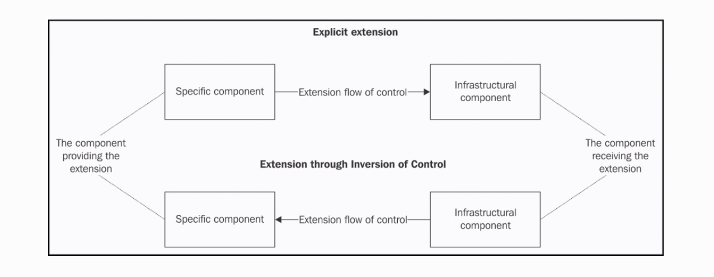

# Chapter 7. Wiring Modules

Node.js 的模块系统极大填充了 JavaScript 语言中的断层：缺乏原生的方式来把代码组织到独立的单元中。一个最大的优点就是使用 require 函数把模块组织到一起，简单有力。但是许多 Node.js 新手还是会问：用哪种方式是把组件 X 的实例传入模块 Y 中最好。

有时这种混乱导致在希望找到一种更熟悉的方式将我们的模块链接在一起时对单例模式绝望的追求。换句话说，这可能会过度随意使用依赖注入模式导入任何类型的依赖。模块的写法在 Node.js 中是最具有争议和主观性的话题。有许多思想流派影响着这个领域，但没有一个可以被视为拥有无可争议的真理。每一种实现都有其优缺点并且他们经常最终在同一个应用程序中混合在一起，改编，定制或以其他名称伪装使用。

在本章，我们将分析各种把模块连接起来的实现。并比较它们的优缺点进而帮助我们在简约性、可重用性、扩展性方面进行权衡。

总的来说，我们将展示关于这个主题的几种最重要的模式：

* 硬编码依赖
* 依赖注入
* 服务定位器
* 依赖注入容器

然后我们将探讨一个密切相关的问题，即如何连接插件。这是在连接模块时经常遇到的问题，它们呈现出相同的特征，但是依据的应用上下文略有差异，特别是在一个插件被当作 Node.js 包来发布时。我们将学习创建一个插件化的架构然后聚焦如何把这些插件集成进主要应用的流程内。

本章结尾，令人摸不着头脑的模块连接问题将不再困惑我们。

## 模块和依赖

每一个现代化的应用总结起来就是一些模块的聚合产物，因为随着应用的增长，我们连接这些组件的方式变得异常重要。这不仅仅关系到技术方面，例如扩展性，而且也关系到整个系统的运行。纠结的依赖图是一种负担，它增加了项目的技术债；与此同时，任何代码的改变无论是修改或者扩展都将导致极大的副作用。

最糟糕的是，组件紧密地连接在一起，最后我们只能重构或完全重写这一部分。当然，这并不意味着我们必须从第一个模块就开始过度设计我们的设计，但从一开始就找到一个很好的平衡将产生深远的影响。

Node.js 提供了一个伟大的工具来组织连接模块。它就是 CommonJS 模块系统。但是单独的模块系统无法保证成功；换句话说，它虽然为客户端和依赖间提供了便利，如果使用不当，它可能会引入更紧密的耦合。在这部分，我们将讨论一些 Node.js 中的基本方面。

### Node.js 中最普遍的依赖

在软件架构中，我们称任何影响组件行为或结构的实体、状态，或者数据格式为依赖。例如，一个组件可能使用了另一个组件的服务，依托特定的系统全局状态或者实现一种特定的交流协议来与其它组件交流信息等等情况。依赖的概念非常广泛而且很难被界定。

但是，在 Node.js 中，我们可以立即识别出一种基本的依赖类型，这是最常见且易于识别的; 当然，我们正在讨论模块之间的依赖关系。模块是我们处理和组织代码结构的基本机制；在不依赖模块系统的情况下构建大型应用程序是不合理的。如果恰当的把各类元素组合在一起，将带来巨大的好处。实际上，模块的属性可以这样总结：

* 一个模块更加可读且便于理解，理想情况下它的内聚性更高
* 以单一文件呈现，模块易于区分
* 模块可以在不同的应用间重用

模块呈现了信息隐藏的完美粒度级别，而且是仅提供公开组件的公共接口的有效机制（使用 module.exports）。

但是，仅仅通过应用或者库的功能来简单分割模块还远远算不上成功的设计。其中一个谬误将在我们的删除或替换模块时被终结。我们迅速认识到把代码组织进模块内并把它们连接起来将非常重要。同时，就像软件设计中的其它问题一样，在不同的标准间找到平衡才是关键。

### 内聚和耦合

在构建模块时最重要的两点属性就是内聚和耦合。它们可以被运用到软件架构中的任意组件或子系统，所以我们把这两点作为构建 Node.js 模块时的指导方针。

* 内聚：衡量一个组件中功能间的相关性。例如，一个模块只做一件事，这就体现出了这个模块的高内聚性。一个包含好几种保存对象到数据库的功能 -- saveProduct()、saveInvoice()、saveUser()，它的内聚性就很低。
* 耦合：衡量一个模块依赖多少个其它模块。例如，当一个模块直接从另一个模块内读取数据时，我们说耦合很高。当然，如果两个模块通过全局或共享状态也是耦合很高。换句话说，两个模块只通过传递参数来交流的话就是松耦合。

我们的目标是高内聚与松耦合，这样的模块会更易读，可用性更高也更容易扩展。

### 有状态的模块

在 JavaScript 中，一切都是对象。我们没有像纯接口或这类的抽象概念；它的动态类型已经提供了一种将接口（或策略）与实现（或细节）分离的自然机制。

在 JavaScript 中，我们在将接口与实现分离时遇到是最小的问题；但是，通过简单使用 Node.js 模块系统，我们已经引入了一种硬编码的特殊实现。一般情况下，这没有问题，但是如果我们使用 require 来导入一个暴露状态化实例的模块时，例如像 db 处理、HTTP 服务实例、服务实例、或者是任何无状态的对象，实际上我们都是引用了一个类似单例的东西，因此继承了它的优点和缺点，并增加了一些注意事项。

#### Node.js 中的单例模式

很多 Node.js 新手对于如何在 Node.js 中正确实现单例充满困惑，大部分时间都是为了在应用程序的各个模块之间共享实例。但是，答案比我们想象的简单；使用 module.exports 简单导出一个实例就已经足够拥有一个类似于单例的东西了。

````JavaScript
// 'db.js' module

module.exports = new Database('my-app-db')
````

通过简单导出一个数据库实例，我们已经获取了 db 模块的实例了。因为 Node.js 会在第一次调用 require 方法后缓存模块，并在后面的调用中直接返回这个模块的缓存。例如，我们简单拥有一个 db 共享的实例：

````JavaScript
const db = require('./db')
````

这里需要注意的点是，模块以它的全路径作为键被缓存，因此这里单例只是当前的包的单例。

````JavaScript
//package.json
{
  "name": "mydb",
  "main": "db.js"
}

// file structure
app/
`-- node_modules
    |-- packageA
    |  `-- node_modules
    |      `-- mydb
    `-- packageB
        `-- node_modules
            `-- mydb

````

packageA 和 packageB 都依赖于 mydb 包；app 包依赖于 packageA 和 packageB。但是 packageA 和 packageB 包都将导入各自的 mydb 模块，因为它们的路径是不同的。

从这点来说，我们字面上描述的单例并不存在于 Node.js 中，除非我们使用一个真正的全局变量来保存它：


````JavaScript
global.db = new Database('my-app-db')
````

这将保证实例在整个应用内是唯一且共享，而不像是个包一样根据导入路径而无法保持状态。大多数情况下，我们不需要一个真正的单例，如果真的需要，我们将在后面看到另一个模式来在不同的包之间共享一个实例。

## 连接模块的模式

我们已经讨论了围绕依赖和耦合的一些基本思想，现在来进一步看一些实际的概念。在这部分，我们将呈现一个模块连接的主要模式。毫无疑问，通过有状态的实例来连接模块是应用中最重要的依赖。

### 硬编码的依赖

我们以分析两个模块间最常规的关系即硬编码依赖为开端。在 Node.js 中，通过 require 方法倒入一个模块时就是这种情况。这种方法创建的模块依赖简单有效，我们必须特别关注有状态实例的硬编码依赖关系。

#### 使用硬编码依赖构建一个授权服务

通过下面的图示来分析：



这幅图显示了一种典型的层级架构；这就是一个简单的授权系统的结构。 AuthController 接收客户端的收入，在请求中获取到登录信息并进行一些初步验证。然后它依赖 AuthService 来检查这个用户是否和数据库内的用户匹配；这些查询依赖于 db 模块处理。这三个组件连接起来的方式将决定可重用性、可测试性和可维护性的程度。

最自然的处理方式是在 AuthService 内导入 db 模块，然后在 AuthController 内导入 AuthService。这就是我们所讨论的硬编码。

我们在系统中来展示一下我们刚刚讨论的实现，进而实现一个简单的授权服务：

* POST '/login'：它接收一个包含 username 和 password 的 JSON 对象来授权。成功的话就返回一个 JSON Web Token(JWT)，它可以在请求时校验用户身份。
* GET '/checkoutToken'：他将从 GET 请求内获取查询参数并对之校验。

##### db 模块

我们由底层开始构建我们的应用；首先我们需要暴露 levelUp 数据库实例。创建 lib/db.js:


````JavaScript
const level = require('level');
const sublevel = require('level-sublevel');

module.exports = sublevel(
  level('example-db', {valueEncoding: 'json'})
);
````

我们简单创建一个到 LevelDB 数据库的连接并储存在 ./example-db 目录下，然后使用 sublevel 插件对其进行装饰，它增加了对创建和查询数据库的不同部分的支持（可以将其与 SQL 表或 MongoDB 集合进行比较）。模块导出的对象是数据库句柄本身，它是一个有状态实例; 因此，我们正在创造一个单例。

##### authService 模块

既然我们拥有了 db 单例，我们可以用它来实现我们的 lib/authService.js 模块：

````JavaScript
// ...
const db = require('./db');
const users = db.sublevel('users');

const tokenSecret = 'SHHH!';

exports.login = (username, password, callback) => {
  users.get(username, function(err, user) {
      // ...
    });
  };

exports.checkToken = (token, callback) => {
  // ...
  users.get(userData.username, function(err, user) {
    // ...
  });
};

````

authService 模块实现了 login 服务和 checkToken 服务。我们将讨论 db 模块，db 变量包含了一个已经初始化的数据库句柄，我们可以直接在上面处理数据操作。

##### AuthController 模块

````JavaScript
// lib/authController.js
const authService = require('./authService');

exports.login = (req, res, next) => {
  authService.login(req.body.username, req.body.password,
    (err, result) => {
      // ...
    }
  );
};

exports.checkToken = (req, res, next) => {
  authService.checkToken(req.query.token,
    (err, result) => {
      // ...
    }
  );
};

````

authController 模块实现了两个路由来处理 HTTP 请求和响应。

在这个模块内，我们依然硬编码了一个状态模块：authService。是的，authService 也成了一个状态模块因为它直接依赖于 db 模块。这样我们就理解了硬编码的依赖是如何在整个应用内传播的。

##### app 模块

````JavaScript
//app.js

const express = require('express');
const bodyParser = require('body-parser');
const errorHandler = require('errorhandler');
const http = require('http');

const authController = require('./lib/authController');
const app = module.exports = express();
app.use(bodyParser.json());

app.post('/login', authController.login);
app.get('/checkToken', authController.checkToken);

app.use(errorHandler());
http.createServer(app).listen(3000, () => {
  console.log('Express server started');
});

````

##### 启动服务

**node app**

我们通过 curl 命令来调用我们的服务：

**curl -X POST -d '{"username": "alice", "password":"secret"}' http://localhost:3000/login -H "Content-Type: application/json**

上面的代码应该返回一个 token，然后我们把它放在下面的 <TOKEN HERE> 处：

**curl -X GET -H "Accept: application/json" http://localhost:3000/checkToken?token=<TOKEN HERE>**

然后会返回下面的字符串：

**{"ok":"true","user":{"username":"alice"}}**

##### 硬编码依赖的优缺点

我们前面的例子展示了利用 Node.js 中的模块系统来管理在组件间的依赖的方便之处。我们从模块内暴露一个状态化的实例，让 Node.js 来管理它的生命周期，然后从应用的其它部分导入它。结果是一个直观的直观组织，易于理解和调试，每个模块初始化并连接自己，无需任何外部干预。

换句话说，硬编码依赖限制了模块再次连接一个其它的实例，这将降低重用性和可测试性。例如，在组合内重用 authService 和其它数据库实例就不太可能了，因为这个硬编码依赖依赖的是同一个实例。而且独立测试 authService 的任务也是非常艰难的，因为我们不能简单模拟模块使用的数据库。

作为最后一个考虑因素，重要的是要看到使用硬编码依赖项的大多数缺点都与有状态实例相关联。 这意味着如果我们使用 require 来加载无状态模块，例如工厂，构造函数或一组无状态函数，我们就不会遇到同样的问题。我们仍将与特定实现紧密耦合，但在 Node.js 中，这通常不会影响组件的可重用性，因为它不会引入与特定状态的耦合。

### 依赖注入

依赖注入（DI）模式也许是在软件设计中最被误解的概念。许多人将这个术语与框架和 DI 容器相关联，例如 Spring（用于 Java 和 C＃ ）或者 Pimple（用于 PHP ），但实际上它是一个更简单的概念。依赖注入模式背后的主要思想是由外部实体提供的组件的依赖关系。

这个实体可以是一个客户端组件或一个集中连接所有模块的全局容器。这种实现的主要优势是可以提升解耦，尤其是在一些依赖状态实例的模块上。使用依赖注入，每一个依赖将不会被硬编码进模块，这个依赖来自外部。这意味我们可以配置模块使用任意依赖，因此就可以在不同的上下文中重用。

为了演示这个模式，我们将使用依赖注入模式重构我们先前的授权服务。

#### 使用 DI 重构授权服务

通过 DI 来重构我们的模块，这其中有一个非常简单的窍门：我们将创建一个工厂，它将一组依赖项作为参数而不是将依赖项硬编码到有状态实例。

以 lib/db.js 模块开始：


````JavaScript
// lib/db.js
const level = require('level');
const sublevel = require('level-sublevel');

module.exports = dbName => {
  return sublevel(
    level(dbName, {valueEncoding: 'json'})
  );
};

````

首先我们通过把 db 模块转换成一个工厂函数为开端。现在我们可以创建任意数量的数据库了；这意味着整个模块将是可重用和无状态的了。

然后构建 lib/authService.js：

````JavaScript
// lib/authService.js

const jwt = require('jwt-simple');
const bcrypt = require('bcrypt');

module.exports = (db, tokenSecret) => {
  const users = db.sublevel('users');
  const authService = {};

  authService.login = (username, password, callback) => {
    //...same as in the previous version
  };

  authService.checkToken = (token, callback) => {
    //...same as in the previous version
  };

  return authService;
};

````

现在， authService 模块也是无状态的了；它不再导出特定的实例了，仅仅导出一个工厂函数。最重要的细节在于我们使得 db 依赖注入作为这个工厂函数的参数，移除了前面的硬编码依赖。这个简单的变化使得我们可以把它连接到任意数据库实例来创建新的 authService 模块。

然后是 lib/authController.js 模块：

````JavaScript
// lib/authController.js
module.exports = (authService) => {
  const authController = {};

  authController.login = (req, res, next) => {
    //...same as in the previous version
  };

  authController.checkToken = (req, res, next) => {
    //...same as in the previous version
  };
  return authController;
};
````

authController 模块没有任何硬编码的依赖。

剩下的就是 app.js 了：


````JavaScript
// app.js

// ...
const dbFactory = require('./lib/db');                        //[1]
const authServiceFactory = require('./lib/authService');
const authControllerFactory = require('./lib/authController');

const db = dbFactory('example-db');                           //[2]
const authService = authServiceFactory(db, 'SHHH!');
const authController = authControllerFactory(authService);

app.post('/login', authController.login);                     //[3]
app.get('/checkToken', authController.checkToken);
// ...


````

1. 首先导入我们的 services 工厂；这时它们还是无状态对象。
1. 然后，通过导入的依赖实例化每一个 service。在这个阶段所有的模块被创建和连接。
1. 最后，我们注册 authController 模块的路由。

#### 不同类型的 DI

我们上面实现的工厂注入是 DI 的一种，这里还有一些其它需要提及的事情：

* 构造器注入：在这种类型的 DI 内，依赖在它被创建的时候传入构造器；可能是这样的：

````JavaScript
const service = new Service(dependencyA, dependencyB)
````

* 属性注入：在这种类型的 DI 内，依赖绑定到一个对象上：

````JavaScript
const service = new Service()
service.dependencyA = anInstanceOfDependencyA
````

属性注入意味着对象在一个不一致的状态下被创建，因为它不连接自己的依赖，所以它的健壮性不高。但是在依赖间出现循环时可能很有用。例如，如果我们有两个组件 A 和 B ，这两个组件都使用工厂或着构造器注入，而且它们互相依赖。我们不能实例化它们其中任意一个，因为它们其中的一个已经被实例化创建。例子如下：

````JavaScript
function Afactory(b) {
  return {
    foo: function() {
      b.say();
    },
    what: function() {
      return 'Hello!';
    }
  }
}

function Bfactory(a) {
  return {
    a: a,
    say: function() {
      console.log('I say: ' + a.what);
    }
  }
}

````

我们只能通过使用属性注入来解决这种僵局。例如，我们可以先创建 B 的实例，然后再实例化 A：

````JavaScript
const b = Bfactory(null)
const a = Afactory(b)
a.b = b
````

#### DI 的优缺点

在使用 DI 实现的授权服务中，我们从依赖实例入手解耦各个模块。结果是我们可以单独重用我们的各个模块了。测试也方便多了。

值得一提的是，我们把依赖的职责从底层切换到的顶层。高阶组件的重用性不如低阶组件，因为随着我们所在的层级越高，每个组件会变得更加具体。

从这个假定出发，我们可以明白常规来说高阶组件拥有被反转的低阶依赖，所以低阶组件只依赖一个接口，因为依赖的定义和实现的所有权在高阶组件上。在我们的授权服务中，所有的依赖被一个顶级组件所实例化并连接起来，app 模块就是哪个顶级组件，这个顶级组件重用性不高，耦合性强。

然而我们需要为解藕和可重用性方面的优势付出代价。一般来说，我们无法在编码时解决依赖关系，这使得理解系统各个组件之间的关系变得更加困难。而且，我们在 app 模块内实例化所有依赖时需要按照特定的顺序；我们不得不手动为整个应用构建依赖树。所以随着应用规模变大这将变得难以管理。

一个可能的解决方案是在多个组件间分割依赖的所有权，而不是把它们集中在一个地方。这样可以大幅度降低依赖管理的复杂度，因为每个组件都拥有其特定的依赖。当然，我们也可以在必要的时候才使用 DI。

我们将在下面的章节中看到如何在复杂架构中简化模块连接的解决方案，这种方案将使用一个 DI 容器来处理所有的依赖职责。

使用 DI 增加了负责度和冗余性，但是依然有很多理由来使用它。我们有责任选择正确的方法，取决于我们想要获得的简单性和可重用性之间的平衡。

### 服务定位器

在前一章节我们学习了 DI 如何通过获取可重用和解藕的模块改变我们连接依赖的方式。另一个具有类似目的的模式就是服务定位器。它的核心原则就是具有一个在模块任何时候需要导入依赖的调解人并集中管理系统间的组件。我们的想法是向服务定位器询问依赖项而不是硬编码依赖。

重要的是要理解通过使用服务定位器，我们引入了对它的依赖，因此我们将它连接到模块的方式决定了它们的耦合程度即可重用性。在 Node.js 中我们可以通过它们连接系统组件的方式来分出三种类型的服务定位器：

* 在服务定位器上硬编码
* 注入服务定位器
* 全局服务定位器

第一个对解藕最不利，因为它使用 require 包含了服务定位器直接的引用。在 Node.js 中，这被称为反模式，因为它引入了与组件的紧密耦合，据称可以提供更好的解藕。在这种情况下，服务定位器显然不会在可重用性方面提供任何价值，只会增加另一层次的间接性和复杂性。

另一方面，一个注入服务定位器被一个组件通过 DI 引用。这样就可以很方便的一次注入整个依赖了。

第三种被提及的服务定位器直接来自全局作用域。它有和硬编码服务定位器一样缺点，但是因为是全局的，它是个真正的单例因此也可以简单的在包之间共享实例。我们可以在接下来的例子中看到，但一般不使用全局服务定位器。

#### 使用服务定位器重构授权服务

我们将用注入的服务定位器来转换授权服务。第一步要实现服务定位器本身：

````JavaScript
//lib/serviceLocator.js

module.exports = function() {
  const dependencies = {};
  const factories = {};
  const serviceLocator = {};

  serviceLocator.factory = (name, factory) => {     //[1]
    factories[name] = factory;
  };

  serviceLocator.register = (name, instance) => {   //[2]
    dependencies[name] = instance;
  };

  serviceLocator.get = (name) => {                  //[3]
    if(!dependencies[name]) {
      const factory = factories[name];
      dependencies[name] = factory && factory(serviceLocator);
      if(!dependencies[name]) {
        throw new Error('Cannot find module: ' + name);
      }
    }
    return dependencies[name];
  };

  return serviceLocator;
}
````

我们的 serviceLocator 模块是一个返回有三个方法对象的工厂：

* factory 将组件名称与工厂关联。
* register 将组件名称直接与实例关联。
* get 通过组件名称取回组件。如果一个实例已经可用，就简单返回它；相反，它会尝试调用注册的工厂来获取一个新实例。知道通过注入服务定位器当前的模块实例调用模块工厂很重要。这是模式的核心机制，允许我们的系统的依赖图自动和按需构建。

````JavaScript
//lib/db.js
const level = require('level');
const sublevel = require('level-sublevel');

module.exports = (serviceLocator) => {
  const dbName = serviceLocator.get('dbName');

  return sublevel(
    level(dbName, {valueEncoding: 'json'})
  );
}

````

db 模块使用服务定位器来接收输入并返回数据库的名称来实例化。一个值得提及的点是，服务定位器不仅可以返回组件实例而且也可以提供一个带参数的配置项。

````JavaScript
//lib/authService.js

// ...
module.exports = (serviceLocator) => {
  const db = serviceLocator.get('db');
  const tokenSecret = “serviceLocator.get('tokenSecret');

  const users = db.sublevel('users');
  const authService = {};

  authService.login = (username, password, callback) => {
    //...same as in the previous version
  }

  authService.checkToken = (token, callback) => {
    //...same as in the previous version
  }

  return authService;
};

````

authService 模块是一个以服务定位器作为输入的工厂。db 句柄和 tokenSecret 两个依赖通过 get 方法被返回。


````JavaScript
//lib/authController.js

module.exports = (serviceLocator) => {
  const authService = serviceLocator.get('authService');
  const authController = {};

  authController.login = (req, res, next) => {
    //...same as in the previous version
  };

  authController.checkToken = (req, res, next) => {
    //...same as in the previous version
  };

  return authController;
}

// app.js

//...
const svcLoc = require('./lib/serviceLocator')();      //[1]

svcLoc.register('dbName', 'example-db');               //[2]
svcLoc.register('tokenSecret', 'SHHH!');
svcLoc.factory('db', require('./lib/db'));
svcLoc.factory('authService', require('./lib/authService'));
svcLoc.factory('authController', require('./lib/authController'));

const authController = svcLoc.get('authController');   //[3]
app.post('/login', authController.login);
app.all('/checkToken', authController.checkToken);
// ...

````

1. 我们通过调用工厂来实例化一个新的服务定位器
1. 我们针对服务定位器注册配置参数和模块工厂。此刻，所有的依赖还未被实例化；我们只是注册了它们的工厂。
1. 我们从服务定位器导入 authController；这会触发整个应用依赖树实例化。当我们实例化 authController 组件时，服务定位器通过注入自己来调用相关的工厂。然后 authController 工厂将尝试导入 authService 模块，这会返回 db 模块的实例。

我们可以看到服务定位器惰性特性；每一个实例只有在需要时才会创建。另一个重要的实现是：每一个依赖不需要提前手动连接。优点是我们不必提前知道实例化和连接模块的顺序 -- 它们全部自动按需发生。相比简单的 DI 模式这样更加方便了。

#### 服务定位器的优缺点

服务定位器和依赖注入有很多相似点：它们都将依赖所有权转移到组件外部的实体。但我们连接服务定位器的方式决定了我们整个架构的灵活性。我们选择一个注入的服务定位器而不是硬编码或全局服务定位器来实现我们的示例并不是偶然的。这最后两个变种几乎抵消了这种模式的优势。实际上我们通过在服务定位器实例里面连接它们，而不是通过 require 导入依赖来连接组件。虽然硬编码的服务定位器更方便但就可重用性来说优势不大。

当然，就像 DI 一样，使用一个服务定位器很难确定两个组件间的关系，因为它们在运行时才确定关系。还有，也很难确切知道哪个组件是被导入的。通过声明构造器参数或工厂中的依赖，在 DI 中表达会更清晰一点。但在服务定位器内需要代码审查器或一个确切的语句来解释组件的具体依赖。

最后需要注意的是对于 DI 容器相比，服务定位器是一个不那么正确的实现，因为它共享了和服务注册相同的角色；但是，这里也有很大区别。在服务定位器中，每个组件知道自己明确的依赖；在 DI 容器中，组件对自己的容器一无所知。

两种实现的不同点主要有以下几点：

* 可重用性：依赖于服务定位器的组件重用性更低因为它依赖于服务定位器。
* 可读性：服务定位器混淆了依赖。

就可重用性来说，我们可以说服务定位器模式居于硬编码依赖和 DI 之间。就便捷性和简易性来说，它绝对比手动依赖好，因为我们不必手动控制整个依赖树。

基于这些假定，就组件可重用性和便捷性来说，一个 DI 容器绝对提供了最好的平衡。我们这就来看看。

### 依赖注入容器

将服务定位器转换为依赖注入（DI）容器的步骤并不大，但正如我们已经提到的，它在解耦方面产生了巨大的差异。这个模式下，每个模块不必依赖于服务定位器，它可以简单地表达其对依赖性的需求，DI 容器将无缝地完成剩下的工作。对于这个容器最大的进步就是每个模块可以脱离模块进行重用。

#### 为一个 DI 容器声明一系列依赖

一个 DI 容器本质上是一个添加的新特性的服务定位器：在模块实例化前它可以识别模块的依赖。因此，一个模块必须以某种方法来声明它的依赖。

首先，最流行的方式是注入一系列基于在工厂中使用的参数和构造器的依赖：


````JavaScript
//lib/authService.js

module.exports = (db, tokenSecret) => {
  //...
}
````

正如我们定义的，这个模块将通过我们的 DI 容器传入的名称来实例化。但是为了从函数内读取到参数，我们有必要使用一点点技巧。在 JavaScript 中，我们可以通过序列化一个函数返回它的源码；使用 toString 方法就可以办到。

这种方法的最大问题在于它不能很好地用于缩小，这种做法在客户端JavaScript中广泛使用，其中包括应用特定的代码转换以将源代码的大小减小到最小。许多缩小应用了一种称为名称修改的技术，它基本上重命名了一切局部变量以减少其长度，通常减少为单个字符。一个坏消息是函数参数是本地变量而且经常被其处理过程所影响，这会导致我们描述的声明依赖的机制失效。即使在服务端缩小不是必须的，但是考虑在浏览器内共享 Node.js 模块的代码也很重要。

幸运的是，一个 DI 容器可能使用其它的的技术来获取注入的依赖。这些技术被列在下面：

* 我们可以使用一个附在工厂函数上的特别属性，例如一个确切列出注入依赖的数组：

````JavaScript

module.exports = (a, b) => {}

module.exports._inject = ['db', 'another/dependency']
````

* 我们可以指定一个依赖名称的数组：

````JavaScript
module.exports = ['db', 'another/dependency'， (a, b) => {}]
````

* 我们可以使用一个注释标记添加到每个函数内：

````JavaScript
module.exports = function(a /*db*/, b /*another/dependency*/) {}
````

这些技术都十分主观，所以我们使用其中最流行的实现：使用函数参数作为依赖名称。

#### 通过 DI 容器来重构授权服务

为了展示 DI 容器比服务定位器侵扰性更低，我们将基于原本的 DI 模式重新构建我们的授权服务。事实上，我们要做的就是保持应用程序的所有组件不受影响。除了app.js模块，它将成为负责初始化容器的模块。

但是，首先我们需要实现我们的 DI 容器。我们创建一个 diContainer.js：

````JavaScript
// lib/diContainer.js

const fnArgs= require('parse-fn-args');

module.exports = function() {
  const dependencies = {};
  const factories = {};
  const diContainer = {};

  diContainer.factory = (name, factory) => {
    factories[name] = factory;
  };

  diContainer.register = (name, dep) => {
    dependencies[name] = dep;
  };

  diContainer.get = (name) => {
    if(!dependencies[name]) {
      const factory = factories[name];
      dependencies[name] = factory &&
          diContainer.inject(factory);
      if(!dependencies[name]) {
        throw new Error('Cannot find module: ' + name);
      }
    }
    return dependencies[name];
  };
  //...to be continued

````

我们的 diContainer 模块和我们先前构建的服务定位器一样。值得注意的点有：

* 我们导入了一个新的模块 [args-list](https://npmjs.org/package/args-list)，这个包会取得函数内参数名称。
* 这次我们没有直接调用模块工厂，我们依赖 diContainer 模块的 inject 方法来解决模块依赖并调用工厂。

我们来看下 diContainer.injdect 方法：

````JavaScript
diContainer.inject = (factory) => {
  const args = fnArgs(factory)
  .map(dependency => diContainer.get(dependency));
    return factory.apply(null, args);
  };

}; //end of module.exports = function() {


````

这个方法不同于服务定位器内的方法，它的逻辑很直接：

1. 我们使用 parse-fn-args 库获取到工厂函数的参数。
1. 然后通过 map 方法取得每个实例的对应参数。
1. 最后使用我们刚刚生成的依赖列表调用工厂函数。

这就是我们 diContainer 做的，和服务定位器区别不大，但是通过注入它的依赖来简单实例化一个模块的这个步骤却产生了戏剧化的差异。

````JavaScript
// app.js

const diContainer = require('./lib/diContainer')();

diContainer.register('dbName', 'example-db');
diContainer.register('tokenSecret', 'SHHH!');
diContainer.factory('db', require('./lib/db'));
diContainer.factory('authService', require('./lib/authService'));
diContainer.factory('authController', require('./lib/authController'));

const authController = diContainer.get('authController');

app.post('/login', authController.login);
app.get('/checkToken', authController.checkToken);
// ...

````

app 模块内的代码和我们初始化服务定位器内的一样。

#### DI 容器的优缺点

一个 DI 容器假定了我们的模块使用了 DI 模式，因此继承了它的大部分优缺点。尤其是，我们提升了解藕性和特测试性，但是复杂度也随着上升，因为我们的依赖在运行时才被导入。一个 DI 容器也和服务定位器共享了很多属性，但它的另一面除了实际的依赖外，它不需要强制模块依赖任何额外的服务。这是个极大的优势，因为这样的话我们的每个模块可以在没有 DI 容器的情况下通过手动注入被使用了。

这就是我们这部分展示的：授权服务在原生 DI 模式下，没有修改它的组件（除了 app.js）也岁每个依赖实现了注入。

## 接连插件

一个软件工程师梦想中的架构是拥有一个极简的核心并在需要的时候通过插件来扩展的架构。不幸的是，一般来说这不容易做到，因为大多数情况下实现这样的架构意味着事件、资源和复杂度的消耗。尽管如此，即使是被限制在系统的部分使用，我们还是希望会有一些所谓的外部扩展可以使用。在本节中，我们将进入这个迷人的世界，并专注于二元问题。

* 暴露一个应用的服务给插件
* 集成一个插件到父极应用

### 作为包的插件

通常在 Node.js 中应用的插件被以包的形式安装在 node_modules 文件夹中。这样做有两个优点。首先，我们可以使用 npm 发布并管理依赖。然后，一个包可以拥有自己私有的依赖树，这样可以避免依赖之间的冲突和矛盾。

下面的文件夹结构就展示了两个作为包的插件：

````JavaScript
application
  -- node_modules
      |-- pluginA
      |-- pluginB
````

在 Node.js 中这是个很常见的实践。

但是使用包的好处不仅仅在于。实际上，一个流行的模式是通过包装它们组件到一个包内来构建整个应用，就像是它的内部插件一样。所以不是把模块组织进应用的主体包内，我们可以把功能分割成小块然后在每个小块内分别安装包。

为何要使用这个模式呢？首先，方便：人们经常会发现在包的本地模块内通过相对路径来引用一个包很不现实。比如下面这样：

````JavaScript
application
|-- componentA
|   '-- subdir
|       '-- moduleA
'-- componentB
    '-- moduleB

````

如果我们想从 moduleA 中查询 moduleB，我们必须这样：**require('../../componentB/moduleB')**

实际上我们可以把整个 componentB 文件夹放到一个包内然后利用 require 算法。通过把它安装进 node_modules 文件夹内，我们可以这样： **reuire('componentB/module')**。

把项目分离到包内的第二个原因在于，可重用性。一个包可以拥有其私有的依赖，这会强制开发者去思考哪些应该暴露给主要应用哪些应该保持私有。

我们刚刚描述的用例使用的包不仅仅是一个无状态的，可重用的库（就像 npm 上的大多数包一样），而是更多地作为特定应用程序的一个组成部分，提供服务，扩展其功能，或者修改其行为。主要区别在于这些类型的软件包集成在应用程序中而不是仅仅被使用。

我们现在遇到的问题是何时决定暴露部分主体应用给插件的这类架构。实际上，我们不能只考虑无状态插件，虽然它是一个完美的扩展方案，因为插件不得不使用父级应用的服务来完成任务。这方面依赖于父级应用连接模块的技术。

### 扩展点

这里有数不清的方式来扩展一个应用。例如使用我们前面提到了代理或者装饰器，这样可以改变或增强服务的功能；我们可以使用策略模式把一部分包装进算法；我们可以使用中间件在存在的管道内插入处理单元。而且由于它的可组合性，流可以提供极大的扩展性。

还有 EventEmitter 允许我们使用事件和推/拉模式解藕我们的组件。另一个重要技术是在应用程序中明确定义可以附加的新功能或修改现有功能的一些点；这些在应用内的点被称为钩子。总而言之，支持插件的最重要的成分是一组扩展点。

我们连接组件的方式起着决定性的作用，因为它影响着应用内服务是如何暴露给插件的。在这一部分我们将聚焦于这个方面。

### 插件控制与应用程序控制的扩展

在举例子前，了解我们将使用的技术背景很重要。这里有两类实现：

* 明确的扩展
* 通过控制反转的扩展

在第一类扩展内我们拥有特定的组件明确扩展我们的基础架构。而在第二类中，基础架构将通过加载、安装或者启动一个新的组件来控制扩展。


IoC 是一个非常广泛的原则，它不仅仅可以被运用在应用扩展问题上。事实上，从更一般的角度来看，可以说通过实施某种形式的 IoC，而不是控制基础设施的自定义代码，基础设施控制着自定义代码。 对于 IoC，应用程序的各个组件会牺牲其控制流的能力来换取更高水平的解耦。这也被称为好莱坞原则或者是 “don't call me, we'll call you”。

例如，一个 DI 容器就是 IoC 原则应用在特定依赖管理器上的事例。观察者是 IoC 运用到状态管理器的事例。模版、策略、状态和中间件也是相同原则的本地化表现。浏览器在分发 UI 事件给 JavaScript 代码也实现了 IoC 原则。猜猜怎么着？ Node.js 本身在控制不同回掉的时候也遵循 IoC 原则。

把这个概念运用到特定的插件上，就出现了两种扩展：

* 插件控制的扩展
* 应用控制的扩展（IoC）

在第一个事例内，插件被集成进应用组件内按需扩展。而在第二个事例内，应用控制着插件，应用把插件集成到一个特定的扩展点上。

一个快速实例就是，我们来看看一个扩展 EXpress 路由的插件。通过插件控制类的扩展，将是这样的：


````JavaScript
//in the application:
const app = express();
require('thePlugin')(app);

//in the plugin:
module.exports = function plugin(app) {
  app.get('/newRoute', function(req, res) {...})
};

````

如果我们使用应用控制的扩展（IoC）是这样的：

````JavaScript
//in the application:
const app = express();
const plugin = require('thePlugin')();
app[plugin.method](plugin.route, plugin.handler);

//in the plugin:
module.exports = function plugin() {
  return {
    method: 'get',
    route: '/newRoute',
    handler: function(req, res) {...}
  }
}

````

在后面的示例内，可以看到插件是被动的；控制权在应用上，应用实现了插件的接收工作。

基于前面的例子，我们可以迅速找出这两类插件的区别：

* 插件控制的扩展更加灵活也更具弹性，因为我们可以在到达应用内部并自由使用插件。但是有时却会是相反的情况。实际上，应用程序的任何更改都会对插件产生更大的影响，需要不断更新，因为主应用程序在不断发展。
* 应用程序控制的扩展依赖主应用程序中的插件基础结构。使用插件控制扩展，唯一的要求是应用程序的组件可以以某种方式扩展才行。
* 使用插件控制的扩展，我们必须共享应用内部的服务（例如例子的 app 实例）；否则我们无法对其扩展。使用应用控制的扩展，也可能需要获取到应用的服务，我们不仅仅是用来扩展而且还要用来使用。例如我们需要 db 实例来进行查询或者利用主应用的日志打印。


最后一点应该让我们考虑将应用程序的服务暴露给插件的重要性 -- 这是我们主要关注的问题。这样做的最好方法是展示插件控制扩展的实际示例，这需要在基础架构方面花费最少的工作量，我们可以更多地强调使用插件共享应用程序状态的问题。

### 实现一个登出插件

我们现在来为我们的授权服务实现一个简单的插件。基于我们的原本实现，我们需要使 token 无效即可实现登出；这很容易因为当 token 过期了就会失效。现在我们为这个功能增加一个支持，logout。我们不通过修改主应用的代码，我们把这个任务委托给插件。

为了实现这个新功能，我们需要在 token 创建后并把它保存进数据库内，然后在我们需要验证的时候验证它是否还存在。使一个 token 失效，我们只需把它从数据库中移除。

我们将使用插件控制的扩展来代理 authService.login 和 authService.checkToken 方法。我们需要用一个叫 logout 的新方法装饰 authService。我们需要注册一个新的路由端点来使 token 无效。

步骤有如下四步：

* 使用硬编码依赖
* 使用依赖注入
* 使用服务定位器
* 使用 DI 容器

#### 使用硬编码依赖

我们现在要实现的插件的第一个变体涵盖了我们的应用程序主要使用硬编码依赖关系来连接其有状态模块的情况。如果我们的插件是在 node_modules 文件夹下，为了使用主应用的服务，我们必须可以获取到父级包。我们可以这样做：

* 使用 require 并通过绝对或相对路径导航到应用的根。
* 通过模拟父应用程序中的模块来使用 require -- 通常是实例化插件的模块。这样我们可以通过 require 来获取到应用的服务，就像是被应用调用的一样。

相比来说，第一个实现的健壮性不强，因为它假设了包主导了主应用的位置。而模块模仿模式可以不管包在何处应用，基于这个理由，我们将使用第二技术来演示。

我们需要在 node_modules 文件夹下创建一个新的包，取名 authsrv-plugin-logout。在我们开始前，我们需要一个 package.json 文件来描述一下我们的这个插件：


````JavaScript
// node_modules/authsrv-plugin-logout/package.json

{
  "name": "authsrv-plugin-logout",
  "version": "0.0.0"
}
````

现在我们来创建了插件的主模块，即 index.js 文件，这是 Node.js 尝试加载的默认包（如果 package.json 中无 main 属性的话）。通常初始化需要加载依赖：


````JavaScript
const parentRequire = module.parent.require;
const authService = parentRequire('./lib/authService');
const db = parentRequire('./lib/db');
const app = parentRequire('./app');

const tokensDb = db.sublevel('tokens');

````

第一行是关键。我们获取到了父级模块 require 函数的引用，父级模块指加载插件的模块。在我们的例子中， app 模块将是父级模块，这就意味这我们每次使用 parentRequire 就相当于我们在 app.js 中加载模块。

下一步来为 authService.login 创建一个代理方法：

````JavaScript
const oldLogin = authService.login;                    //[1]
authService.login = (username, password, callback) => {
  oldLogin(username, password, (err, token) => {       //[2]
    if(err) return callback(err);                      //[3]
    tokensDb.put(token, {username: username}, () => {
      callback(null, token);
    });
  });
});
}

````

1. 首先我们保存了 login 方法的引用便于重写。
1. 在代理函数内，通过提供的自定义回掉调用原来的 login 方法，这样才可以拦截到原来的返回值。
1. 如果原来的 login 返回一个错误，我们把它传递给回掉；否则，保存 token 到数据库内。

相似的，我们需要拦截 checkToken 的调用并添加自己的逻辑：

````JavaScript
const oldCheckToken = authService.checkToken;

authService.checkToken = (token, callback) => {
  tokensDb.get(token, function(err, res) {
    if(err) return callback(err);

    oldCheckToken(token, callback);
  });
}

authService.logout = (token, callback) => {
  tokensDb.del(token, callback);
}

app.get('/logout', (req, res, next) => {
  authService.logout(req.query.token, function() {
    res.status(200).send({ok: true});
  });
});


````

这次，我们首先检查 token 是否存在于数据库内然后再把控制权交还给原来的 checkToken 方法。如果这个 token 不存在， get 操作将返回一个错误；这意味着我们的 token 已经失效。

最后是 authService 的扩展，并用一个新方法来装饰它，使这个 token 失效。

现在我们的插件已经准备好附加到主应用上了。编辑 app.js 模块：

````JavaScript
// app.js

// ...
let app = module.exports = express();
app.use(bodyParser.json());

require('authsrv-plugin-logout');

app.post('/login', authController.login);
app.all('/checkToken', authController.checkToken);
// ...

````

我们需要引入插件来把它附加到主应用上。现在我们的授权服务也支持了验证 token。我们以一种可重用的方式对其进行实现。应用的核心部分依然保持原样。我们可以简单的运用代理和装饰器模式来扩展功能。

现在我们尝试启动我们应用： **node app**。

````JavaScript
// 并对我们的新功能进行验证
curl -X POST -d '{"username": "alice",“password":"secret"}' http://localhost:3000/login -H Content-Type: application/json


// 然后检查 token

curl -X GET -H "Accept: application/json" http://localhost:3000/checkToken?token=<TOKEN HERE>

// 登出

curl -X GET -H "Accept: application/json" http://localhost:3000/logout?token=<TOKEN HERE>
````

即使是这样的一个小插件，支持一个基于插件的扩展依然很明显。我们学习了如何利用模块模仿从另一个包中获取到主程序的服务。

模块模仿是一种硬编码的依赖并且拥有和硬编码一样的优缺点。从另一方面说，它允许我们从主应用中获取任意的服务。但是它也创建了一个紧密的耦合，不仅与服务的特定实例耦合，而且与其位置有耦合，这将使插件在主应用程序中的更容易更改和重构。

#### 使用服务定位器暴露服务

和模块模仿类似，如果我们想暴露应用的所有组件给它的插件，服务定位器也是一个好选择。但是在这之上，它拥有一个极大的优点，就是一个插件可以以服务定位器的形式暴露自己的服务给应用甚至是暴露给其它插件。

我们用服务定位器来重构一下我们的 logout 插件：

````JavaScript
// node_modules/authsrv-plugin-logout/index.js

module.exports = (serviceLocator) => {
  const authService = serviceLocator.get('authService');
  const db = serviceLocator.get('db');
  const app = serviceLocator.get('app');

  const tokensDb = db.sublevel('tokens');

  const oldLogin = authService.login;
  authService.login = (username, password, callback) => {
    //...same as in the previous version
  }

  const oldCheckToken = authService.checkToken;
  authService.checkToken = (token, callback) => {
    //...same as in the previous version
  }
  authService.logout = (token, callback) => {
    //...same as in the previous version
  }

  app.get('/logout', (req, res, next) => {
    //...same as in the previous version
  });
};

````

现在我们的插件以父级应用作为输入，它可以获取到任何需要的服务。这意味着应用不需要提前知道插件需要什么依赖；这是一个实现插件控制的扩展的极大优势。

下一步就是在主应用中启动插件，修改 app.js 模块。我们将使用基于服务定位器模式的授权服务：

````JavaScript
// app.js

// ...
const svcLoc = require('./lib/serviceLocator')();
svcLoc.register(...);
// ...

svcLoc.register('app', app);
const plugin = require('authsrv-plugin-logout');
plugin(svcLoc);

````

* 注册 app 模块给服务定位器，因为插件可能需要获取到 app。
* 导入插件
* 通过提供的服务定位器作为参数调用插件的主要函数

正如我们先前说过的服务定位器的主要优点就是提供了一种简单的方式暴露出应用的所有服务给插件，但是也可以当作在插件和应用或插件间共享服务的机制。

#### 使用 DI 暴露服务

使用 DI 传递服务给插件很简单。如果 main 方法来连接父级应用的依赖，而且没有什么可以阻止我们在管理依赖时使用硬编码依赖或者是一个服务定位器，DI 模式几乎成为了必须使用 main 方法内的必需。当我们想要支持一个应用控制的扩展时，DI 也是一个理想的选择，因为它为共享插件提供了更好的控制。

````JavaScript
module.exports = (app, authService, db) => {
  const tokensDb = db.sublevel('tokens');

  const oldLogin = authService.login;
  authService.login = (username, password, callback) => {
    //...same as in the previous version
  }

  let oldCheckToken = authService.checkToken;
  authService.checkToken = (token, callback) => {
    //...same as in the previous version
  }

  authService.logout = (token, callback) => {
    //...same as in the previous version
  }

  app.get('/logout', (req, res, next) => {
    //...same as in the previous version
  });
};

// app.js
// ...
const plugin = require('authsrv-plugin-logout');
plugin(app, authService, authController, db);
// ...


````

我们把插件包装到一个接收父级应用服务的工厂内；剩下的不变。然后修改 app.js 内的代码。

DI 模式绝对是提供一系列服务给插件的最清晰的方式，更重要的是它还提供了对暴露出来的东西最高的控制权，更完善的信息隐藏。但是有时这也会被当作一项缺点，因为主应用不能经常知道插件需要哪个服务，所以我们注入了所有的服务，这是不现实的。由于这个原因，当我们主要想要支持插件控制扩展时，DI 不是理想的选择。但是使用 DI 容器可以简单地解决这个问题。

#### 使用 DI 容器暴露服务

在 app.js 内，我们可以这样实现：


````JavaScript
// ...
const diContainer = require('./lib/diContainer')();
diContainer.register(...);
// ...
//initialize the plugin
diContainer.inject(require('authsrv-plugin-logout'));
// ...

````

在注册或实例化我们的应用后，我们只需要实例化我们的插件。这样每个插件可以导入它自己的依赖而不需要父级应用知道。所有的连接再次被 DI 容器自动完成。

使用 DI 容器也意味着每一个插件可以潜在地获取到应用的任意服务，这会降低信息的隐藏和扩展的使用。一个可能的解决方案是创建一个分离的 DI 容器注册我们想要暴露给插件的服务；这样，我们可以控制每一个插件在应用内的可见度。

## 总结

连接依赖在软件工程内是最具主观性的话题之一，但是在本章内，我们尽可能保持分析的真实性，以便客观地概述最重要的连接模式。我们澄清了在 Node.js 中关于单例和实例的一些普遍疑问，学习了如何使用硬编码、DI、服务定位器来连接依赖。我们使用了一个授权服务来实践了每一种技术，并探讨它们的优缺点。

在本章的第二部分，我们学习了如何使应用支持插件，最重要的是如何把插件集成进应用中。我们运用了在第一部分内相同的技术并从另一个角度对其进行分析。我们发现一个插件从主应用中获取到正确的服务是多么重要，这会影响其能力。

在本章的最后部分，我们应该在选择何种级别的解藕性、可重用性和精简性上感到得心应手。我们可以在应用中使用更多的模式。例如，我们可以使用硬编码作为主要技术，然后使用服务定位器连接插件；现在我们知道了每种方法的最佳用例，我们现在能做的事情确实没有限制。

到目前为止，在本书中，我们将分析重点放在高度通用和可定制的模式上，但从下一章开始，我们将把注意力转移到解决更具体的技术问题上。接下来的内容实际上是一系列的窍门，可用于解决与 CPU 绑定任务相关的具体问题，异步缓存以及与浏览器共享代码。
