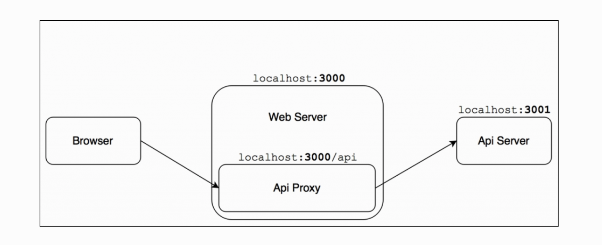

# Chapter 8. Universal JavaScript for Web Applications

JavaScript 诞生自 1995 年，它的使命是赋予开发者构建更多动态交互的网站的能力。

从那以后，JavaScript 成长的很快，现在它已经是世界上最著名最广泛的语言之一了。很早以前， JavaScript 还是一门非常简单有限的语言。如今它可以被认为是一种完整的通用语言，甚至可以在浏览器之外用于构建几乎任何类型的应用程序。实际上，JavaScript 现在驱动了前端应用、web 服务、移动应用当然也可以内置到可穿戴设备内。

 JavaScript 的跨平台和跨设备能力引导了一种新的趋势，那就是把代码简化到在同一个项目在不同的环境下都可以运行。对于 Node.js 来说，最有意义的例子就是代码可以在服务端和客户端进行共享。这种追求代码在多个平台的重用以前被称为同构 JavaScript 现在被称为通用 JavaScript。

 在本章节，我们将探索奇妙的通用 JavaScript，尤其是在 web 开发领域，并发现那些可以在客户端和服务端进行共享的工具和技术。

 特别是，我们将学习如何在客户端和服务端使用相同的模块，并学习像 WebPack 和 Babel 这样的工具。我们将选用 React 库和其它著名的模块来构建 web 接口，在服务端和客户端共享状态，最后探索一些有趣的解决方案来使路由和数据检索变得通用。

 在本章最后，我们将写一个基于 React 的单页面应用（SPAs），这个应用的大部分代码可以共享给服务端，这样的应用一致且易于维护。


 ## 与浏览器共享代码

 Node.js 的一大卖点就是基于 JavaScript 和基于 V8 引擎。肃然如此但在服务端和客户端间共享代码也并不是那么简单。为双端开发代码需要极大的努力。因为这两个环境本质上是截然不同的。例如，Node.js 没有 DOM 或者长时间视图，而浏览器里没有文件系统或者开启新进程的能力。而且我们可以在 Node.js 中安全地使用许多 ES2015 的新特性，而在浏览器内则不能，因为浏览器主要的版本依然是 ES5，所以在浏览器内运行 ES5 代码依然是最保险的行为。

 所以为双端开发代码需要把差异缩减到最小。这可以在抽象和模式的帮助下完成，这些抽象和模式使应用程序能够在浏览器和 Node.js 兼容代码之间动态或在构建时切换。

 幸运的是，随着人们对这种新的令人兴奋的可能性越来越感兴趣，许多生态中的库和框架已经开始支持这两个环境了。这种发展也得到了越来越多支持这种新型工作流程工具的支持，这些工具多年来一直在不断完善和完善。这意味着如果我们在 Node.js 中使用一个包，这个包也可能无缝在浏览器中使用。但是，这并不意味着会一帆风顺，我们需要更小心的设计开发。

 在这一部分，我们将探索在为双端开发应用时将遭遇到的基本问题，并提出一些工具和模式来帮助我们完成挑战。

 ### 共享模块

 我们解决的第一个问题就是 Node.js 中的模块系统与浏览器内各种各样的模块系统的匹配问题。另一个问题是在浏览器内我们没有 require 函数或者可以导入模块的文件系统。如果我们想要在浏览器内共享大量代码，我们需要在浏览器内抽象 require 机制。

 #### 通用模块定义

 在 Node.js 中，我们知道 CommonJS 模块是在组件间创建依赖的默认机制。不幸的是，浏览器空间的情况更加分散；

* 我们可能有一个无模块系统的环境，这意味着 globals 是获取模块的主要机制。
* 我们有一个基于异步模块定义（AMD）的加载器的环境。例如， RequireJS。
* 我们可能有一个抽象了 CommonJS 模块系统的环境。

幸运的是，这里有一个叫通用模式定义（UMD）的模式，这个模式可以让我们从模块系统内抽象代码。

##### 创建一个 UMD 模块

UMD 到目前为止还不是一个标准，所以这里可能有很多根据组件需要和模块系统支持的变体。但是这里有一个可能是最流行的变体，它允许我们支持最通用的模块系统，例如， AMD、CommonJS 和浏览器 globals。

````JavaScript
//umdModule.js
(function(root, factory) {                           //[1]
  if(typeof define === 'function' && define.amd) {   //[2]
    define(['mustache'], factory);
  } else if(typeof module === 'object' &&            //[3]
      typeof module.exports === 'object') {
    var mustache = require('mustache');
    module.exports = factory(mustache);
  } else {                                           //[4]
    root.UmdModule = factory(root.Mustache);
  }
}(this, function(mustache) {                         //[5]
  var template = '<h1>Hello <i>{{name}}</i></h1>';
  mustache.parse(template);

  return {
    sayHello:function(toWhom) {
      return mustache.render(template, {name: toWhom});
    }
  };
}));
````

前面的例子定义了一个简单的模块。这里产出一个有 sayHello 方法的对象，这个方法会渲染 mustache 模版并返回给它的调用者。UMD 的目的就是集成环境中的其它模块系统。

1. 所有的代码都被包围在一个匿名的自执行函数内，这很揭露模块模式很像。这个函数接收一个全局命名空间对象（例如在浏览器中是 window 对象）。这主要用于将依赖项注册为全局变量，我们将在稍后看到。第二个参数是模块的 factory，一个返回模块实例并接受其依赖关系作为输入的函数（依赖注入）
1. 我们首先要做的事就是检查一下 AMD 是否在系统内可用。我们通过检查 define 函数作为标识来完成检查。如果发现有，就意味着在系统内 AMD 是可用的，所以我们使用 define 来定义模块。
1. 然后我们通过 module 和 module.exports 对象检查是否是 Node.js 环境。如果是就直接导入模块并赋值给 module.exports。
1. 如果既不是 AMD 环境也不是 Node.js 环境的话，我们使用 root 对象把模块赋值给全局变量。这个 root 对象在浏览器内将是 window 对象。
1. 最后如果包装函数是自调用的，提供 this 对象给 root，并提供我们的模块工厂作为第二个参数。

值得一说的是我们还未使用任何 ES2015 的新特性。因为这可以让我们的代码的适配性更强。

现在，我们来在 Node.js 和浏览器环境内使用我们的 UMD 模块。

首先，创建一个 testserver.js 文件：

````JavaScript
const umdModule = require('./umdModule');
console.log(umdModule.sayHello('Server!'));

````

如果我们执行这个脚本它将输出：

**<h1>Hello <i>Server!</i></h1>**

如果我们想要在浏览器中使用我们的模块，就创建一个 testBrowser.html 文件：

````Html
<html>
  <head>
    <script src="node_modules/mustache/mustache.js"></script>
    <script src="umdModule.js"></script>
  </head>
  <body>
    <div id="main"></div>
    <script>
document.getElementById('main').innerHTML =
         UmdModule.sayHello('Browser!');
    </script>
  </body>
</html>

````

这将在浏览器内输出 **Hello Browser！**

这里我们将 mustache 和 umdModule 作为普通脚本引入，然后创建了一个内联脚本。

##### 对于 UMD 模式的思考

UMD 模式是一个有效简单的技术来创建通用模块。但是我们也知道了它需要大量的模版，这些模版在每个环境下是难以测试的。当我们从头开始编写新模块时，这不是一种惯例；这是不可行和不切实际的，所以在这些情况下，最好将任务留给可以帮助我们自动化流程的工具。其中一个工具是 Webpack，我们将在本章中使用它。

我们也提及的 AMD， CommonJS 和浏览器全局变量不是唯一的模块系统。我们提及的模式覆盖到了大多数的情况，但也需要适配到其它情况。例如 ES2015 的模块规格。

#### ES2015 模块

ES2015 为我们带来了内建的模块系统。在本书内我们还未提及过这种模块系统，因为目前为止的 Node.js 还没有支持。

我们将深入这个模块系统的的细节，因为它有可能在将来成为一种模块语法；ES2015 模块系统不仅仅提出了一种好用的语法而且相比我们讨论的一些模块系统也拥有很多优点。

ES2015 的目标就是融合 CommonJS 和 AMD 模块的优势：

* 像 CommonJS，ES2015 需要特定的语法，对单一导出的偏好，以及对循环依赖的支持。
* 像 AMD，ES2015 提供了异步导入和配置模块导入。

而且，由于清晰的语法，我们可以使用静态分析器执行静态检查和优化等任务。对于实例，我们可以分析脚本依赖树并为浏览器创建打包文件。

今天，你也可以在 Node.js 中使用新的模块语法，采用像 Babel 这样的转换器。实际上，许多开发人员都在倡导它，同时提出自己的解决方案来构建通用 JavaScript 应用程序。通常一个好的想法是面向未来，特别是因为这个功能已经标准化，最终将成为 Node.js 核心的一部分。为简单起见，我们将在本章中全面遵循 CommonJS 语法。


### WebPack 介绍

在编写 Node.js 应用程序时，我们要做的最后一件事是手动添加对模块系统的支持，该模块系统与平台默认提供的模块系统不同。理想情况下，我们使用 require 和 module.exports 来编写模块，然后使用工具把代码转换到一个打包文件中供浏览器使用。幸运的是，WebPack 的出现解决了这个问题。


WebPack 允许我们使用 Node.js 的惯例来编写模块，由于编译的存在，这里将会创建一个包含了我们所有模块的依赖的打包文件供浏览器使用。WebPack 递归检查我们的源文件并查找 require 函数引用，然后把这些引用包含到打包文件内。

#### 探索神奇的 WebPack

我们以我们的 umdModule 为例展示 WebPack 的威力。首先安装 WebPack：

**npm install webpack -g**

-g 标识用于全局安装 WebPack， 然后我们才能使用 WebPack 的一些命令行功能。

然后，创建一个新的项目，并构建一个和 umdModule 相当的模块：

````JavaScript
//sayHello.js
var mustache = require('mustache');
var template = '<h1>Hello <i>{{name}}</i></h1>';
mustache.parse(template);
module.exports.sayHello = function(toWhom) {
 return mustache.render(template, {name: toWhom});
};

````

UMD 模式的简单使用，对吗？现在我们创建一个 main.js：

````JavaScript
window.addEventListener('load', function(){
  var sayHello = require('./sayHello').sayHello;
  var hello = sayHello('Browser!');
  var body = document.getElementsByTagName("body")[0];
  body.innerHTML = hello;
});

````

我们导入 sayHello 模块，然后安装 **npm install mustache**

现在我们来启动： **webpack main.js bundle.js**

这个指令将编译 main 模块并打包所有需要的依赖到一个 bundle.js 文件，在浏览器中引入这个文件。

我们创建一个 HTML 文件测试一下：

````HTML
<html>
  <head>
    <title>Webpack magic</title>
    <script src="bundle.js"></script>
  </head>
    <body>
    </body>
</html>

````

#### 使用 WebPack 的优势

WebPack 的神奇之处不仅仅如此。它还有很多特性。

* WebPack 自动提供了许多兼容浏览器的 Node.js 核心模块。这意味着我们可以在浏览器内使用像 http、assert、events 等等模块。
* 如果我们有一个与浏览器不兼容的模块，我们可以将其从构建中排除，或者将其替换为空对象或替换为另一个提供替代和浏览器兼容实现的模块。这是一个至关重要的功能，我们将有机会在我们即将看到的示例中使用它。
* WebPack 可以为不同的模块生成打包文件。
* WebPack 允许我们使用像加载器或插件对源文件执行额外的操作。这里有一堆我们需要的插件和加载器。
* WebPack 允许我们管理预处理所有的资源，包括 JavaScript、图片、字体、模版。
* 我们可以配置 WebPack 来分割依赖树并组织它到不同的块中。

WebPack 的灵活的配置使很多开发者开始使用它来管理客户端代码。这也让很多客户端的库开始支持 CommonJS 和 npm，开创了一个全新的局面。例如，我们可以这样安装 jQuery： **npm install jquery**。

然后在我们的项目内导入： **const $ = require('jquery')**

你讲对已有如此多的客户端库支持了 CommonJS 感到惊讶不已。

#### 使用 WebPack 和 ES2015

正如我们在前一段说的，WebPack 一个主要的优势就是可以使用加载器和插件在打包前对源代码进行转换。

这本树我们已经使用了 ES2015 标准的很多新特性，我们将继续在通用 JavaScript 应用中继续使用。在这一部分，我们将看看利用 WebPack 的加载器来重写我们使用 ES2015 的模块。假如适当的配置，WebPack 将把 ES2015 编译为浏览器支持 ES5 语言。

首先，我们把我们的模块移动到 src 文件夹下。这将让我们更加易于组织我们的代码。

现在，我们重写我们的模块。 我们 ES2015 版本的 src/sayHello.js 如下：

````JavaScript

const mustache = require('mustache');
const template = '<h1>Hello <i>{{name}}</i></h1>';
mustache.parse(template);
module.exports.sayHello = toWhom => {
  return mustache.render(template, {name: toWhom});
};

````

注意我们使用了 const、let 和箭头函数语法。

我们可以更新我们的 src/main.js 文件到 ES2015。如下：

````JavaScript

window.addEventListener('load', () => {
  const sayHello = require('./sayHello').sayHello;
  const hello = sayHello('Browser!');
  const body = document.getElementsByTagName("body")[0];
  body.innerHTML = hello;
});

````

如何配置 webpack.config.js：

````JavaScript
const path = require('path');

module.exports = {
  entry:  path.join(__dirname, "src", "main.js"),
  output: {
    path: path.join(__dirname, "dist"),
    filename: "bundle.js"
  },
  module: {
    loaders: [
      {
        test: path.join(__dirname, "src"),
        loader: 'babel-loader',
        query: {
          presets: ['es2015']
        }
      }
    ]
  }
};

````

这个文件暴露一个 WebPack 可读取的配置对象。

在这个配置对象内，我们定义了一个 entry 作为 src/mian.js 文件的端点，并设置打包文件为 dist/bundle.js。

现在我们来看看加载器数组。这个可选的数组允许我们指定一系列可以改变源代码的加载器。每个加载器都是一个特定的转换器（例如使用 babel-loader 将 ES2015 转换为 ES5），然后只在当前的文件匹配特定的 test 时才起效。在这个例子中，我们告诉 WebPack 对所有 src 文件夹下的文件使用 babel-loader。

现在我们执行 WebPack 操作 **npm install babel-core babel-loader babel-preset-es2015**， **webpack**

记住在 magic.html 中引用 dist/bundle.js 文件。


### 跨平台开发基础

当我们为不同的平台开发时，遇到的最普遍的问题就是我们不得不面对基于特定的平台提供一个方案的实现了。我们将探索一些面对这些问题时使用的原则和模式。

#### 代码运行时分支

一个最简单最易见的例子就是基于不同的主机平台来提供不同的实现。这要求我们有一种识别出运行时的主机平台的机制，然后通过 if...else 语句动态实现切换。一些通用的实现涉及到检查全局变量。例如，我们可以检查全局 window 是否存在：

````JavaScript
if(typeof window !== "undefined" && window.document) {
  //client side code
  console.log('Hey browser!');
} else {
  //Node.js code
  console.log('Hey Node.js!');
}

````

使用一个运行时分支实现在 Node.js 和浏览器定义间切换是最简单最易见的模式；但是也有一些不便之处：

* 对这两个平台的代码被包含到相同的模块所以也被放入到最后的打包文件内，因此一些不用的代码会增加打包文件的体积。
* 如果大面积使用，这将降低代码可读性，因为业务逻辑将被和跨平台逻辑相混合。
* 依赖于平台使用动态的分支来导入不同的模块将导致所有的模块都被添加到最后的打包文件内。例如，如果我们考虑一下下一个代码片段，clientModule 和 serverModule 将被包含到打包文件中，除非我们在构建时明确地排除它们：

````JavaScript
if(typeof window !== "undefined" && window.document) {
         require('clientModule');
       } else {
         require('serverModule');
       }

````

最后一个不便之处在于打包文件在构建时无法知道运行时变量的值（除非这个变量是一直不变的），所以它们将打包所有模块无论是否会被用到。

这最后一个属性的结果是动态使用变量所需的模块不包含在打包文件中。例如，对于下面的代码，没有模块将被打包：

````JavaScript
moduleList.forEach(function(module) {
  require(module)
})
````

值得注意的是 WebPack 克服了一些限制，在确定的环境下，它可以猜出变量所有可能的值。如果你有这样一段代码：

````JavaScript
function getController(controllerName) {
  return require("./controller/" + controllerName);
}
````

它将导入所有在 controller 文件夹下的模块变量。

#### 构建时代码分支

在这一部分我们将看看如何使用 WebPack 来移除不需要的文件。这样我们就有了更加轻量的打包文件并且避免了意外暴露出属于服务端的敏感代码。

WebPack 还支持插件，这些插件允许我们扩展我们的打包文件处理。去执行一个构建时代码分支，我们可以使用一个两个内建插件： DefinePlugin 和 UglifyJsPlugin。

DefinePlugin 可以帮助我们用自定义代码或变量替代一些代码。而且，UglifyJsPlugin 允许我们压缩我们的代码并移除未使用的语句。

我们在 mian.js 中实现：

````JavaScript
//main.js

if (typeof __BROWSER__ !== "undefined") {
  console.log('Hey browser!');
} else {
  console.log('Hey Node.js!');
}

//webpack.config.js
const path = require('path');
const webpack = require('webpack');

const definePlugin = new webpack.DefinePlugin({
  "__BROWSER__": "true"
});
const uglifyJsPlugin = new webpack.optimize.UglifyJsPlugin({
  beautify: true,
  dead_code: true
});

module.exports = {
  entry:  path.join(__dirname, "src", "main.js"),
  output: {
    path: path.join(__dirname, "dist"),
    filename: "bundle.js"
  },
  plugins: [definePlugin, uglifyJsPlugin]
};

````

DefinePlugin 插件允许我们用动态代码或常量值对特定的代码进行替换。我们把 __BROWSER__ 替换为 true。

第二个插件用于混淆和最小化打包文件内的 JavaScript 代码。 dead_code 选项用于移除所有没有用到的代码。


````JavaScript
//mian.js
if (true) {
  console.log('Hey browser!');
} else {
  console.log('Hey Node.js!');
}

console.log('Hey browser!')
````

现在我们的 mian.js 文件就是这样的了。beautify：true 选项用于避免移除所有的空格。

#### 模块交换

大多数时间，我们已经知道在构建时包含哪些代码了。这意味着我们可以在构建时对一个模块进行替换。这养就会生成更轻量的打包文件了，因为我们排除了不需要的模块。

我们将构建一个暴露函数 alert 的模块。我们将有两种不同的实现，一个是服务器端一个用于浏览器端：

````JavaScript
//alertServer.js
module.exports = console.log

//alertBrowser.js
module.exports = alert
````

代码很简单。如你所见，我们仅仅是使用了默认的函数。他们都接受一个字符串作为参数。

现在在写我们的通用 main.js 文件：

````JavaScript
//main.js
const alert = require('./alertServer');
alert('Morning comes whether you set the alarm or not!');

````

然后配置：

````JavaScript
//webpack.config.js
const path = require('path');
const webpack = require('webpack');

const moduleReplacementPlugin =
  new webpack.NormalModuleReplacementPlugin(/alertServer.js$/,
    './alertBrowser.js');

module.exports = {
  entry:  path.join(__dirname, "src", "main.js"),
  output: {
    path: path.join(__dirname, "dist"),
    filename: "bundle.js"
  },
  plugins: [moduleReplacementPlugin]
};

````

我们使用 NormalModuleReplacementPlugin 插件，第一个参数是一个正则表达式。第二个参数是资源路径。在构建时，如果一个资源被匹配到，它将被第二个参数里的文件替代。

在我们的事例中， alertBrowser 将替代 alertServer 模块。

我们也可以用 npm 上的库进行替换，比如用 toastr 替换浏览器原生的 alert。

**npm install jQuery toastr**

现在我们可以使用 toastr 重写我们的 alertBrowser 模块。

````JavaScript
const toastr = require('toastr')
module.exports = toastr.info
````

toastr.info 函数接收一个字符串作为参数，并在浏览器的右上方展示一个信息框。

我们的 WebPack 配置文件依然不变，但是这次它将自动解决新的依赖树，包括 jQuery 和 toastr。

还有，服务器端版本的 main.js 文件依然不变。

由于 WebPack 和模块替换插件，我们可以在不同平台间更容易处理这些问题。我们可以聚焦在基于平台的模块，然后使用模块替换插件并打包到一起。


#### 跨平台开发的设计模式

既然我们知道了如何在 Node.js 和浏览器代码之间进行切换，剩下就是如何集成我们的设计模式了，如何创建一个部分组件可以变换的组件。

* 策略和模版：这两个模式可能是在浏览器内共享代码最有用的模式了。他们的目的是定义一个通用的算法，并允许其中的部分可以变换，而这正是我们需要的！在跨平台开发中，这些模式允许我们共享组件中平台无关的部分，同时对哪些基于平台的部分使用不同的策略或者模版进行更改。
* 适配器：这个模式可能在我们替换整个组件时很有用。
* 代理：当代码想同时运行在两个平台上时。远程代理模式正好派上用场：想象一下如果我们像在浏览器端获取到 fs 对象的情况。我们就可以在客户端创建一个 fs 对象并代理服务器端 fs 模块的所有请求，使用 Ajax 或者 Web Socket 来交换命令或者返回值。
* 观察者：观察者在组件间分发接收事件时提供了天然的抽象。在跨平台开发中，这意味着我们可以用浏览器特定的实现代替发射体，而不改变监听器，反之亦然。
* DI 和 服务定位器：这两个模式都可以用在注入的模块实现上。

正如我们所看到的，我们掌握的模式库非常强大，但最强大的武器仍然是开发人员选择最佳方法并使其适应手头的具体问题的能力。 在下一节中，我们将把我们学到的东西付诸实践，利用我们目前所见的一些概念和模式。

## React 介绍

从这一章开始，我们将使用 React。React 提供了一个专注于组件概念的视图抽象，其中组件可以是按钮，表单输入，简单容器（如 HTML div）或用户界面中的任何其他元素。这样你就可以通过定义组合高可复用组件来构建用户界面。

React 相比于其它视图实现的差别在于它没有绑定 DOM。实际上，它提供了一种叫蓄奴 DOM 的更高级抽象，非常适合网络，但也可用于其他环境，例如，构建移动应用程序，建模3D环境，甚至定义硬件组件之间的交互。

用 React 开发通用 JavaScript 的主要原因是它可以使用相同的代码在服务器端和客户端运行。使用 React，我们能够呈现显示用户直接从 Node.js 服务器请求的页面所需的所有 HTML 代码，然后当页面加载时，直接在浏览器呈现。这允许我们构建单页面应用（SPAs），单页面应用指整个页面的部分才会刷新。同时，用户可以直接从服务端加载页面。

由于 React 高效的优化算法，DOM 更新都是批量智能的。这样浏览器的渲染会非常迅速。

### React 第一个组件

首先安装依赖：

**npm install webpack babel-core babel-loader babel-preset-es2015**

**npm install react react-dom babel-preset-react**

然后是我们第一个组件：

````JavaScript
//src/joyceBooks.js
const React = require('react');

const books = [
  'Dubliners',
  'A Portrait of the Artist as a Young Man',
  'Exiles and poetry',
  'Ulysses',
  'Finnegans Wake'
];

class JoyceBooks extends React.Component {
  render() {
    return (
      <div>
        <h2>James Joyces major works</h2>
        <ul className="books">{
          books.map((book, index) =>
            <li className="book" key={index}>{book}</li>
          )
        }</ul>
      </div>
    );
  }
}

module.exports = JoyceBooks;

````

定义 React 组件需要从 React.Component 扩展一个类。这个类必须定义一个 render 方法。render 方法内包装的是 JSX。

### JSX 是什么？

正如我们说的，React 为虚拟 DOM 提供了一个高级 API。DOM 是一个很棒的概念而且易于呈现，但是我们用一些像节点、父级、子极的底层概念来动态操作 DOM 渲染，这样可能会变得非常笨重。所有为了降低操作 DOM 的复杂度，React 引入 JSX 作为处理虚拟 DOM 的中间格式。

实际上，JSX 本身不是一门语言，它是 JavaScript 的超集，它可以编译成可运行的 JavaScript。但是，它对基于 XML 的语法开发者有很大的优势。当我们在浏览器内开发时，JSX 被用于描述 HTML 同时定义我们的组件，所以 JSX 可以看作是对 JavaScript 的增强。

这种方法提供了一个内在优势，也就是说，我们的 HTML 代码现在在构建时动态验证，如果我们忘记，闭合一个标签，我们将提前得到错误。

我们来分析一下 render 方法内的代码：

````JavaScript
render() {
  return (
    <div>
      <h2>James Joyces major works</h2>
      <ul className="books">{
        books.map((book, index) =>
          <li className="book" key={index}>{book}</li>
        )
      }</ul>
    </div>
  );
}

````

我们在 JSX 内写了一些 HTML 代码而且没有什么特别的指引或者包装。这里我们简单定义了一个 div 标签作为组件的容器。

我们也可以在 HTML 块内放置一些 JavaScript 逻辑代码；注意在 ul 中的大括号内容。这样允许我们在 HTML 中做一些模版引擎才能完成的任务。我们使用了 map 函数来便利所有的 books，并为每个 book 创建一个 li。

在开发 React 时，你不必强制使用 JSX。JSX 仅仅是 React 虚拟 DOM 库上的一个很棒的接口而已。我们还可以直接定义我们的代码：

````JavaScript
function render() {
  return React.createElement(
    'div',
    null,
    React.createElement(
      'h2',
      null,
      'James Joyce's major works
    ),
    React.createElement(
      'ul',
      { className: 'books' },
      books.map(function (book) {
        return React.createElement(
          'li',
          { className: 'book' },
           book
        );
      })
    )
  );
}

````

直接这样写的话可读性会差一些，而且更容易出现错误，所以大多数情况下我们使用 JSX 然后把它编译成 JavaScript 代码。

下面就是编译 JSX 后的的内容：

````HTML
<div data-reactroot="">
  <h2>James Joyce's major works</h2>
    <ul class="books">
      <li class="book">Dubliners</li>
      <li class="book">A Portrait of the Artist as a Young Man</li>
      <li class="book">Exiles and poetry</li>
      <li class="book">Ulysses</li>
      <li class="book">Finnegans Wake</li>
    </ul>
</div>
````

### 配置 WebPack 编译 JSX

我们配置 WebPack 编译 JSX 到 JavaScript：

````JavaScript

const path = require('path');
module.exports = {
  entry:  path.join(__dirname, "src", "main.js"),
  output: {
    path: path.join(__dirname, "dist"),
    filename: "bundle.js"
  },
  module: {
    loaders: [
      {
        test: path.join(__dirname, "src"),
        loader: 'babel-loader',
        query: {
        cacheDirectory: 'babel_cache',
        presets: ['es2015', 'react']
       }
     }
   ]
 }
};  

````

* 我们使用 react Babel 预设。
* 开启 cacheDirectory 选项。这样选项允许 Babel 使用特定的文件夹作为缓存文件夹，就可以更快速的编译打包了。这不是必须的但强烈推荐开启。

### 在浏览器内渲染

我们创建 src/main.js：

````JavaScript
const React = require('react');
const ReactDOM = require('react-dom');
const JoyceBooks = require('./joyceBooks');

window.onload = () => {
  ReactDOM.render(<JoyceBooks/>, document.getElementById('main'))
};

````

ReactDOM.render 函数以 React 组件和一个 DOM 节点为参数。而且我们传入的 React 组件是一个自定义标签（JoyceBooks），我们每次导入的组件都会是一个新实例。

现在构建我们的 HTMl 页面：

````HTML
<!-- index.html -->
<!DOCTYPE html>
<html>
  <head>
    <meta charset="utf-8" />
    <title>React Example - James Joyce books</title>
  </head>
  <body>
    <div id="main"></div>
    <script src="dist/bundle.js"></script>
  </body>
</html>

````

我们引入打包文件到原生 HTMl 页面内，并创建了一个 id 为 main 的 div作为组件的容器。

客户端渲染时发生一下的事件：

1. 浏览器下载 HTMl 代码并渲染。
1. 下载打包文件并解析 JavaScript 内容。
1. 解析后的代码生成真正的 DOM 内容。

这也意味着如果浏览器禁用了 JavaScript ，页面将是一片空白。这可能成为一个严重的问题，尤其对 SEO 来说。

### React 路由库

在这一部分内，我们将构建一个简单路由的应用。首先下载安装 React 路由库。这个路由库使在组件间的路由更加简单。

**npm install react-router**

然后我们创建我们的所有组件：

````JavaScript
//src/components/authorsIndex.js
const React = require('react');
const Link = require('react-router').Link;

const authors = [
  {id: 1, name: 'James Joyce', slug: 'joyce'},
  {id: 2, name: 'Herbert George Wells', slug: 'h-g-wells'}
];

class AuthorsIndex extends React.Component {  
  render() {
    return (
      <div>
        <h1>List of authors</h1>
        <ul>{
          authors.map( author =>
            <li key={author.id}><Link to={`/author/${author.slug}`}>  
                    {author.name}</Link></li>
          )
        }</ul>
      </div>
    )
  }
}

module.exports = AuthorsIndex;

//components/joyceBooks.js

const React = require('react');
const Link = require('react-router').Link;

const books = [
  'Dubliners',
  'A Portrait of the Artist as a Young Man',
  'Exiles and poetry',
  'Ulysses',
  'Finnegans Wake'
];

class JoyceBooks extends React.Component {
  render() {
    return (
      <div>
        <h2>James Joyces major works</h2>
          <ul className="books">{
            books.map( (book, key) =>
              <li key={key} className="book">{book}</li>
            )
          }</ul>
          <Link to="/">Go back to index</Link>
        </div>
      );
    }
  }

  module.exports = JoyceBooks;

//compoenents/wellsBooks.js
const React = require('react');
const Link = require('react-router').Link;

const books = [
  'The Time Machine',
  'The War of the Worlds',
  'The First Men in the Moon',
  'The Invisible Man'
  ];

class WellsBooks extends React.Component {
  render() {
    return (
      <div>
        <h2>Herbert George Wellss major works</h2>
        <ul className="books">{
          books.map( (book, key) =>
            <li key={key} className="book">{book}</li>
          )
        }</ul>
        <Link to="/">Go back to index</Link>
      </div>
    );
  }
}

module.exports = WellsBooks;

````

我们引入了一个新的 Link 组件，这个组件来自 React Router 库。它允许我们创建一个用于导航的可点击的链接。它其中的 to 属性定义了一个相对 URI 来指示到一个特殊的视图。就像 HTML 中的 a 标签一样，但不一样的是点击 Link 标签后整个页面不会发生跳转。React Router 将基于 URI 动态刷新需要刷新的部分。我们将看到这个机制是如何影响我们配置路由的。

````JavaScript
//routes.js

const React = require('react');
const ReactRouter = require('react-router');
const Router = ReactRouter.Router;
const Route = ReactRouter.Route;
const hashHistory = ReactRouter.hashHistory;
const AuthorsIndex = require('./components/authorsIndex');
const JoyceBooks = require('./components/joyceBooks');
const WellsBooks = require('./components/wellsBooks');
const NotFound = require('./components/notFound');

class Routes extends React.Component {
  render() {
    return (
      <Router history={hashHistory}>
        <Route path="/" component={AuthorsIndex}/>
        <Route path="/author/joyce" component={JoyceBooks}/>
        <Route path="/author/h-g-wells" component={WellsBooks}/>
        <Route path="*" component={NotFound} />
      </Router>
    )
  }
}  
module.exports = Routes;

````

我们在这里首先引入了 react-router，它包含了我们需要的 Router、Route、hashHistory。

Router 是我们的路由配置的主要模块。它是我们 Routes 组件的根元素。history 属指定了 URL 更新的规则。这里有两种 URl 策略： hashHistory 和 browserHistory。第一种是 URL 片段更新。使用这种策略，我们的链接是带 # 符号的：index.html#/author/h-g-wells。而第二种策略是基于 HTML5 的 history API 来现实 URLs 的。这种策略下的 URI 是类似这样的： http://example.com/author/h-g-wells。

在本例中，我们使用 hashHistory 策略，因为它是最简单的策略并且也不需要 web 服务器来刷新页面。我们在稍后将使用 browserHistory 策略。

Route 组件允许我们在 path 和 component 之间定义一个关联。当路由匹配时这个组件会被渲染。

在 render 函数内，我们总结组合这些概念。

* Router 组件就像一个容器；它不渲染任何 HTML 代码仅仅是包装着一系列 Route 定义。
* 每个 Route 定义关联着一个组件。当这个组件的路由被匹配时，组件被渲染。
* 对于给定的 URI，只能匹配一条路由。在模棱两可的情况下，路由器更喜欢确切点的路由（匹配 /authod/joyce 而不是 /author）。
* 你可以通过 * 来捕获所有路由，在前面所有的路由没有被匹配时，它将被匹配。这里我们使用我们的 “not found” 组件。
* 现在更新我们的 main.js 文件：


````JavaScript
//main.js
const React = require('react');
const ReactDOM = require('react-dom');
const Routes = require('./routes');
window.onload = () => {
  ReactDOM.render(<Routes/>, document.getElementById('main'))
};

````

现在启动 WebPack 生成打包文件并打开 index.html 查看效果。

React Router 是一个很给力的组件，它拥有很多有趣的特性。例如，它允许你嵌套路由。

## 创建一个通用的 JavaScript 应用

我们已经拥有了把我们的简单 app 转换为一个通用的 JavaScript 应用的所有基础。我们认识了 WebPack、ReactJs 并分析了大部分在不同平台间统一代码的模式。

在本节中，我们将通过创建可重用组件，添加通用路由和渲染以及最终通用数据检索来不断改进我们的示例。

### 创建可重用组件

在前面的例子中，我们创建了两个非常相似的组件：JoyceBooks 和 WellsBooks。这两个组件基本相同；唯一的差别就是使用了不同的数据。在本节，我们将创建更通用的组件并更新我们的路由。

我们来创建一个 components/authorPage.js 组件：


````JavaScript
//components/authorPage.js

const React = require('react');
const Link = require('react-router').Link;
const AUTHORS = require('../authors');

class AuthorPage extends React.Component {
  render() {
    const author = AUTHORS[this.props.params.id];
    return (
      <div>
        <h2>{author.name}s major works</h2>
        <ul className="books">{
          author.books.map( (book, key) =>
            <li key={key} className="book">{book}</li>
          )
        }</ul>
        <Link to="/">Go back to index</Link>
     </div>
    );
  }
}
module.exports = AuthorPage;

````

这个组件和我们想要替换的组件很像，我们需要在组件内部接收不同的数据来展示。

为了简化，我们在这里导入 authors.js，这个文件导出了我们所需的数据。变量 this.props.params.id 是每个展示 author 的标识。这个参数被路由所填充。现在我们填充我们的 authors.js：

````JavaScript
//authors.js
module.exports = {

  'joyce': {
    'name': 'James Joyce',
    'books': [
      'Dubliners',
      'A Portrait of the Artist as a Young Man',
      'Exiles and poetry',
      'Ulysses',
      'Finnegans Wake'
    ]
  },

   'h-g-wells': {
    'name': 'Herbert George Wells',
    'books': [
      'The Time Machine',
      'The War of the Worlds',
      'The First Men in the Moon',
      'The Invisible Man'
    ]
  }
};

//routes.js
const React = require('react');
const ReactRouter = require('react-router');
const Router = ReactRouter.Router;
const hashHistory = ReactRouter.hashHistory;
const AuthorsIndex = require('./components/authorsIndex');
const AuthorPage = require('./components/authorPage');
const NotFound = require('./components/notFound');

const routesConfig = [
  {path: '/', component: AuthorsIndex},
  {path: '/author/:id', component: AuthorPage},
  {path: '*', component: NotFound}
];

class Routes extends React.Component {
  render() {
    return<Router history={hashHistory} routes={routesConfig}/>;
  }
}
module.exports = Routes;

````

这次我们使用新的 AuthorPage 组件，我们没有是有 Route 组件而是使用一个 JavaScript 原生数组来定义我们的路由并传入 routes 特性中。这种配置与基于标签的路由配置是一样的。其他时候，例如当我们有许多嵌套路由时，可能更适合使用基于标签的配置。一个重要的变化是我们新的 /author/:id 路由，这个路由链接到了我们新的组件。带参数的路由将匹配 /author/joyce 和 /author/h-g-wells。

### 服务端渲染

我们继续我们的通用 JavaScript 之路。我们说 React 一个最有趣的特性是它可以在服务端渲染组件。我们将在这部分利用这个特性来更新我们的 app 并且直接在服务端渲染。

我们将使用 Express 作为 web 服务器，ejs 作为内部模版引擎。我们将基于 Babel 使用 JSX，首先我们需要安装新依赖：

**npm install express ejs babel-cli**

我们所有的组件依然和前面的相同。在服务端，我们将需要获取到路由配置，为了简化，我们将从 routes.js 中取出配置并放置到 routesConfig.js 文件中：


````JavaScript
//routesConfig.js

const AuthorsIndex = require('./components/authorsIndex');
const AuthorPage = require('./components/authorPage');
const NotFound = require('./components/notFound');

const routesConfig = [
  {path: '/', component: AuthorsIndex},
  {path: '/author/:id', component: AuthorPage},
  {path: '*', component: NotFound}
];
module.exports = routesConfig;

//view/index.ejs
<!DOCTYPE html>
<html>
  <head>
    <meta charset="utf-8" />
    <title>React Example - Authors archive</title>
  </head>
  <body>
    <div id="main">
      <%- markup -%>
    </div>
    <!--<script src="dist/bundle.js"></script>-->
  </body>
</html>

````

* <%- markup -%>  部分将动态被 React 内容替换掉，React 的内容将在服务端先渲染然后在发送到浏览器。
* 我们现在包含了打包文件，因为在本节中我们只想关注服务器端呈现。在下一部分我们将集成一个完整的通用渲染方案。
* 现在来创建我们的 server.js：

````JavaScript
//server.js
const http = require('http');
const Express = require('express');
const React = require('react');
const ReactDom = require('react-dom/server');
const Router = require('react-router');
const routesConfig = require('./src/routesConfig');

const app = new Express();
const server = new http.Server(app);

     app.set('view engine', 'ejs');

      app.get('*', (req, res) => {
      Router.match(
        {routes: routesConfig, location: req.url},
        (error, redirectLocation, renderProps) => {
          if (error) {
            res.status(500).send(error.message)
          } else if (redirectLocation) {
            res.redirect(302, redirectLocation.pathname +       
              redirectLocation.search)
          } else if (renderProps) {
            const markup = ReactDom.renderToString(<Router.RouterContext
                         {...renderProps} />);
            res.render('index', {markup});
          } else {
            res.status(404).send('Not found')
          }
        }
      );
      });

      server.listen(3000, (err) => {
      if (err) {
        return console.error(err);
      }
      console.info('Server running on http://localhost:3000');
      });

````

这段配置的重点在 **app.get('*', (req, res) => {...})**。这是个抓取所有 get 请求 的 Express 路由。在这个路由内，我们对路由逻辑进行了代理。

为了适配 React Router，我们使用了 Router.match 函数，这个函数接收一个路由配置对象和一个回掉函数作为参数。配置对象有两个键：

* routes：这个传入一个路由数组，然后我们配置了一个常用于客户端渲染的额外参数。
* location：这个用于指定当前请求的 URL。

回掉在路由匹配时执行。接收三个参数：

* error 参数用于产生错误时对错误作处理。
* redirectLocation 参数用于重定向路由，这里我们就需要创建一个重定向信息告诉浏览器进行重定向。
* renderProps 参数用于路由被匹配时渲染相应的组件。参数 renderProps 是一个包含去渲染组件数据的对象。这个是服务端渲染的核心机制，我们使用 ReactDom.renderToString 函数来渲染 HTML 代码。然后，我们注入最终的 HTML 到 index.ejs 模版中。
* 最后当路由没有被匹配时，简单返回 404 not found 给浏览器。


````JavaScript
const markup = ReactDom.renderToString(<Router.RouterContext {...renderProps} />
````JavaScript

所以这是最重要的一部分，我们来看看这个函数是如何运行的：

* 这个函数来自 react-dom/server，这个函数可以渲染任何 React 组件成一个字符串。它通常用于在服务端渲染 HTMl 代码并立即发送到浏览器，加速页面载入提高 SEO 性能。React 很智能因为在我们调用 ReactDOM.render 方法渲染同一个组件时，它将不会重新渲染，它会为已存在的组件附加一个事件监听器。
* 我们渲染的 RouterContext 组件，用于渲染对应路由的组件树。我们为这个组件传入一系列属性。为了扩展这个对象我们使用了基于 JSX 的展开特性操作符，它将取出组件特性内的所有键值对。

现在启动我们的 server.js： **node server**

记住我们没有开启包括打包文件，所以我们没有任何客户端的 JavaScript 代码，每一个交互都会重新请求服务器。

在下一部分，我们将看看如何开启客户端和服务端渲染，为我们的 app 添加一个有效的通用路由和渲染方案。

### 通用渲染和路由

在本段中，我们将利用服务端和客户端渲染和路由更新我们的应用。

第一件事就是解除 views/index.ejs 中 bundle.js 的注释。

然后，我们需要在客户端 main.js 文件中改变历史策略。我们以前使用的 hashHistory 策略不能很好支持通用渲染，因为我们不得不在客户端和服务端采取一致的 URLs。在服务端内，我们智能使用浏览器历史策略，所以重写 routes.js 模块：

````JavaScript
//routes.js

const React = require('react');
const ReactRouter = require('react-router');
const Router = ReactRouter.Router;
const browserHistory = ReactRouter.browserHistory;
const routesConfig = require('./routesConfig');

class Routes extends React.Component {
  render() {
    return<Router history={browserHistory} routes={routesConfig}/>;
  }
}
module.exports = Routes;

````

如你所见我们只变化了 ReactRouter.browserHistory 函数并把它传入到我们的 Router 组件内。

接近成功； 我们需要在服务器应用程序中执行一项小的更改，以便能够将 bundle.js 文件作为静态资源从我们的服务器提供给客户端。

我们使用 Express.static 中间件暴露我们的文件作为静态文件：

**app.use('/dist', Express.static('dist'))**

### 通用数据检索

我们的应用基本完成了但还有一个基础点就是我们使用了静态的 JSON 对象作为我们的数据来源。随着应用扩张我们需要耦合更低可伸缩的数据方案。

在这部分，我们将构建一个允许我们异步获取数据的 REST API 服务。

#### API 服务

我们需要一个完全分离的 API 服务，构建一个 apiServer.js：

````JavaScript
//apiServer.js
const http = require('http');
const Express = require('express');
const app = new Express();
const server = new http.Server(app);
const AUTHORS = require('./src/authors');               // [1]

app.use((req, res, next) => {                           // [2]
  console.log(`Received request: ${req.method} ${req.url} from
    ${req.headers['user-agent']}`);
  next();
});

app.get('/authors', (req, res, next) => {               // [3]
  const data = Object.keys(AUTHORS).map(id => {
    return {
      'id': id,
      'name': AUTHORS[id].name
    };
  });

  res.json(data);
});

app.get('/authors/:id', (req, res, next) => {           // [4]
  if (!AUTHORS.hasOwnProperty(req.params.id)) {
    return next();
  }
  const data = AUTHORS[req.params.id];
  res.json(data);
});

server.listen(3001, (err) => {
  if (err) {
    return console.error(err);
  }
  console.info('API Server running on http://localhost:3001');
});


````

* 我们的数据依然存放在一个 JSON 文件内。当然我们简化了我们的例子，但是在真实情景下，这里是个真正的数据库。像 MongoDB、MySql 或者 LevelDB。在这个例子中，我们将直接从 JSON 对象内获取数据。
* 我们使用了一个打印信息的中间件。
* 我们通过 /authors 暴露一个 GET 端点，返回一个 JSON 数组。对于每一个 author 我们暴露给 id 和 name 字段。
* 我们也通过 URI 的 /authors/:id 路由暴露GET 端点。

启动服务： **node apiServer**

现在我们的服务可以在 http://localhost:3001 来访问到，这样使用：


````JavaScript
curl http://localhost:3001/authors/
[{"id":"joyce","name":"James Joyce"},
{"id":"h-g-wells","name":"Herbert George Wells"}]

curl http://localhost:3001/authors/h-g-wells
{"name":"Herbert George Wells","books":["The Time Machine","The War of the Worlds","The First Men in the Moon","The Invisible Man"]}
````

#### 从前端代理请求

这个 API 应该让前端和后端都能访问到。前端通过 AJAX 请求访问，你可能已经知道了浏览器只能对同一个域下的 URLs 进行 JJAX 请求。这意味着我们的 API 服务运行在 localhost：3001 而我们的 web 服务运行在 localhost：3000。我们现在使用了两个不同的域，所以浏览器无法使用 AJAX 请求。为了克服这个限制，我们可以在我们的 web 服务器内创建一个代理，暴露出和浏览器同样的域：



为了在 web 服务上构建一个代理组件，我们将使用 [http-proxy](https://npmjs.com/package/http-proxy)，所以先安装： **npm install http-proxy**。

#### 通用 API 客户端

我们将基于当前环境为 API 配置两个不同的前缀：

* http://localhost:3001 当我们从 web 服务调用 API 时使用。
* /api 当我们从浏览器内调用 API 时使用。

我们可应该考虑到浏览器只使用 XHR/AJAX 机制来处理异步请求，所以我们需要像 request 或内建的 http 库。

为了克服这些问题我们使用 [axios](https://npmjs.com/package/axios)。这个库可以在服务端和客户端使用，在两个平台内进行了抽象最后形成了一个统一的 API。

安装 axios： **npm install axios**

然后，我们需要创建一个简单的包装模块，暴露一个 axios 实例：

````JavaScript
//xhrClient.js
const Axios = require('axios');

const baseURL = typeof window !== 'undefined' ? '/api' :
  'http://localhost:3001';
const xhrClient = Axios.create({baseURL});
module.exports = xhrClient;

````

在这个模块内，我们检查了 window 是否存在，进而探测出在哪个平台。简单暴露出 axios 的一个新实例。

#### 异步 React 组件

既然我们的组件使用了新的 APIs，它们将需要被异步初始化。我们使用 React Router 的一个扩展 [async-props](https://npmjs.com/package/async-props)。

安装这个扩展： **npm install async-props**。

重写我们的 components/authorsIndex.js、components/authorPage.js：

````JavaScript
//components/authorsIndex.js
const React = require('react');
const Link = require('react-router').Link;
const xhrClient = require('../xhrClient');

class AuthorsIndex extends React.Component {
  static loadProps(context, cb) {
    xhrClient.get('authors')
      .then(response => {
        const authors = response.data;
        cb(null, {authors});
      })
      .catch(error => cb(error))
    ;
  }

  render() {
    return (
      <div>
        <h1>List of authors</h1>
        <ul>{
          this.props.authors.map(author =>
            <li key={author.id}>
              <Link to={`/author/${author.id}`}>{author.name}</Link>
            </li>
          )
        }</ul>
      </div>
    )
  }
}
module.exports = AuthorsIndex;


//components/authorPage.js
const React = require('react');
const Link = require('react-router').Link;
const xhrClient = require('../xhrClient');

class AuthorPage extends React.Component {
  static loadProps(context, cb) {
    xhrClient.get(`authors/${context.params.id}`)
      .then(response => {
        const author = response.data;
        cb(null, {author});
      })
      .catch(error => cb(error))
    ;
  }

  render() {
    return (
      <div>
        <h2>{this.props.author.name}s major works</h2>
        <ul className="books">{
          this.props.author.books.map( (book, key) =>
            <li key={key} className="book">{book}</li>
          )
        }</ul>
        <Link to="/">Go back to index</Link>
      </div>
    );
  }
}
module.exports = AuthorPage;

````

正如你看到，我们导入一个新的 xhrClient 来请求数据并定义了一个 loadProps 的新方法。这个方法接收一个包含一些上下文参数和一个回掉函数。在这个函数内我们可以处理所有的异步操作。

为了正确加载所有的异步组件，我们需要更新我们的客户端和服务端代码。

````JavaScript
//routes.js
const React = require('react');
const AsyncProps = require('async-props').default;
const ReactRouter = require('react-router');
const Router = ReactRouter.Router;
const browserHistory = ReactRouter.browserHistory;
const routesConfig = require('./routesConfig');

class Routes extends React.Component {
  render() {
    return <Router
      history={browserHistory}
      routes={routesConfig}
      render={(props) => <AsyncProps {...props}/>}
    />;
  }
}
module.exports = Routes;

````

#### web 服务器

最后我们需要更新我们的 web 服务器，设置代理服务重定向 API 调用到真正的 API 服务并使用 async-props 模块。

把 server.js 更名为 webServer.js：

````JavaScript
//webServer.js
const http = require('http');
const Express = require('express');
const httpProxy = require('http-proxy');
const React = require('react');
const AsyncProps = require('async-props').default;
const loadPropsOnServer = AsyncProps.loadPropsOnServer;
const ReactDom = require('react-dom/server');
const Router = require('react-router');
const routesConfig = require('./src/routesConfig');

const app = new Express();
const server = new http.Server(app);

const proxy = httpProxy.createProxyServer({
  target: 'http://localhost:3001'
});

app.set('view engine', 'ejs');
app.use('/dist', Express.static('dist'));
app.use('/api', (req, res) => {
  proxy.web(req, res, {target: targetUrl});
});

app.get('*', (req, res) => {
  Router.match({routes: routesConfig, location: req.url}, (error,
    redirectLocation, renderProps) => {
    if (error) {
      res.status(500).send(error.message)
    } else if (redirectLocation) {
      res.redirect(302, redirectLocation.pathname +
        redirectLocation.search)
    } else if (renderProps) {
      loadPropsOnServer(renderProps, {}, (err, asyncProps, scriptTag) => {
const markup = ReactDom.renderToString(<AsyncProps {...renderProps}
          {...asyncProps} />);
        res.render('index', {markup, scriptTag});
      });
    } else {
      res.status(404).send('Not found')
    }
  });
});

server.listen(3000, (err) => {
  if (err) {
    return console.error(err);
  }
  console.info('WebServer running on http://localhost:3000');
});

````

* 首先导入了 http-async 和 async-props。
* 初始化 proxy 实例并通过中间件把它添加到我们的 web 服务中。
* 我们改变了服务端渲染逻辑。这次我们不能直接调用 renderToString 函数，因为我们必须确认所有的异步数据被加载完成才行。async-props 模块提供了 loadPorpsOnServer 来处理。这个函数启动了所有必要的逻辑来从当前匹配的组件中导入数据。当导入结束，一个回掉函数被调用，然后我们再调用我们的 renderToString 方法。而且这次我们渲染了 AsyncProps 组件而不是 RouterContext，并传入各种同步和异步属性。另外我们还接收了一个叫 scriptTag 的参数。这个变量将包含一些 JavaScript 代码放置到 HTMl 中。这些码将包含服务器端渲染过程中加载的异步数据，以便浏览器能够直接访问此数据，并且不需要重复发出 API 请求。把这个脚本放置到 HTML 代码中，我们将其与从组件呈现过程中获取的标记一起传递给视图。

我们的 views/index.ejs 模版：

````HTML
<!DOCTYPE html>
<html>
  <head>
     <meta charset="utf-8"/>
     <title>React Example - Authors archive</title>
  </head>
  <body>
    <div id="main"><%- markup %></div>
    <script src="/dist/bundle.js"></script>
    <%- scriptTag %>
  </body>
</html>

````

我们添加了一个 scriptTag。现在我们启动这个服务：

**babel-cli server.js**

## 总结

在本章节，我们探索了日新月异的通用 JavaScript 的世界。通用 JavaScript 为 web 开发领域开启了新的机会，但它依旧是一个新鲜不成熟的领域。

在本章节，我们聚焦于介绍一些科目的基本概念，讨论了面向组件的用户界面、通用渲染、通用路由和通用数据检索。通过这些程序，我们通过一个非常简单的应用展示了如何把这些概念组合起来。

尽管我们讨论了一大堆主题，我们仅仅接触了一些皮毛而已，如果你对这方面感兴趣你已经获取了基本的知识了，后面完全可以自己去探索了。

在下一章，我们将强化我们对异步设计模式的知识并探索一些情景，例如异步模块的初始化和异步批处理、异步缓存。
