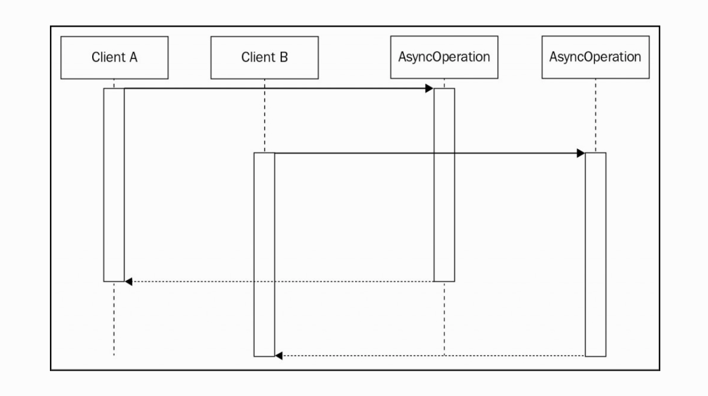
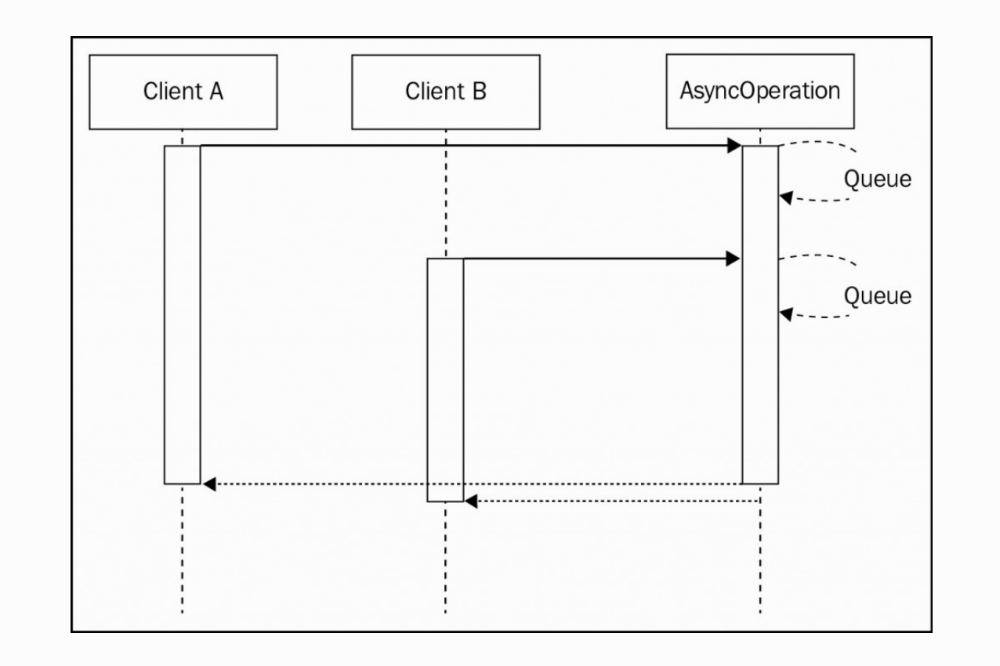
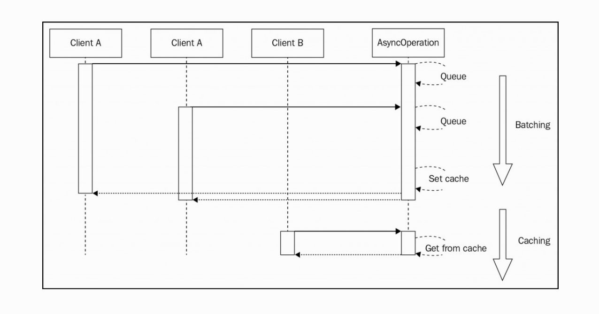

# Chapter 9. Advanced Asynchronous Recipes

几乎我们见过的所有设计模式都被认为是通用并适用于应用的许多不同方面的。但是这里还有一系列的模式聚焦于解决特定的问题；我们可以叫这些模式为「食谱」。因为在真实的烹饪中，我们有一套定义好的步骤去遵循，跟着这些步骤就可以达到我们想要的结果。当然，这不意味着我们不可以根据自己的口味进行调节，但是这套流程很重要。在本章，我们将提供一些流行的诀窍来解决特定的问题，这些问题在我们每天开发 Node.js 时都会遇到：

* 导入异步初始化的模块
* 通过批处理和缓存异步操作，以便在繁忙的应用程序中获得性能提升，只需极少的开发工作
* 运行可以阻塞事件循环的同步 CPU 绑定操作，并削弱 Node.js 处理并发请求的能力

## 导入异步的初始化模块

在第二章中我们讨论了 Node.js 模块系统的基础属性，我们说到 require 方法是同步的，module.exports 不能是异步的。

这就是有很多 npm 包都支持同步 API 的原因，它们为模块直接初始化而不必去寻找替代异步 API 提供了便利。

不幸的是，这有时候行不通；因为不一定都有同步的 API，尤其是那些使用网络的初始化过程，例如，去执行一个握手协议或者取得一个配置参数。就像很多数据库驱动器和为客户端设计的消息队列。

### 权威解决方案

我们来看个例子：一个链接远程数据库的 db 模块。db 模块将在服务器连接并握手后接收请求。这里我们有两个选项：

* 在模块被使用前确保它已被初始化，否则就等待它初始化。我们不得不在调用异步模块时执行这个处理：

````JavaScript

const db = require('aDb'); //The async module

module.exports = function findAll(type, callback) {
 if(db.connected) {  //is it initialized?
   runFind();
 } else {
   db.once('connected', runFind);
 }
 function runFind() {
   db.findAll(type, callback);
 });
};

````

* 使用依赖注入（DI）而非直接导入异步模块。这样，我们可以延缓一个模块的初始化直到它们的异步依赖已经被完全初始化成功。这个技术使用父级组件将管理模块的复杂性转移到了另一个组件上：

````JavaScript
//app.js
//in the module app.js
const db = require('aDb'); //The async module
const findAllFactory = require('./findAll');
db.on('connected', function() {
 const findAll = findAllFactory(db);
});

//in the module findAll.js
module.exports = db => {
 //db is guaranteed to be initialized
 return function findAll(type, callback) {
   db.findAll(type, callback);
 }
}

````

就模版代码的数量来说，我们可以看到第一个选项没有第二个方案好。

当然，在第二个方案也有不好用的时候，正如我们在第七章里说的。在大项目内，它又能会引入过分的复杂度，尤其是手动且异步处理初始化的时候。这些问题将在我们使用 DI 容器的时候有所缓解。

正如我们将要看到的，还有第三种替代方案可以让我们轻松地将模块与其依赖项的初始化状态隔离开来。

### 预初始化队列

使用命令模式和队列可以简单地解藕模块初始化的依赖状态。这个方法将在模块未初始化前保存模块所有的操作直到初始化成功后才执行。

#### 实现一个异步初始化模块

为了演示这个简单有效的技术，我们构建一个测试应用：

````JavaScript
//asyncModule.js

const asyncModule = module.exports;

asyncModule.initialized = false;

asyncModule.initialize = callback => {
  setTimeout(function() {
    asyncModule.initialized = true;
    callback();
  }, 10000);
};

asyncModule.tellMeSomething = callback => {
  process.nextTick(() => {
    if(!asyncModule.initialized) {
      return callback(
        new Error('I dont have anything to say right now')
      );
    }
    callback(null, 'Current time is: ' + new Date());
  });
};

````

在代码内，asyncModule 尝试去展示异步初始化。它暴露一个会延迟 10 秒钟执行的 initialize 方法，并设置 initialized 为 true 然后通知它的回掉函数。tellMeSomething 方法返回当前的事件，如果模块还未初始化则返回一个错误。

下一步就是创建另一个模块：

````JavaScript
//routes.js
const asyncModule = require('./asyncModule');

module.exports.say = (req, res) => {
  asyncModule.tellMeSomething((err, something) => {
   if(err) {
      res.writeHead(500);
      return res.end('Error:' + err.message);
    }
    res.writeHead(200);
    res.end('I say: ' + something);
  });
};

````

处理句调用 tellMeSomething 方法，然后写入到 HTTP 响应内。如我们所见，我们不去检查 asyncModule 的初始化状态，这可能会导致问题。

现在，我们创建一个基本的 HTTP 服务：


````JavaScript
//app.js

const http = require('http');
const routes = require('./routes');
const asyncModule = require('./asyncModule');

asyncModule.initialize(() => {
  console.log('Async module initialized');
});

http.createServer((req, res) => {
  if (req.method === 'GET' && req.url === '/say') {
    return routes.say(req, res);
  }
  res.writeHead(404);
  res.end('Not found');
}).listen(8000, () => console.log('Started'));

````

现在，我们可以启动我们的应用了。在服务开启后，我们可以跳转到 **http://localhost:8000/say**，看到输出为： Error:I don't have anything to say right now。这就是说异步模块还未被初始化，但我们依然可以继续使用它。基于异步初始化的模块实现，我们可以收到错误提示，甚至可以挂掉整个应用。总的来说，我们必须避免这种情况。大多数情况下，有几个失败的请求是没关系的，而且初始化可能很快，在实践中，这绝不会发生；但是，对于高负载应用程序和设计为自动伸缩的云服务器，这两种假设都可能很快被消除掉。

#### 用预初始化队列包装模块

为了提高服务的健壮性，我们将使用我们在本部分前提到的设计模式重构我们的应用。我们将把所有在 asyncModule 未初始化前的操作放入队列内，然后一个个执行我们的队列任务。看起来像是状态模式的应用！我们将需要两个状态，一个是模块还未初始化的队列，另一个将在初始化完成后简单委托原生 asyncModule 模块的每一个方法。

我们也没有机会去修改异步模块的代码；所以加入我们的队列层，我们将需要围绕 asyncModule 模块创建一个代理。

我们把这个文件叫作 asyncModuleWrapper.js：


````JavaScript
const asyncModule = require('./asyncModule');

const asyncModuleWrapper = module.exports;

asyncModuleWrapper.initialized = false;
asyncModuleWrapper.initialize = () => {
  activeState.initialize.apply(activeState, arguments);
};

asyncModuleWrapper.tellMeSomething = () => {
  activeState.tellMeSomething.apply(activeState, arguments);
};

````

asyncModuleWrapper 简单委托它的每个方法给当前的活跃状态。我们来看看这两个状态：

````JavaScript
//notInitializedState
const pending = [];
const notInitializedState = {

  initialize: function(callback) {
    asyncModule.initialize(() => {
      asyncModuleWrapper.initalized = true;
      activeState = initializedState;                 //[1]

      pending.forEach(req => {                        //[2]
        asyncModule[req.method].apply(null, req.args);
      });
      pending = [];
      callback();                                     //[3]
    });
  },

  tellMeSomething: callback => {
    return pending.push({
      method: 'tellMeSomething',
      args: arguments
    });
  }
};

````

当 initialize 方法被调用时，我们通过一个回掉代理触发原生 asyncModule 的初始化。这样我们的包装器就知道原生模块何时初始化因此触发以下的操作；

1. 用下一个状态对象更新 activeState 变量。
1. 启动我们先前保存在 pending 中的所有命令。
1. 调用原生回掉。

因为模块这时还未初始化，这个状态的 tellMeSomething 方法创建一个新的命令对象然后把它添加到 pending 操作队列。

这时，当原生 asyncModule 模块还未初始化时，这个模式应该已经很清晰了，我们的包装器简单队列化了所有接收到的请求。然后当初始化完成时，我们执行所有队列内的操作并切换内部状态的 initializedState。最后一行代码： **let initializedState = asyncModule**

毫无疑问，initializedState 对象是原生 asyncModule 模块的引用！实际上，当初始化完成时，我们可以直接安全地路由任何请求到原生模块。

最后我们看到： **let activeState = notInitializedState**

我们可以尝试再次实施我们的测试服务，但是，别忘了替换原生 asyncModule 模块为我们新的 asyncModuleWrapper 对象；我们需要在 app.js 和 routes.js 模块内完成。

做完这个后，如果我们尝试给服务器发送一个请求，我们将在 asyncModule 模块还未初始化成功是不再接收到时报的请求；请求将挂起直到初始化完成，然后再执行。

现在，我们的服务可以立即接收请求了。我们在没有使用 DI 或者冗长的错误检查来确认异步模块的状态了。

### 真实情景

我们刚刚呈现的模式被很多数据库驱动和 ORM 库所使用。最值得一提的就是 [Mongoose](http://mongoosejs.com)，是 MongoDB 的 ORM。Mongoose 就不需要等待数据库连接后才能发送查询，因为每一个操作都被队列化了，在数据库成功连接后才执行。这大大提高了它 API 的可用性。


## 异步化的批处理和缓存

在高载荷应用中，缓存是关键。它几乎被 web 中的任何地方都用到，从像网页、图片、样式表一样的静态资源到像数据库查询内的纯数据。在本部分，我们将学习如何对异步操作进行缓存，如何将高要求的吞吐量转化为我们的优势。

### 实现一个没有缓存或批处理的服务

在我们开始新挑战前，我们来实现一个简单的事例，我们将用它来衡量我们将要实施的各种技术。

有这样一个管理电子商务的 web 服务，我们想去查询某一类型的所有交易信息。为此，我们将再次使用 LevelUP。

**transactionId {amount, item}**

````JavaScript
//totalSales.js

const level = require('level');
const sublevel = require('level-sublevel');
const db = sublevel(level('example-db', {valueEncoding: 'json'}));
const salesDb = db.sublevel('sales');

module.exports = function totalSales(item, callback) {
  console.log('totalSales() invoked');
  let sum = 0;
  salesDb.createValueStream()            // [1]
    .on('data', data => {
      if(!item || data.item === item) {  // [2]
        sum += data.amount;
      }
    })
    .on('end', () => {
      callback(null, sum);               // [3]
    });
};

````

1. 我们创建了一个包含销售交易的 salesDb 分段流。这个流拉取整个数据库数据。
1. data 事件接收每一个销售交易作为它的返回事件流。我们添加了 amount 值到整个 sum 值，但是只有 item 匹配的时候才这样。
1. 最后，当 end 事件被接收时我们调用 callback 方法。

就性能来说我们的这个查询不是最佳的。理想地，在真实应用中，我们通过 item 类型的查询索引，或者更好，一个递增的 map/reduce 来计算 sum 值；但是，对于我们的事例，就我们将要分析的模式来说，一个慢查询实际上更轻量更适合。

最后确定的 total sales 应用，我们需要暴露 totalSales API：

````JavaScript
//app.js

const http = require('http');
const url = require('url');
const totalSales = require('./totalSales');

http.createServer((req, res) => {
  const query = url.parse(req.url, true).query;
  totalSales(query.item, (err, sum) => {
    res.writeHead(200);
    res.end(`Total sales for item ${query.item} is ${sum}`);
  });
}).listen(8000, () => console.log('Started'));

````

我们创建的服务非常抽象；只需要暴露 totalSales API。

在我们开始我们的服务前，我们需要填充我们的数据库，然后启动服务： **node server**。

然后浏览 **http://localhost:8000?item=book**。

### 批量异步请求

当处理异步操作时，通过批量调用一些相同的 API 来实现基本的批处理。想法很简单：如果我们调用一个异步函数，而另一个被挂起，我们可以在已经运行的操作上附加一个回掉。



前面图片展示了两个客户端（可以是两个不同的对象也可以是两个不同的 web 请求）调用相同的异步操作。当然，一般的情况是两个客户端开始两个分离操作，这两个操作发生在不同的时刻，正如前面展示的。现在考虑下一个情况：



第二个图片展示两个请求如何调用相同的 API，这是可以批量的，或者说是增加相同的运行操作。这样，当操作完成时，两个客户端将收到通知。这呈现了在没有复杂缓存机制下的一个简单极有力的方式来优化应用的载荷的方式，这通常需要足够的内存管理和有效的策略。

#### 在 total sales 销售服务内批处理请求

我们在我们的 totakSales API 上添加批处理层。我们将要使用的模式非常简单：当调用一个 API 时，如果这里已经有了另一个相同的请求的话，我们将为队列增添一个回掉。当异步操作完成时，所有在队列内的回掉将被一次调用。


现在，我们看看这个模式的实现代码。创建 totalSalesBatch.js：

````JavaScript
//totalSalesBatch.js

const totalSales = require('./totalSales');

const queues = {};
module.exports = function totalSalesBatch(item, callback) {
  if(queues[item]) {                                  // [1]
    console.log('Batching operation');
    return queues[item].push(callback);
  }

  queues[item] = [callback];                          // [2]
  totalSales(item, (err, res) => {
    const queue = queues[item];                       // [3]
    queues[item] = null;
    queue.forEach(cb => cb(err, res));
  });
};

````

totalSalesBatch 函数是原生 totalSales API 的代理：

1. 如果队列内已经存在 item 类型，这意味着对这个 item 的请求已经在运行中了。在这个例子中，我们所做的就是简单附加回掉给存在的队列并立即返回调用。
1. 如果没有为 item 定义队列，这意味着我们必须创建一个新的请求。为此，我们为特定的 item 创建一个队列并用当前的回掉函数对其初始化。然后调用 totalSales API。
1. 当原生的 totalSales 请求完成时，我们遍历所有的回掉。

totalSalesBatch 函数与原生的 totalSales API 相同，相同的请求将被批量处理。

想直到没有进行批处理的操作和运用批处理的操作之间的提升吗？我们改写 app.js：

````JavaScript
//app.js

//const totalSales = require('./totalSales');
const totalSales = require('./totalSalesBatch');

http.createServer(function(req, res) {
// ...

````

如果我们试着再次开启服务并运行测试，会发现请求被批量返回了。

除此之外，我们还会发现操作的执行时间减少了；至少比原生测试性能快了四倍！

这是个令人惊叹的结果，证实了我们只需要应用一个简单的批处理层即可获得大幅的性能提升，而不需要管理完整缓存的所有复杂度也不必担心失效策略。

### 缓存异步请求

批处理请求模式的一个问题是 API 的速度越快，我们得到的批处理请求就越少。有人可能会争辩说，如果 API 已经很快，那么试图优化它是没有意义的; 但是，它仍然是应用程序资源负载的一个因素，当数量足够多时时，仍然可以产生实质性影响。此外，有时我们可以安全地假设 API 调用的结果不会经常变化; 因此，简单的请求批处理不会提供最佳性能。在所有这些情况下，减少应用程序负载并提高其响应能力的最佳候选者肯定是一种更具侵略性的缓存模式。

想法很简单：当请求完成时，我们把结果缓存起来，可以是一个变量，一个数据库的入口，或者是一个特殊的缓存服务。因此，在 API 下次被调用时，结果可以从缓存中立即被返回，而不是产生另一个请求。

有经验的开发者不应该对缓存陌生，但是在异步编程内这个模式的特殊之处在于我们需要结合批处理请求来优化。原因是当缓存黑违背设置时多个请求可能同时运行，当这些请求完成时，缓存将被设置多次。

基于这些假设，最后的异步缓存请求模式结构如下：



这个图展示了两个异步缓存算法的阶段：

* 第一个阶段和批处理模式一样。当缓存未被设置时所有请求被批处理。当请求完成时缓存被设置。
* 当缓存最后被设置时，任何随之而来的请求将直接从缓存中返回。

正如我们处理异步 APIs 一样，我们必须经常异步返回缓存，即使获取缓存的只是一个同步操作。

#### 在 toal sales 服务中缓存请求

为了展示和测试异步缓存模式的优势，我们现在把它运用在 totalSales API 上。在批处理请求例子中，我们必须为原生 API 创建一个代理进而添加了缓存层。

````JavaScript
//totalSalesCache.js

const totalSales = require('./totalSales');

const queues = {};
const cache = {};

module.exports = function totalSalesBatch(item, callback) {
  const cached = cache[item];
  if (cached) {
    console.log('Cache hit');
    return process.nextTick(callback.bind(null, null, cached));
  }

  if (queues[item]) {
    console.log('Batching operation');
    return queues[item].push(callback);
  }

  queues[item] = [callback];
  totalSales(item, (err, res) => {
    if (!err) {
      cache[item] = res;
      setTimeout(() => {
        delete cache[item];
      }, 30 * 1000); //30 seconds expiry
    }

    const queue = queues[item];
    queues[item] = null;
    queue.forEach(cb => cb(err, res));
  });
};
````

* 当 API 被调用时检查缓存是否被设置，如果被设置了，我们使用 callback 立即返回缓存值，使用 preocess.nextTick 进行延迟。
* 执行在批处理模式下继续，但这次，当原生 API 成功完成时，我们把结果保存到缓存内。我们也设置了一个缓存过期时间。

现在，我们尝试包装我们的 totalSales：

````JavaScript
//app.js

//const totalSales = require('./totalSales');
//const totalSales = require('./totalSalesBatch');
const totalSales = require('./totalSalesCache');

http.createServer(function(req, res) {
  // ...

````

现在，服务可以再次启动并使用 loadTest.js 脚本。默认参数下，在启动时间上我们看到了 10% 的提升。当然这依赖于很多因素；例如，请求的数量，请求之间的时间间隔。当请求数量更高并且跨越更长的时间时，使用缓存而不是批处理的优势将更加显着。

#### 实现缓存机制的注意点

我们必须记住在真实的应用中，我们可能需要使用更多高级有效的技术和存储机制。这可能是有必要的：

* 大量的缓存可能会耗尽内存。在这个例子中，一个最小利用算法可以维持稳定的内存使用。
* 当应用被多个进程分发时，使用简单的变量来保持缓存将导致不同的结果。如果这对我们正在实现的特定应用程序不利，则解决方案是使用共享存储来缓存。 流行的解决方案是 [Redis]（http://redis.io）和 [Memcached]（http://memcached.org）。
* 与定时到期相反，手动缓存失效可以实现更长久的缓存，同时提供更多的最新数据，但是，理所当然，管理它会复杂得多。

### promises 下的批处理和缓存

在第四章内，我们看到了 promises 如何极大的简化了我们的异步代码，但在处理批处理和缓存时，它们提供了一个更有趣的应用程序。如果我们回想一个 promises，在这种情况下，有两个属性可以利用我们的优势：

* 多个 then 监听器可以附着在相同的 promise 上。
* then 监听器在调用时产生，而且在 promise 已经被解决时依然有效。

简单的说，第一个属性时我们的批量请求所需要的，而第二个意味着一个 promise 已经是一个解决的值的缓存并为我们提供了一个自然的机制来异步返回缓存值。换句话说，在 promises 下批量和缓存都及其简单了。

为了展示，我们试着用 promise 包装 totalSales API：

````JavaScript
//totalSalesPromises.js

const pify = require('pify');                    // [1]
const totalSales = pify(require('./totalSales'));

const cache = {};
module.exports = function totalSalesPromises(item) {
  if (cache[item]) {                            // [2]
    return cache[item];
  }

  cache[item] = totalSales(item)                // [3]
    .then(res => {                              // [4]
      setTimeout(() => {delete cache[item]}, 30 * 1000); //30s expiry
      return res;
    })
    .catch(err => {                             // [5]
      delete cache[item];
      throw err;
    });
  return cache[item];                           // [6]
};

````

非常简单优雅。Promises 确实很帮，但是对于这个应用它提供了一个极大的开箱即用优势。

1. 首先我们使用了一个叫 [pify](https://www.npmjs.com/package/pify) 的模块让 totalSales 直接返回一个 ES2015 promise。
1. 当 totalSalesPromises 包装器被返回时，我们检查给定的 item 类型是否存在缓存 promise。如果存在就直接返回这个给调用者。
1. 如果给定的 item 类型没有缓存，我们简单的调用原生 promise 化的 totalSales API。
1. 当 promise 被解决时，我们设置缓存失效时间并把 res 传递给下一个 then 操作。
1. 如果 promise 拒绝并产生一个错误，我们立即重置缓存并跑出一个错误给 promise 链，所以任何附加在相同 promise 上的监听器也将接收到错误。
1. 最后，返回我们创建的缓存 promise。

如果我们试着使用 totalSalesPromises 函数，我们将需要简单适配 app.js：


````JavaScript
//app.js

const http = require('http');
const url = require('url');
const totalSales = require('./totalSalesPromises');

http.createServer(function(req, res) {
  const query = url.parse(req.url, true).query;
  totalSales(query.item).then(function(sum) {
    res.writeHead(200);
    res.end(`Total sales for item ${query.item} is ${sum}`);
  });
}).listen(8000, () => console.log('Started'));
````

## 运行 CPU 绑定任务

totalSales API 就资源来说是昂贵的，但并未影响服务器接受并发请求的能力。我们在第一章内学到的事件轮询为此提供了解释：调用了一个异步操作会解开栈给时间轮询，并把控制权交还给其它请求。

但是，如果我们运行了一个长时间的同步任务怎么办呢？这种任务被称为 CPU 绑定任务，因为它的主要特点是它在 CPU 利用率上很重，而不是在 I/O 操作上很重。

### 解决分组集合问题

我们来选择一个计算昂贵的问题作为基础。一个好的候选者是子集合问题，它包括判定整数的集合（或多集合）是否包含一个总和等于零的非空子集。例如，如果我们输入集合 [1,2，-4,5，-3]，则满足该问题的子集是 [1,2，-3] 和 [2，-4,5，-3]。

最简单的算法之一是检查每个可能的子集合组合，它的计算花费是 O(2ⁿ)，换句话说，它呈几何倍数增长。这意味着一个 20 个整数的集合需要检查 1048576 种组合。当然，解决方案的实现要慢的多；所以为了让事情变得更难，我们将考虑以下面的变体：给定一个整数集合，计算所有可能的组合。

我们来实现这样的算法；创建一个 subsetSum.js：

````JavaScript
//subsetSum.js

const EventEmitter = require('events').EventEmitter;

class SubsetSum extends EventEmitter {
  constructor(sum, set) {
    super();
    this.sum = sum;
    this.set = set;
    this.totalSubsets = 0;
  }
  //...

  _combine(set, subset) {
      for(let i = 0; i < set.length; i++) {
        let newSubset = subset.concat(set[i]);
        this._combine(set.slice(i + 1), newSubset);
        this._processSubset(newSubset);
      }
    }

  _processSubset(subset) {
    console.log('Subset', ++this.totalSubsets, subset);
    const res = subset.reduce((prev, item) => (prev + item), 0);
    if(res == this.sum) {
      this.emit('match', subset);
    }
  }

  start() {
    this._combine(this.set, []);
    this.emit('end');
  }

````

SubsetSum 类扩展自 EventEmitter 类；这允许我们在发现新的子集合时产生一个事件。这将有更多的灵活性。

然后，我们生成所有可能的子集合组合。

* _combine 方法完全是同步的；它递归生成每一个可能的子集合。这个算法不会请求任何 I/O。
* 每次生成一个新的组合时，我们提供给 _processSubset 方法做其他运算。

_processSubset 方法用于给定的子集合值是否等于我们寻找的值。为了计算每个元素的总数，这个方法使用 reduce 操作来计算。匹配值后分发 match 事件。


最后，start 方法把所有方法聚集起来。

通过调用 _combine 方法生成所有的组合，最后分发 end 事件。可能因为 _combine 是同步的；因为此，end 事件将在函数返回时被分发。

然后暴露我们的算法。我们想创建一个这样的端点： **/subsetSum?data=<Array>&sum=<Integer>**。它以给定的整数数组和匹配的总数调用 SubsetSum 算法。


````JavaScript
//app.js

const http = require('http');
const SubsetSum = require('./subsetSum');

http.createServer((req, res) => {
  const url = require('url').parse(req.url, true);
  if(url.pathname === '/subsetSum') {
    const data = JSON.parse(url.query.data);
    res.writeHead(200);
    const subsetSum = new SubsetSum(url.query.sum, data);
    subsetSum.on('match', match => {
      res.write('Match: ' + JSON.stringify(match) + '\n');
    });
    subsetSum.on('end', () => res.end());
    subsetSum.start();
  } else {
    res.writeHead(200);
    res.end('I\m alive!\n');
  }
}).listen(8000, () => console.log('Started'));

````

在真实应用中由于 SubsetSum 对象使用事件来返回结果，我们可以在算法生成它们的时候使用流来匹配子集合。另一个细节是我们的服务会返回一个 I’m alive! 的文本。我们用这个来检查我们的服务是否在响应。

启动服务： **node app**。

当服务启动时，我们来发送我们的第一次请求；我们尝试 17 个数字的集合，这会生成 131071 种组合：

````JavaScript
curl -G http://localhost:8000/subsetSum --data-urlencode "data=[116, 119,101,101,-116,109,101,-105,-102,117,-115,-97,119,-116,-104,-105,115]" --data-urlencode "sum=0
````

我们可以看到来自服务器的结果流，范式如果我们在另一个命令行内尝试下面的命令就会出问题：

````JavaScript
curl -G http://localhost:8000
````

我们将看到这个请求将一直挂起直到子集合求和算法完成；服务器不会响应！这正是我们希望的。Node.js 事件轮询运行在单线程上，如果线程被长时间的同步操作阻塞。

我们很快就会明白，这种行为不适用于任何旨在为多个请求提供服务的应用程序。 但是，不要在 Node.js 中绝望，我们可以通过多种方式解决这类问题。让我们分析两个最重要的问题。

### 用 setImmediate 实现间隔

通常来说，一个 CPU 绑定算法构建在一系列步骤之上。它可能是一系列递归调用，一个循环，或者它们任何变体/组合。所以，一个简单的解决方案就是在每个步骤完成后把控制权交还给事件轮询。这样，这样，任何挂起的 I/O 仍然可以在长时间运行的算法产生 CPU 的那些时间间隔内由事件循环处理。一个达到这个目的的简单方法就是在任何等待 I/O 请求后做一个安排。这听起来就是 setImmediate 函数可以做的事。

#### 间隔子集合求和算法的步骤

我们把它运用到我们的例子中。轻微修改一下 subsetSum.js 模块。为了方便我们创建一个叫 subsetSumDefer.js 的模块：

````JavaScript
//subsetSumDefer.js
_combineInterleaved(set, subset) {
  this.runningCombine++;
  setImmediate(() => {
    this._combine(set, subset);
    if(--this.runningCombine === 0) {
      this.emit('end');
    }
  });
}   
````

如你所见，我们需要做的就是使用 setImmediate 延迟调用原生的同步 _combine 方法。但是，现在很难知道函数多会儿生成了所有的子集合了因为算法不再是同步的了。为了解决这个问题，我们使用一个很像异步平行启动的模式跟踪所有 _combine 方法运行的实例。当所有的实例的 _combine 方法完成了运行，我们可以分发 end 事件来提醒监听者处理已完成。

我们需要修改 _combine 方法：

````JavaScript
_combine(set, subset) {
  for(let i = 0; i < set.length; i++) {
    let newSubset = subset.concat(set[i]);
    this._combineInterleaved(set.slice(i + 1), newSubset);
    this._processSubset(newSubset);
  }
}

start() {
  this.runningCombine = 0;
  this._combineInterleaved(this.set, []);
}


````

这样我们就确保了使用 setImmediate 算法的每一步都将在事件队列内了，因此可以在任何等待的 I/O 请求后启动而非同步执行了。

在 satrt 方法内，我们初始化 _combine 运行实例的数量为零。我们可以用不惯 _combineInterleaved 替代 _combine 并移除 end 事件，因为这在 _combineInterleaved 内异步处理了。

最后修改 app.js：

````JavaScript
//app.js
const http = require('http');
//const SubsetSum = require('./subsetSum');
const SubsetSum = require('./subsetSumDefer');

http.createServer(function(req, res) {
  // ...

````

启动 app： **node app**。在命令行内继续输入：

````JavaScript
curl -G http://localhost:8000/subsetSum --data-urlencode "data=[116, 119,101,101,-116,109,101,-105,-102,117,-115,-97,119,-116,-104,-105,115]" --data-urlencode sum=0

curl -G http://localhost:8000
````

现在第二个请求会直接返回结果，而计算还在进行。

#### 对间隔模式的考虑

正如我们所看到的，运行一个受 CPU 绑定的任务，同时保留了应用程序的响应能力并不复杂，只需要使用 setImmediate 计划让算法的下一步在任何 I/O 之后运行。但是，就有效性来说，这不是最好的模式；实际上，推迟任务会产生一个小的开销，再乘以算法必须运行的所有步骤，会产生重大影响。这通常是我们最后才运行的步骤，尤其是如果我们必须对用户直接快速返回一个结果时。一个可能的解决方案是在一些步骤后再使用 setImmediate，而不是在每一个步骤后都使用 setImmediate。但这依然解决不了根本问题。

### 使用多进程

延迟 CPU 绑定算法的每一步不是我们唯一的选择；另一个模式来放置阻塞事件轮询的方案是使用子进程。我们已经知道 Node.js 很擅长运行 I/O 集中应用，基于它的异步架构它可以让我们优化资源利用率。

所以，我们最好不要在主进程运行 CPU 绑定任务，而要把它放到分进程上执行：

* 异步任务可以全速运行，不需要间隔启动步骤
* 在 Node.js 中使用进程很简单，差不多就像修改算法使用 setImmediate 一样
* 如果我们真的需要性能最大化，额外的进程可以被更低级的语言创建，例如 C

Node.js 有足够的 APIs 来与额外的进程交互。我们可以在 child_process 模块内找到。还有额外的进程就是另一个 Node.js 程序，连接到主进程非常简单，就像我们扩展了本地应用以一样。由于 child_process.fork 函数创建一个新的子进程并自动创建一个交流通道，这允许我们使用类似 EventEmitter 的接口进行通信。

#### 委托子集合求和任务给其他进程

重构 SubsetSum 的任务是创建一个分进程来处理同步过程，让事件轮询自由处理来自网络的请求。下面是我们的食谱：

1. 创建一个新的叫 processPool.js 的模块，它可以为我们创建一个进程池。开启一个新的进程昂贵而耗时，所以保持它们始终运行并准备处理任务可以节省时间和 CPU。当然，一个进程池也可以帮助我们限制运行进程的数量避免暴露应用给 denial-of-service（DoS） 攻击。
1. 然后，我们创建一个叫 subsetSumFork.js 的模块抽象运行在子进程上的 SubsetSum 任务。它用来与子进程交流并暴露任务结果，就像是它们来自当前的应用一样。
1. 最后，我们需要一个工人（即子进程），处理计算问题并把结果传递给父进程。

##### 实现一个进程池


````JavaScript
//processPool.js
const fork = require('child_process').fork;

class ProcessPool {
    constructor(file, poolMax) {
      this.file = file;
      this.poolMax = poolMax;
      this.pool = [];
      this.active = [];
      this.waiting = [];
    }
    //...
    acquire(callback) {
      let worker;
      if(this.pool.length > 0) {                // [1]
        worker = this.pool.pop();
        this.active.push(worker);
        return process.nextTick(callback.bind(null, null, worker));
      }

      if(this.active.length >= this.poolMax) {  // [2]
        return this.waiting.push(callback);
      }

      worker = fork(this.file);                 // [3]
      this.active.push(worker);
      process.nextTick(callback.bind(null, null, worker));
    }

    release(worker) {
      if(this.waiting.length > 0) {                          // [1]
        const waitingCallback = this.waiting.shift();
        waitingCallback(null, worker);
      }
      this.active = this.active.filter(w => worker !==  w);  // [2]
      this.pool.push(worker);
    }


````

我们导入 child_process.fork 函数创建新的进程。然后定义一个接收 file 参数的 ProcessPool 类构造器：

* pool 是一系列准备被使用的进程
* active 包含一系列当前被使用着的进程
* waiting 是一个缺乏进程处理的请求的回掉队列


acquire 方法返回将被使用的进程：

1. 如果在进程池内有一个将被使用的进程，我们把它移到 active 列表内并通过调用回掉来返回它。
1. 如果进程池内没有进程而且我们已经达到了运行进程的最大数量，就等待一个可用的进程。
1. 如果进程还未达到最大进程限制，我们通过 child_process.fork 来创建一个新的进程，并把它添加到 active 列表内，使用回掉返回给它的调用者。

最后的方法是 release，它把进程放回到进程池内：

* 如果等待队列有任务，通过把它传入一个回掉给 waiting 队列来指派工人。
* 否则，从 active 移除这个工人并把它放回到进程池内。

如我们所见，进程永远不会被停止，它们只是被重新指派，这样我们就可以节省每一个请求后重启进程的时间了。然而，这不一定是最佳的实践，因为这很大部分取决于我们的应用情况。

下面是可能减少长期内存耗用量并提高应用健壮性的建议：

* 杀掉那些长时间不活动的进程
* 添加一个杀掉不响应进程或重启这些挂掉进程的机制

##### 与子进程通信

我们的 PorocessPool 类已经准备就绪，现在使用它来实现 SubsetSumFork 包装器暴露结果并与子进程交流。如我们所说的，使用 child_process.fork 创建进程我们就有了一个基本的信息交流频道：

````JavaScript
//subsetSumFork.js

const EventEmitter = require('events').EventEmitter;
const ProcessPool = require('./processPool');
const workers = new ProcessPool(__dirname + '/subsetSumWorker.js', 2);

class SubsetSumFork extends EventEmitter {
  constructor(sum, set) {
    super();
    this.sum = sum;
    this.set = set;
  }

  start() {
    workers.acquire((err, worker) => {               // [1]
      worker.send({sum: this.sum, set: this.set});

      const onMessage = msg => {
        if (msg.event === 'end') {                   // [3]
          worker.removeListener('message', onMessage);
          workers.release(worker);
        }

        this.emit(msg.event, msg.data);             // [4]
      };

      worker.on('message', onMessage);             // [2]
    });
  }
}
module.exports = SubsetSumFork;
````

首先我们使用 subsetSumWorker.js 文件初始化 ProcessPool 对象作为我们的子进程。我们设置最大进程为 2。

另外我们试着维持与原生 SubsetSum 类相同的 API。实际上，SubsetSumFork 是一个 EventEmitter 对象，它拥有 sum 和 set 属性。当 start 被算法触发时，它在子进程中运行。

1. 我们试着从进程池内获取一个新的子进程。获取到了就给它发送信息。send API 是 Node.js 自动提供给所有用 child_process.fork 创建的进程的。
1. 然后使用 on 方法附着一个新的监听器来监听子进程返回的一切信息。
1. 在监听器内，我们检查是否接收到 end 事件，这个事件代表 SubsetSum 任务以完成，然后就移除监听器并释放进程回进程池。
1. 工人以 { event, data} 的形式来产生信息，借此我们可以无缝重分发子进程的任何信息。

这是 SubsetSumFork 的包装器，我们来实现子进程应用。

##### 与父进程交流

我们创建 subsetSumWorker.js：

````JavaScript
//subsetSumWorker.js
const SubsetSum = require('./subsetSum');

process.on('message', msg => {                   // [1]
  const subsetSum = new SubsetSum(msg.sum, msg.set);

  subsetSum.on('match', data => {                // [2]
    process.send({event: 'match', data: data});
  });

  subsetSum.on('end', data => {
    process.send({event: 'end', data: data});
  });

  subsetSum.start();
});

````

我们重用了原生的 SubsetSum。既然我们在子进程内，我们就不必担心再次阻塞事件轮询了，所有的 HTTP 请求将继续被主应用的事件轮询处理。

1. 子进程使用 process.on 函数迅速监听来自父进程的消息。我们期待从父进程哪里接收到一个 SubsetSum 任务。当收到这个信息时，创建一个 SubsetSum 类并注册 match 和 end 事件。最后通过 subsetSum.start 开启计算。
1. 每次从运行算法哪里收到事件时，用 { event, data } 的格式来包装进一个对象内并把它发送给父进程。这些信息被 subsetSumFork.js 模块所处理，正如我们在前面看到的。

正如我们见到的，我们仅仅包装了我们以前的算法。这意味着使用我们前面的模式应用的任何一部分都可以简单地被我们放进额外的进程内。

#### 多进程模式的考虑

我们通过引入新的模块来使用新版本的子集合求和算法：

````JavaScript
//app.js

const http = require('http');
//const SubsetSum = require('./subsetSum');
//const SubsetSum = require('./subsetSumDefer');
const SubsetSum = require('./subsetSumFork');
//...

````

更有趣的是我们可以同时启动两个 subsetSum 任务，我们可以看到启动了两个不同的进程。如果我们同时启动了三个 subsetSum 任务，第三个任务就会被挂起。这不是因为主进程的事件轮询被阻塞了，而是因为我们设置了最大子进程数为 2，这意味着第三个任务只有当进程池内有空闲进程才会运行。

如我们所见，所进程模式绝对比间隔模式更加给力灵活；然而，它仍然无法扩展，因为单台机器提供的资源量仍然是一个硬限制。这里的答案是通过多个机器来分发载荷，但这是我们在下一章内的分布式架构模式设计了。

# 总结

本章我们添加了一个新的武器，我们现在开始聚焦于解决更加具体的问题了并且是深入了一些高级的解决方案。当然，我们重用了一些以前提到过的模式：状态、命令、代理来对异步初始化模块提供一种有效抽象。提供异步控制流模式来批量缓存我们的 APIs，延迟执行和事件来运行 CPU 绑定任务。

这章不仅给我们一系列食谱来重用自定义我们的需求，而且还提供了一些很棒的事例来帮我们掌握一些准则和模式。

下两章是本书的巅峰。在学习各种策略后，我们将探索可伸缩和可分布式的 Node.js 应用。
